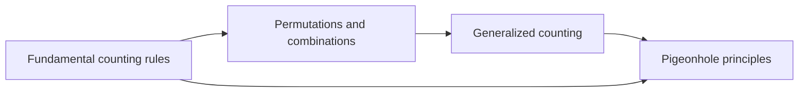
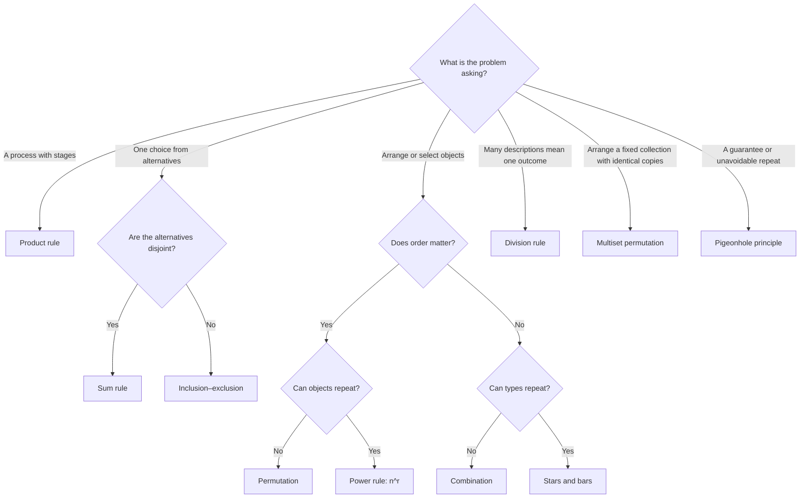

# Counting

[[1. Graph Theory and Trees/10 - Tree Applications: Backtracking, BSTs, and Expression Trees|← Prev: Graph Theory & Trees]]

> [!quote] The central idea
> **Do not list every outcome. Describe the decisions that create an outcome, then count those decisions.**

Counting is the part of discrete mathematics that answers questions such as:

- How many passwords satisfy a rule?
- How many teams can be formed?
- How many arrangements are possible?
- How many objects guarantee a repeated category?

## Learning path

Study the notes in this order:

1. [[01 Fundamental Counting Rules]]
2. [[02 Permutations and Combinations]]
3. [[03 Generalized Counting]]
4. [[04 Pigeonhole Principles]]
5. [[05 Counting Formula and Decision Sheet]]
6. [[06 Counting Mixed Practice]]

## Progress dashboard

| Stage | Main skill | Status |
|---|---|---|
| [[01 Fundamental Counting Rules]] | Split a count into stages or cases | ⬜ |
| [[02 Permutations and Combinations]] | Decide whether order matters | ⬜ |
| [[03 Generalized Counting]] | Handle repetition and identical objects | ⬜ |
| [[04 Pigeonhole Principles]] | Prove that repetition must occur | ⬜ |
| [[05 Counting Formula and Decision Sheet]] | Select the correct rule quickly | ⬜ |
| [[06 Counting Mixed Practice]] | Combine the ideas independently | ⬜ |

## The counting-rule compass

> [!tip] Five questions to ask first
> 1. Am I completing **stages**, or choosing among **cases**?
> 2. Does **order** change the outcome?
> 3. Is **repetition** allowed?
> 4. Are any objects **identical**?
> 5. Is the question asking for a **number of outcomes** or a **guarantee**?

## Symbols used throughout

**Basic vocabulary:** a *set* is a collection of distinct elements; a *subset* selects some of those elements, possibly none or all. The empty set $\varnothing$ contains no elements. “Distinct” means distinguishable: swapping two distinct books changes an arrangement. “Identical” means indistinguishable for the question being asked.

A **bit** is 0 or 1. A **bit string** is an ordered sequence such as 0101. Its length is its number of positions, including any leading zeros. “Non-negative integer” means $0,1,2,\ldots$; “positive integer” means $1,2,3,\ldots$.

| Symbol | Meaning |
|---|---|
| $n!$ | $n(n-1)(n-2)\cdots 2\cdot1$ |
| $P(n,r)$ | Ordered selections of $r$ distinct objects from $n$ |
| $\binom nr$ | Unordered selections of $r$ distinct objects from $n$ |
| $\lceil x\rceil$ | Smallest integer greater than or equal to $x$ |
| $\lfloor x\rfloor$ | Largest integer less than or equal to $x$ |
| $\mathcal P(S)$ | Power set: the set of all subsets of $S$ |
| $\lvert A\rvert$ | Number of elements in the set $A$ |
| $A\cup B$ | Elements in $A$ or $B$ (or both) |
| $A\cap B$ | Elements common to both $A$ and $B$ |

For example, $\lfloor3.7\rfloor=3$ and $\lceil3.7\rceil=4$. The notation $\operatorname{lcm}(a,b)$ means the least positive common multiple of $a$ and $b$; it identifies integers divisible by both.

The decision chart selects a starting method. Extra restrictions such as fixed positions, limited supplies, or required blocks may need casework or another rule as well.

## A reliable study loop

> [!example] Learn → cover → solve → check
> 1. Read one rule and its worked example.
> 2. Cover the formula and explain the idea aloud.
> 3. Solve the practice questions without looking back.
> 4. Open the collapsed solutions and correct the *reasoning*, not only the answer.

Treat the numbered lessons as a single sequence: each builds on the earlier ones. The formula sheet is for revision after the lessons. If an answer is wrong, first identify whether the mistake was the **model**, the **formula**, or the **arithmetic**. Revisit the corresponding worked example, then solve the question again with its solution closed.

---

[[01 Fundamental Counting Rules|Next: 01. Fundamental Counting Rules →]]
