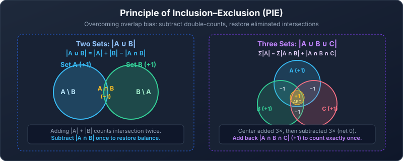

---
aliases:
  - Fundamental Counting Rules
  - Product Sum Subtraction Division Rules
tags:
  - discrete-mathematics
  - counting
  - counting-rules
---

# Fundamental Counting Rules

> [!abstract] Goal
> Learn to turn a problem into **stages**, **cases**, **overlaps**, or **equivalent descriptions**.

Navigation: [[00 Counting|← Prev: Counting Overview]] · [[Discrete Mathematics/index|Table of Contents]] · [[02 Permutations and Combinations|Next: 02. Permutations and Combinations →]]

## 1. Product rule — multiply stages

Use the product rule when one complete outcome is built through a sequence of decisions.

> [!note] Product rule
> If stage 1 has $n_1$ choices, stage 2 has $n_2$ choices, …, and stage $k$ has $n_k$ choices, then
> $$
> \text{total}=n_1n_2\cdots n_k.
> $$

Each stage must have the stated number of choices **for every valid sequence of earlier choices**, and each complete decision sequence must describe exactly one outcome being counted.

### Think in slots

Suppose a label contains one uppercase letter followed by a number from 1 to 100.

| Slot | Letter | Number |
|---|---:|---:|
| Choices | 26 | 100 |

$$
26\cdot100=2600
$$

The word **and** is a useful signal: choose a letter **and** choose a number.

### Repetition allowed

A three-digit code allows any digit in every position.

$$
\underbrace{10}_{\text{first}}\cdot
\underbrace{10}_{\text{second}}\cdot
\underbrace{10}_{\text{third}}=10^3=1000.
$$

`000` is valid because this is a code, not a three-digit integer.

### Repetition forbidden

A three-digit code uses distinct digits.

$$
10\cdot9\cdot8=720.
$$

The particular digits remaining depend on earlier choices, but their **number** is always 9 and then 8.

> [!warning] When simple multiplication fails
> If different first choices leave different numbers of later choices, draw branches, count each branch separately, and add the branch totals.

### Set form

Choosing one element from each set produces an element of a Cartesian product:

The **Cartesian product** $A\times B$ is the set of ordered pairs $(a,b)$ with $a$ chosen from $A$ and $b$ chosen from $B$. For $A=\{a,b\}$ and $B=\{1,2,3\}$,

$$
A\times B=\{(a,1),(a,2),(a,3),(b,1),(b,2),(b,3)\}.
$$

Each of the two first entries can be paired with three second entries, giving $2\cdot3=6$ pairs. The same idea extends to more sets:

$$
|A_1\times A_2\times\cdots\times A_k|
=|A_1||A_2|\cdots|A_k|.
$$

### Computing applications: network addressing and loop counts

The product rule directly governs core computer science calculations:

- **IPv4 Host Addressing:** An IPv4 address has 32 bits. A subnet with prefix length $k$ (e.g., `/24`) leaves $32-k$ host bits. By the product rule, there are $2^{32-k}$ bit combinations. In networking, the all-zeros address (network address) and all-ones address (broadcast address) are reserved, giving:
  $$
  \text{Usable hosts} = 2^{32-k} - 2.
  $$
  For a `/24` subnet: $2^{32-24} - 2 = 2^8 - 2 = 254$ assignable hosts.
- **Nested Loop Iterations:** A loop nested inside another executes a number of times determined by counting choices. If an outer loop runs $n$ times and an independent inner loop runs $m$ times, the body executes $n \cdot m$ times. If the inner loop depends on the outer loop index (e.g., `for i = 1 to n` and `for j = 1 to i`), the total operations sum across disjoint iterations: $1 + 2 + \dots + n = \frac{n(n+1)}{2}$.

### Practice — product rule

#### Counting subsets: an include-or-exclude decision

For each of the $n$ distinct elements of a set, make one of two choices: include it in the subset or leave it out. Thus

$$
\lvert\mathcal P(S)\rvert=2^{\lvert S\rvert}=2^n.
$$

The **power set** $\mathcal P(S)$ is the set of all subsets of $S$, including the empty set and $S$ itself. For $S=\{a,b\}$, the subsets are $\varnothing,\{a\},\{b\},\{a,b\}$.

> [!question] Easy · Subsets
> A set has 5 elements. How many subsets does it have? How many are nonempty?

> [!success]- Solution
> All subsets: $2^5=32$. Only the empty set is excluded from the second count, so there are $32-1=31$ nonempty subsets.

> [!question] Easy
> A café offers 4 sandwiches, 3 drinks, and 2 desserts. How many meals contain one of each?

> [!success]- Solution
> There are three stages, so multiply:
> $$4\cdot3\cdot2=24.$$

> [!question] Medium
> How many 6-character passwords start with an uppercase letter if every later character may be an uppercase letter, lowercase letter, or digit? Repetition is allowed.

> [!success]- Solution
> The first position has 26 choices. Each of the other five has $26+26+10=62$ choices:
> $$26\cdot62^5=23{,}819{,}453{,}632.$$

---

## 2. Sum rule — add disjoint cases

Use the sum rule when one task can be completed through one of several alternatives.

> [!note] Sum rule
> If case 1 has $n_1$ outcomes, case 2 has $n_2$ outcomes, …, and no outcome belongs to two cases, then
> $$
> \text{total}=n_1+n_2+\cdots+n_k.
> $$

Suppose one award goes to a student from Section A or Section B. Section A has 35 students and Section B has 40, with no student in both.

$$
35+40=75.
$$

The word **or** is a useful signal, but addition is valid only because the cases are disjoint.

In set notation, for pairwise disjoint sets:

$$
\lvert A_1\cup\cdots\cup A_k\rvert
=\lvert A_1\rvert+\cdots+\lvert A_k\rvert.
$$

**Pairwise disjoint** means $A_i\cap A_j=\varnothing$ whenever $i\ne j$.

> [!tip] Make cases disjoint on purpose
> “Passwords of length 6, 7, or 8” naturally gives three disjoint cases because one password cannot have two different lengths.

### Practice — sum rule

> [!question] Easy
> A student may choose one project from 12 database topics or 9 networking topics. The lists do not overlap. How many choices are available?

> [!success]- Solution
> $$12+9=21.$$

> [!question] Medium
> How many bit strings have length 3 or length 4?

> [!success]- Solution
> There are $2^3$ strings of length 3 and $2^4$ of length 4. The length cases are disjoint:
> $$2^3+2^4=8+16=24.$$

---

## 3. Inclusion–exclusion — correct an overlap

If two cases overlap, adding their sizes counts the overlap twice. Subtract it once.

> [!note] Two-set inclusion–exclusion
> $$
> |A\cup B|=|A|+|B|-|A\cap B|.
> $$

### Worked example: divisible by 3 or 5

Among the integers from 1 to 100:

- Divisible by 3: $\left\lfloor100/3\right\rfloor=33$
- Divisible by 5: $\left\lfloor100/5\right\rfloor=20$
- Divisible by both: divisible by $\operatorname{lcm}(3,5)=15$, so $\left\lfloor100/15\right\rfloor=6$

Therefore,

$$
33+20-6=47.
$$

### Three-set inclusion–exclusion

When three sets overlap, single-set additions and pairwise subtractions leave the central triple intersection uncounted. Add it back:

> [!note] Three-set formula
> $$
> |A\cup B\cup C| = |A|+|B|+|C| - (|A\cap B| + |B\cap C| + |A\cap C|) + |A\cap B\cap C|.
> $$

#### Why the center must be added back
- An element in only one set is counted once: $+1$.
- An element in exactly two sets is added twice and subtracted once: $2 - 1 = +1$.
- An element in all three sets ($A \cap B \cap C$) is added 3 times ($|A|+|B|+|C|$), then subtracted 3 times (in each pairwise intersection): $3 - 3 = 0$. It is completely eliminated! Adding $|A \cap B \cap C|$ restores its count to exactly $+1$.

#### Worked example: divisible by 2, 3, or 5
Among integers from 1 to 100:
- Single sets: $\lfloor 100/2 \rfloor = 50$, $\lfloor 100/3 \rfloor = 33$, $\lfloor 100/5 \rfloor = 20$. Sum $= 103$.
- Pairwise intersections: $\operatorname{lcm}(2,3)=6 \implies \lfloor 100/6 \rfloor = 16$; $\operatorname{lcm}(3,5)=15 \implies \lfloor 100/15 \rfloor = 6$; $\operatorname{lcm}(2,5)=10 \implies \lfloor 100/10 \rfloor = 10$. Sum $= 32$.
- Triple intersection: $\operatorname{lcm}(2,3,5)=30 \implies \lfloor 100/30 \rfloor = 3$.

$$
|A\cup B\cup C| = 103 - 32 + 3 = 74.
$$

### Complement counting

Sometimes the easiest subtraction is

$$
\text{wanted}=\text{all possibilities}-\text{unwanted possibilities}.
$$

This is especially useful for phrases such as **at least one**, **not all**, and **contains a**.

#### Example: at least one digit

How many length-5 strings use uppercase letters and digits and contain at least one digit?

- All strings: $36^5$
- Strings with no digit: $26^5$

$$
36^5-26^5=48{,}584{,}800.
$$

> [!tip] “At least one” reflex
> First try: **all − none**.

### Practice — subtraction

> [!question] Easy
> How many integers from 1 to 60 are divisible by 4 or 6?

> [!success]- Solution
> Multiples of 4: $15$. Multiples of 6: $10$. Multiples of both are multiples of $\operatorname{lcm}(4,6)=12$: $5$.
> $$15+10-5=20.$$

> [!question] Medium
> How many 8-bit strings contain at least one `1`?

> [!success]- Solution
> There are $2^8$ total strings. Exactly one string has no `1`: `00000000`.
> $$2^8-1=255.$$

> [!question] Medium · Overlapping string restrictions
> How many 6-bit strings start with 1 or end with 00?

> [!success]- Solution
> Starting with 1 fixes one position and leaves five free: $2^5=32$. Ending with 00 fixes two positions and leaves four free: $2^4=16$. Satisfying both fixes the first and last two positions, leaving three free: $2^3=8$.
> $$
> 32+16-8=40.
> $$
> Subtract the intersection once because those strings were included in both counts.

---

## 4. Division rule — remove equal overcounting

Sometimes a counting method describes every real outcome the same number of times.

> [!note] Division rule
> If a procedure creates $n$ descriptions and every actual outcome has exactly $d$ descriptions, then
> $$
> \text{actual outcomes}=\frac nd.
> $$

In function language, send each description to the actual outcome it describes. If every outcome receives exactly $d$ descriptions, this is a **$d$-to-one mapping**. The equal number $d$ is essential: there is no single divisor if different outcomes receive different numbers of descriptions.

### Worked example: handshakes

For each of $n$ people, choose one of the other $n-1$ people:

$$
n(n-1).
$$

This counts each handshake twice: once as $(A,B)$ and once as $(B,A)$. Therefore,

$$
\frac{n(n-1)}2.
$$

### Circular arrangements

Here $k!$ means $k(k-1)\cdots1$, called a **factorial**; for example, $4!=24$. We use $0!=1$. [[02 Permutations and Combinations#1. Factorials|The next lesson]] explains it in more detail.

Writing $k$ people in a row gives $k!$ lists. Around an unlabelled round table, rotating everyone together does not create a new seating. Each circular seating appears in $k$ rotated lists. For three people, the lists ABC, BCA, and CAB describe the same circular seating; ACB describes the reverse order.

Here $k\ge1$, all people are distinct, and there are no seat-specific restrictions.

$$
\frac{k!}{k}=(k-1)!.
$$

> [!warning] Reflection is usually different
> Unless the problem explicitly treats mirror images as identical, clockwise and counterclockwise orders are different.

### Practice — division rule

> [!question] Easy
> Six people sit around a round table. How many distinct seatings are possible if rotations are identical?

> [!success]- Solution
> $$\frac{6!}{6}=5!=120.$$

> [!question] Medium
> A class has 20 students. Each unordered pair exchanges one message. How many messages are exchanged?

> [!success]- Solution
> The ordered count is $20\cdot19$, but each pair is counted twice:
> $$\frac{20\cdot19}{2}=190.$$

---

## 5. Combining rules

Real problems often use multiplication **inside** each case and addition **between** cases.

### Worked example: codes of length 3 or 4

A code starts with one of 5 letters. Every later position is a digit.

- Length 3: $5\cdot10^2$
- Length 4: $5\cdot10^3$

The length cases are disjoint, so

$$
5\cdot10^2+5\cdot10^3=5500.
$$

### A general case table

| Case | Count inside the case |
|---|---:|
| Case 1 | product of its stages |
| Case 2 | product of its stages |
| Other cases | same pattern |
| Total | sum of the case counts |

> [!example] Pattern
> $$
> (a_1a_2\cdots a_r)+(b_1b_2\cdots b_s)+\cdots
> $$

### Practice — mixed rules

> [!question] Easy
> A username is either two uppercase English letters followed by two digits or three uppercase English letters followed by one digit. Repetition is allowed. How many usernames are possible?

> [!success]- Solution
> The two formats are disjoint:
> $$26^2\cdot10^2+26^3\cdot10=67{,}600+175{,}760=243{,}360.$$

> [!question] Medium
> How many length-6 strings over uppercase letters and digits start with a letter and contain at least one digit?

> [!success]- Solution
> The first position has 26 choices. For the other five positions, count all choices and subtract the all-letter case:
> $$26(36^5-26^5)=1{,}263{,}204{,}800.$$

### When later choice counts vary

Choose a main dish and then a permitted side. Each of two rice dishes allows three sides, while one noodle dish allows only two sides.

There are three mains, but not every main permits three sides. Split by main type:

$$
2\cdot3+1\cdot2=8.
$$

> [!question] Medium · Casework
> Two vegetarian mains each allow 4 sides. Three other mains each allow 2 sides. How many permitted main-and-side meals are there?

> [!success]- Solution
> Multiply within each case, then add the disjoint cases: $2\cdot4+3\cdot2=14$. Multiplying five mains by one fixed side count would be incorrect.

---

## Common mistakes

> [!warning] Check these before finalizing an answer
> - Adding cases that overlap without subtracting the overlap.
> - Multiplying alternatives when only one alternative is chosen.
> - Forgetting whether repetition is allowed.
> - Treating a numerical code as an integer and incorrectly banning a leading zero.
> - Dividing by $d$ when outcomes do not all have exactly $d$ descriptions.
> - Counting “at least one” directly when **all − none** is simpler.

## Quick self-check

- [ ] I can explain why stages multiply.
- [ ] I can explain why disjoint cases add.
- [ ] I can correct a two-set overlap.
- [ ] I recognize complement counting.
- [ ] I can identify equal overcounting.
- [ ] I can combine rules in one problem.

## Source pages

- [[Discrete Mathematics Lecture Notes - 27.pdf|Lecture 27]]
- [[Discrete Mathematics Lecture Notes - 28.pdf|Lecture 28, pp. 2–4]]

---

Navigation: [[00 Counting|← Prev: Counting Overview]] · [[Discrete Mathematics/index|Table of Contents]] · [[02 Permutations and Combinations|Next: 02. Permutations and Combinations →]]
