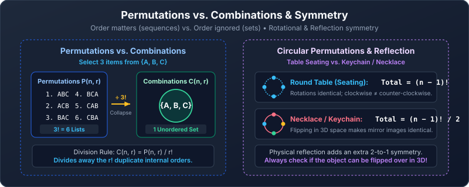

---
aliases:
  - Permutations and Combinations
  - Ordered and Unordered Selections
tags:
  - discrete-mathematics
  - counting
  - permutations
  - combinations
---

# Permutations and Combinations

> [!abstract] Goal
> Learn to recognize whether a selection is an **ordered list** or an **unordered group**.

Navigation: [[01 Fundamental Counting Rules|Previous]] · [[00 Counting|Dashboard]] · [[03 Generalized Counting|Next]]

## 1. Factorials

For a positive integer $n$,

$$
n!=n(n-1)(n-2)\cdots2\cdot1.
$$

Examples:

$$
5!=5\cdot4\cdot3\cdot2\cdot1=120,
\qquad 3!=6.
$$

We define

$$
0!=1.
$$

There is exactly one way to arrange zero objects: the empty arrangement. This definition also keeps permutation and combination formulas consistent.

> [!tip] Cancel before multiplying
> $$
> \frac{10!}{7!}=10\cdot9\cdot8,
> $$
> so there is no reason to calculate either large factorial first.

### Practice — factorials

> [!question] Easy
> Evaluate $6!$ and $\dfrac{8!}{5!}$.

> [!success]- Solution
> $$6!=720,$$
> $$\frac{8!}{5!}=8\cdot7\cdot6=336.$$

---

## 2. Permutations — order matters

A **permutation** is an ordered arrangement.

For the objects A, B, and C, the lists `ABC` and `BAC` are different permutations.

### Arranging all $n$ distinct objects

The first position has $n$ choices, the next has $n-1$, and so on:

$$
n(n-1)\cdots1=n!.
$$

> [!example] Five books on a shelf
> $$5!=120$$
> arrangements.

### Arranging $r$ objects chosen from $n$

An **r-permutation** is an ordered selection of $r$ distinct objects from $n$.

$$
P(n,r)=n(n-1)\cdots(n-r+1)
=\frac{n!}{(n-r)!}.
$$

There are exactly $r$ factors in the falling product.

The factorial formula assumes integers $0\le r\le n$. When $r=0$, there is one empty arrangement. When $r>n$, no selection without repetition is possible.

#### Worked example: three prize positions

First, second, and third place are awarded among 10 students.

$$
P(10,3)=10\cdot9\cdot8=720.
$$

Order matters because the prizes are different.

### The block method

When certain objects must stay together, temporarily glue them into one block.

#### Worked example: `ABC` must remain together

How many permutations of `ABCDEFGH` contain the consecutive block `ABC` in that exact order?

Treat `[ABC]`, D, E, F, G, and H as six objects:

$$
6!=720.
$$

If the letters A, B, and C only had to stay together in **any internal order**, multiply by $3!$:

$$
6!\cdot3!.
$$

> [!warning] A block changes the object count
> A block of several items acts as **one** object when arranging the outside, but its permitted internal arrangements may also need to be counted.

### Circular permutations

For $n$ distinct people around an unlabelled round table, rotations are identical:

$$
(n-1)!.
$$

One quick method is to fix one person’s position, then arrange the remaining $n-1$ people around them. See also [[01 Fundamental Counting Rules#Circular arrangements]].

#### Unoriented circular permutations: necklaces and keychains

When a circular arrangement can be picked up and flipped over (such as beads on a necklace or keys on a keyring), clockwise and counterclockwise orderings become identical.

Each unoriented arrangement corresponds to exactly 2 mirror-image circular permutations. By the division rule:

$$
\text{Total unoriented arrangements} = \frac{(n-1)!}{2}.
$$

For example, 5 distinct keys on a keyring can be arranged in $\frac{(5-1)!}{2} = \frac{24}{2} = 12$ distinct ways.

### Practice — permutations

> [!question] Easy
> How many four-letter arrangements can be made from 10 distinct letters without repetition?

> [!success]- Solution
> $$P(10,4)=10\cdot9\cdot8\cdot7=5040.$$

> [!question] Medium
> Seven people stand in a line. In how many arrangements are A and B next to each other?

> [!success]- Solution
> Treat A and B as one block. The block plus the other five people gives six objects, with $6!$ arrangements. Inside the block, A and B have $2!$ orders:
> $$6!\cdot2=1440.$$

---

## 3. Combinations — order does not matter

A **combination** is an unordered selection.

The lists `ABC`, `BAC`, and `CAB` all describe the same group $\{A,B,C\}$.

### Deriving the formula

$P(n,r)$ first chooses a group and then orders its $r$ members. Every group is counted $r!$ times, once for every internal order. Divide those orders away:

$$
\binom nr=C(n,r)
=\frac{P(n,r)}{r!}
=\frac{n!}{r!(n-r)!}.
$$

The notation $\binom nr$ is read **“$n$ choose $r$.”** It is also called a **binomial coefficient**.

#### Worked example: committee

Choose 4 students from 10 for a committee with no ranked positions.

$$
\binom{10}{4}
=\frac{10!}{4!6!}
=\frac{10\cdot9\cdot8\cdot7}{4\cdot3\cdot2\cdot1}
=210.
$$

### Useful identities

The combination factorial formula also requires $0\le r\le n$. For $r>n$, the number of selections is zero.

$$
\binom n0=\binom nn=1
$$

Choose nobody or everybody in exactly one way.

$$
\binom nr=\binom n{n-r}
$$

Choosing the $r$ included objects is equivalent to choosing the $n-r$ excluded objects.

$$
\binom nr=\binom{n-1}{r}+\binom{n-1}{r-1}
$$

This is **Pascal’s identity**: for one special object, either exclude it or include it.

To choose $r$ people from $n$, focus on one person, Amina. If she is excluded, choose all $r$ people from the other $n-1$: $\binom{n-1}{r}$. If she is included, choose the remaining $r-1$ people from the other $n-1$: $\binom{n-1}{r-1}$. Every committee belongs to exactly one of these cases, so their counts add.

For the displayed factorial forms, use $1\le r\le n-1$. These identities are useful supporting material; the supplied lectures focus on the combination formula and its counting interpretation.

> [!question] Easy · Binomial coefficients
> Evaluate $\binom70$ and $\binom76$ without expanding factorials.

> [!success]- Solution
> $\binom70=1$: choose nobody. By symmetry, $\binom76=\binom71=7$: choose the one person left out.

> [!question] Easy · Pascal's identity
> Count two-person groups from five students by separating the groups that include Amina from those that do not.

> [!success]- Solution
> Excluding Amina gives $\binom42=6$ groups. Including her gives $\binom41=4$ choices for her partner. Total: $6+4=10=\binom52$.

### Selecting from separate groups

If a committee needs 3 mathematics faculty from 9 **and** 4 computer-science faculty from 9, and no faculty member belongs to both groups, choose each subgroup:

$$
\binom93\binom94=84\cdot126=10{,}584.
$$

This combines combinations with the product rule.

### Practice — combinations

> [!info] Standard deck facts used in these notes
> A standard deck has 52 distinct cards and no jokers. It has four suits—hearts, diamonds, clubs, spades—with 13 ranks in each suit: ace, 2–10, jack, queen, king. Thus there are four aces and four of each other rank. A hand is an unordered selection without replacement.

> [!question] Easy
> How many five-card hands can be chosen from a standard 52-card deck?

> [!success]- Solution
> A hand is unordered:
> $$\binom{52}{5}=2{,}598{,}960.$$

> [!question] Medium
> A team of 5 is chosen from 12 students. At least one of three particular students must be on the team. How many teams are possible?

> [!success]- Solution
> Count all teams and subtract teams containing none of the three particular students. Such a team must come entirely from the other nine:
> $$\binom{12}{5}-\binom95=792-126=666.$$

---

## 4. Permutation or combination?

Ask one question:

> [!tip] If I swap two selected objects, do I get a different outcome?
> - **Yes** → permutation.
> - **No** → combination.

| Situation | Order? | Tool |
|---|---:|---|
| Password | Matters | Product rule; $n^r$ if repeats are allowed, $P(n,r)$ if forbidden |
| First, second, third prizes | Matters | Permutation |
| Batting order | Matters | Permutation |
| Committee | Does not matter | Combination |
| Team | Does not matter | Combination |
| Card hand | Does not matter | Combination |
| Schedule | Matters | Permutation |
| Subset | Does not matter | Combination |

### Same objects, different question

Choose 3 students from 10:

- Place them in three numbered seats: $P(10,3)=720$.
- Form an unranked group: $\binom{10}{3}=120$.

The first answer is $3!=6$ times larger because every group has six orders.

### Practice — choose the tool

> [!question] Easy
> Twelve runners compete. How many possible gold–silver–bronze results are there?

> [!success]- Solution
> The positions are ranked, so order matters:
> $$P(12,3)=12\cdot11\cdot10=1320.$$

> [!question] Medium
> From 8 women and 6 men, how many five-person committees contain exactly 3 women and 2 men?

> [!success]- Solution
> Each subgroup is unordered, and both selections must occur:
> $$\binom83\binom62=56\cdot15=840.$$

---

## Common mistakes

> [!warning]
> - Using $n^r$ when repetition is forbidden.
> - Using $P(n,r)$ for an unordered team or committee.
> - Forgetting internal arrangements in a block problem.
> - Dividing circular arrangements by $n$ when seats are labelled; labelled seats make rotations different.
> - Entering huge factorials before cancelling common factors.

## Quick self-check

- [ ] I understand $0!=1$.
- [ ] I can derive $P(n,r)$ using slots.
- [ ] I can use the block method.
- [ ] I can explain why combinations divide by $r!$.
- [ ] I can decide whether order matters.
- [ ] I can combine selections from separate groups.

## Source pages

- [[Discrete Mathematics Lecture Notes - 28.pdf|Lecture 28, pp. 4–8]]
- [[Discrete Mathematics Lecture Notes - 29.pdf|Lecture 29, pp. 2–3]]
