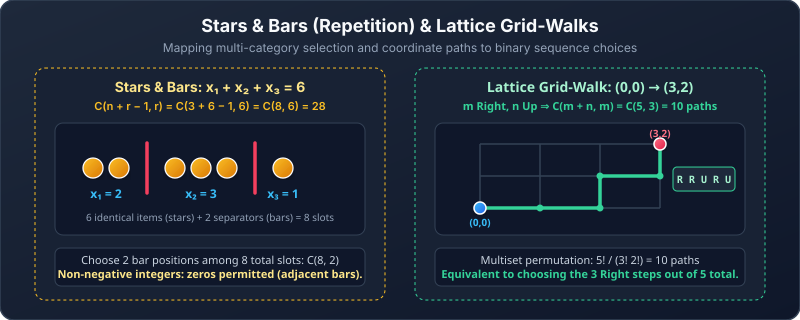

---
aliases:
  - Generalized Counting
  - Counting with Repetition
  - Stars and Bars
tags:
  - discrete-mathematics
  - counting
  - stars-and-bars
  - multisets
---

# Generalized Counting

> [!abstract] Goal
> Handle arrangements and selections when repetition is allowed or some objects are indistinguishable.

Navigation: [[02 Permutations and Combinations|← Prev: Permutations and Combinations]] · [[Discrete Mathematics/index|Table of Contents]] · [[04 Pigeonhole Principles|Next: 04. Pigeonhole Principles →]]

## The four-case map

Before choosing a formula, answer two questions: **Does order matter?** and **Is repetition allowed?**

| | Repetition forbidden | Repetition allowed |
|---|---:|---:|
| **Order matters** | $P(n,r)=\dfrac{n!}{(n-r)!}$ | $n^r$ |
| **Order does not matter** | $\binom nr$ | $\binom{n+r-1}{r}$ |

The no-repetition column assumes $0\le r\le n$. The repetition column assumes $n\ge1$, $r\ge0$, and an unlimited supply of each type. Additional restrictions must be handled separately.

> [!tip] Read the table by meaning
> - Ordered + repeat → fill $r$ positions independently.
> - Unordered + repeat → distribute $r$ identical selections among $n$ types.

---

## 1. Permutations with repetition allowed

There are $r$ ordered positions. Each position may contain any of $n$ objects.

$$
\underbrace{n\cdot n\cdots n}_{r\text{ factors}}=n^r.
$$

This is the product rule with the same number of choices at every stage.

### Worked example: letter codes

How many three-letter codes use uppercase English letters if letters may repeat?

$$
26^3=17{,}576.
$$

The word “code” means order matters: `ABC` and `BAC` differ.

### A restriction: at least one specified symbol

How many length-5 strings over $\{A,B,C\}$ contain at least one A?

- All strings: $3^5$
- Strings with no A: $2^5$

$$
3^5-2^5=211.
$$

### Practice — ordered repetition

> [!question] Easy
> How many four-digit PINs are possible if digits may repeat and `0000` is allowed?

> [!success]- Solution
> $$10^4=10{,}000.$$

> [!question] Medium
> How many length-6 digit strings contain at least one zero?

> [!success]- Solution
> Subtract strings with no zero from all digit strings:
> $$10^6-9^6=1{,}000{,}000-531{,}441=468{,}559.$$

---

## 2. Combinations with repetition — stars and bars

Suppose we choose $r$ objects from $n$ types, repetition is allowed, and order does not matter.

Represent the selected objects by $r$ stars and separate the $n$ types with $n-1$ bars.

> [!note] Formula
> $$
> \binom{n+r-1}{r}
> =\binom{n+r-1}{n-1}.
> $$



There are $n+r-1$ total symbols. Choose the $r$ star positions or, equivalently, the $n-1$ bar positions.

### Worked example: ice-cream scoops

Choose 3 scoops from 5 flavours. Scoops of one flavour are identical, and order in the bowl does not matter.

$$
\binom{5+3-1}{3}=\binom73=35.
$$

For two flavours, a stars-and-bars picture looks like this:

```text
***|   → 3 vanilla, 0 chocolate
**|*   → 2 vanilla, 1 chocolate
*|**   → 1 vanilla, 2 chocolate
|***   → 0 vanilla, 3 chocolate
```

The bar may be at an end because selecting zero of a type is allowed.

### Reading several bars

Fix the type order first. For four named types, the arrangement

~~~text
**||***|*  →  (2, 0, 3, 1)
~~~

has six stars and three bars. Read the star counts before the first bar, between successive bars, and after the last bar. Adjacent bars mean zero of the type between them. The types stay in their fixed order; the stars and bars themselves are identical, so do not multiply by factorials for their orders.

Conversely, the counts $(2,0,3,1)$ produce exactly this arrangement. Every valid selection corresponds to exactly one stars-and-bars arrangement, which is why choosing bar positions counts the selections without duplication.

> [!question] Easy · Decode the representation
> For three named types, what counts does $|**|*$ represent? How many selections of three identical items among those three types are possible?

> [!success]- Solution
> The counts are $(0,2,1)$. In general, three stars and two bars occupy five positions. Choose the two bar positions: $\binom52=10$.

> [!warning] Identical items, named recipients
> Three identical candies given to Alice and Bob have four possible count pairs: $(0,3),(1,2),(2,1),(3,0)$. If the three candies are individually distinct, each candy has two possible recipients, giving $2^3=8$ assignments. Stars and bars counts quantities, not the identities of individual items.

### Non-negative integer solutions

The equation

$$
x_1+x_2+\cdots+x_n=r,
\qquad x_i\ge0,
$$

asks us to distribute $r$ identical units among $n$ named variables. Therefore,

$$
\#\text{solutions}=\binom{n+r-1}{r}.
$$

#### Worked example

For $x_1+x_2+x_3=11$ with every $x_i\ge0$:

$$
\binom{3+11-1}{11}=\binom{13}{2}=78.
$$

### Positive solutions

If every variable must be positive, give each variable one unit first.

For

$$
x_1+\cdots+x_n=r,\qquad x_i\ge1,
$$

set $y_i=x_i-1$. Then $y_i\ge0$ and

$$
y_1+\cdots+y_n=r-n.
$$

Hence, when $r\ge n$,

$$
\#\text{positive solutions}=\binom{r-1}{n-1}.
$$

If $r<n$, there are zero positive solutions: there are not enough units to give every variable even one.

### General lower bounds

If $x_i\ge a_i$, write $y_i=x_i-a_i$. Subtract all required minimums from the total, then use ordinary stars and bars on the non-negative $y_i$ variables.

For integer lower bounds, let $R=r-(a_1+\cdots+a_n)=r-\sum_i a_i$. The symbol $\sum_i$ means add the minimums for all variables. If $R<0$, there are no solutions. Otherwise, the count is $\binom{R+n-1}{n-1}$.

> [!warning] When stars and bars does not apply directly
> The simple formula assumes no upper limits. Conditions such as $x_1\le4$ require another idea, usually casework or inclusion–exclusion.

### A simple upper bound: subtract the forbidden solutions

Count non-negative solutions of $x_1+x_2+x_3=7$ with $x_1\le3$.

1. Ignore the upper bound: $\binom92=36$ solutions.
2. The forbidden solutions have $x_1\ge4$. Set $y_1=x_1-4\ge0$. They correspond exactly to $y_1+x_2+x_3=3$, giving $\binom52=10$ solutions.
3. Subtract: $36-10=26$ valid solutions.

The shift is reversible: adding 4 to $y_1$ recovers exactly one forbidden solution. With several upper bounds, their violations may overlap, so subtracting each violation separately may require inclusion–exclusion.

### Practice — stars and bars

> [!question] Easy
> How many ways can 8 doughnuts be chosen from 3 types, with unlimited supply, if doughnuts of the same type are indistinguishable and order does not matter?

> [!success]- Solution
> $$\binom{3+8-1}{8}=\binom{10}{2}=45.$$

> [!question] Medium
> How many positive integer solutions satisfy $x_1+x_2+x_3+x_4=12$?

> [!success]- Solution
> Give each variable 1, leaving $12-4=8$ units. Equivalently, use the positive-solution formula:
> $$\binom{12-1}{4-1}=\binom{11}{3}=165.$$

> [!question] Medium · Lower bounds
> Count integer solutions of $x_1+x_2+x_3=10$ with $x_1\ge2$, $x_2\ge1$, and $x_3\ge0$.

> [!success]- Solution
> Reserve the required $2+1+0=3$ units. Set $y_1=x_1-2$, $y_2=x_2-1$, and $y_3=x_3$. Then $y_1+y_2+y_3=7$ with all variables non-negative. There are $\binom{7+3-1}{3-1}=\binom92=36$ solutions. Each corresponds to one original solution by restoring the reserved units.

> [!question] Medium · Upper bound
> Count non-negative solutions of $x_1+x_2+x_3=6$ with $x_1\le2$.

> [!success]- Solution
> There are $\binom82=28$ unrestricted solutions. A forbidden solution has $x_1\ge3$; subtract 3 from $x_1$ to obtain a non-negative total of 3, counted by $\binom52=10$. Hence $28-10=18$ solutions remain.

---

## 3. Permutations of a multiset

Now all objects are being arranged, but some are identical. Swapping identical copies changes nothing.

> [!note] Multiset-permutation formula
> If there are $n$ objects in total, with $n_1$ identical objects of type 1, $n_2$ of type 2, …, and $n_k$ of type $k$, then
> $$
> \frac{n!}{n_1!n_2!\cdots n_k!},
> \qquad n_1+\cdots+n_k=n.
> $$

Why divide? First pretend every copy is distinct, giving $n!$ orders. The $n_i!$ swaps inside each identical type produce no new string, so divide them away.

### Worked example: BANANA

`BANANA` contains 6 letters:

- B appears once,
- A appears 3 times,
- N appears 2 times.

$$
\frac{6!}{1!3!2!}=60.
$$

### Practice — multiset permutations

> [!question] Easy
> How many distinct arrangements of the letters in `LEVEL` are possible?

> [!success]- Solution
> There are 5 letters, with L repeated twice and E repeated twice:
> $$\frac{5!}{2!2!}=30.$$

> [!question] Medium
> How many distinct arrangements of `STATISTICS` are possible?

> [!success]- Solution
> There are 10 letters. S appears 3 times, T appears 3 times, I appears 2 times, and A and C appear once:
> $$\frac{10!}{3!3!2!}=50{,}400.$$

### Grid paths / lattice walks: a geometric multiset permutation

How many shortest paths exist in a coordinate grid from $(0,0)$ to $(m,n)$ if you may only move one unit Right ($R$) or one unit Up ($U$)?

- To reach $(m, n)$ from $(0,0)$, any shortest path must take exactly $m$ right steps and $n$ up steps.
- The total length of every path is $m + n$ steps.
- Every path corresponds to a unique sequence of $m$ copies of $R$ and $n$ copies of $U$.

By the multiset permutation formula (or choosing the $m$ right-step positions among $m+n$ total steps):

$$
\text{Total paths} = \frac{(m+n)!}{m!\,n!} = \binom{m+n}{m} = \binom{m+n}{n}.
$$

#### Worked example: checkpoint paths
Count the shortest grid walks from $(0,0)$ to $(4,3)$ that pass through $(2,1)$:
1. Stage 1: from $(0,0)$ to $(2,1)$ needs 2 Rights and 1 Up: $\binom{2+1}{2} = \binom{3}{2} = 3$ paths.
2. Stage 2: from $(2,1)$ to $(4,3)$ needs $4-2=2$ Rights and $3-1=2$ Ups: $\binom{2+2}{2} = \binom{4}{2} = 6$ paths.
3. Multiply the independent stages: $3 \cdot 6 = 18$ valid paths.

---

## 4. Do not confuse these three kinds of repetition

| Situation | What repeats? | Typical tool |
|---|---|---|
| Build a code and reuse symbols | A choice may be made again | $n^r$ |
| Choose identical items by type | A type may be selected again; order is ignored | Stars and bars |
| Arrange a fixed collection with duplicates | Identical copies already exist | Multiset permutation |

### One comparison

Compare three tasks involving four choices from the types A, B, and C:

- Form an ordered string, with repetition allowed: $3^4=81$.
- Exactly two A’s, one B, and one C: $\dfrac{4!}{2!}=12$.
- Choose four letters as an unordered multiset: $\binom{3+4-1}{4}=15$.

The words may look similar, but they describe three different outcome types.

### Practice — identify the model

> [!question] Medium
> Match each problem with its formula.
> 1. Length-7 binary strings.
> 2. Choose 7 candies from 4 flavours with unlimited supply; candies of a flavour are indistinguishable and order is ignored.
> 3. Arrange the letters in `BALLOON`.

> [!success]- Solution
> 1. Ordered positions with repetition: $2^7$.
> 2. Unordered selection with repetition: $\binom{4+7-1}{7}=\binom{10}{7}$.
> 3. Fixed multiset: `BALLOON` has L twice and O twice, so $\dfrac{7!}{2!2!}$.

---

## Common mistakes

> [!warning]
> - Using $n^r$ when order does not matter.
> - Using $\binom nr$ when the same type may be chosen repeatedly.
> - Using stars and bars for distinct objects.
> - Forgetting that zeros are allowed in the standard stars-and-bars formula.
> - Forgetting to subtract required minimums before counting positive or lower-bounded solutions.
> - Dividing a word arrangement by the factorial of the wrong letter count.

## Quick self-check

- [ ] I can use the order/repetition table.
- [ ] I can count strings with reusable symbols.
- [ ] I can draw a stars-and-bars representation.
- [ ] I can count non-negative and positive integer solutions.
- [ ] I can arrange a multiset.
- [ ] I can distinguish the three meanings of repetition.

## Source pages

- [[Discrete Mathematics Lecture Notes - 29.pdf|Lecture 29, pp. 3–6]]

---

Navigation: [[02 Permutations and Combinations|← Prev: Permutations and Combinations]] · [[Discrete Mathematics/index|Table of Contents]] · [[04 Pigeonhole Principles|Next: 04. Pigeonhole Principles →]]
