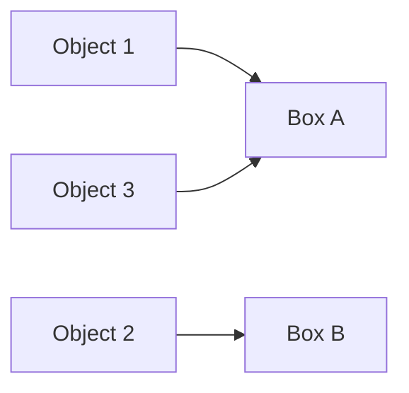
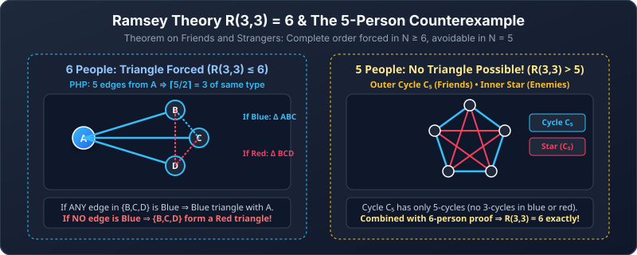

---
aliases:
  - Pigeonhole Principle
  - Generalized Pigeonhole Principle
tags:
  - discrete-mathematics
  - counting
  - pigeonhole-principle
  - ramsey-theory
---

# Pigeonhole Principles

> [!abstract] Goal
> Prove that a repetition or concentration **must** exist, even when you cannot identify where it occurs.

Navigation: [[03 Generalized Counting|← Prev: Generalized Counting]] · [[Discrete Mathematics/index|Table of Contents]] · [[05 Counting Formula and Decision Sheet|Next: 05. Counting Formula & Decision Sheet →]]

## 1. Basic pigeonhole principle

Imagine placing pigeons into holes. If there are more pigeons than holes, at least one hole receives two pigeons.

> [!note] Basic principle
> If $k+1$ or more objects are placed into $k$ boxes, some box contains at least two objects.

The objects and boxes can be anything:

| Objects | Boxes | Guaranteed repetition |
|---|---|---|
| 27 English words | 26 first letters | Two begin with the same letter |
| 367 people | 366 possible birthdays | Two share a birthday |
| 102 exam papers | 101 integer scores from 0 to 100 | Two have the same score |

> [!tip] The creative step
> Decide what the **objects** are and what category acts as a **box**.

### Function interpretation

Assigning each object to a box is a function.

A **function** gives each input exactly one output. The notation $f:A\to B$ means inputs come from $A$ and outputs lie in $B$. **One-to-one**, also called **injective**, means different inputs always receive different outputs. The output $f(a)$ is the **image** of input $a$.

If $f:A\to B$ and $|A|>|B|$, then $f$ cannot be one-to-one. Therefore, two different inputs must have the same output.

Objects 1 and 3 share an image, so the function is not injective.

> [!question] Easy · Function version
> Can a function from five inputs to four possible outputs be one-to-one?

> [!success]- Solution
> No. The five inputs are objects and the four outputs are boxes. Assigning an input to its output places five objects into four boxes, so two different inputs must share an output.

### Practice — basic principle

> [!question] Easy
> Show that among 13 people, at least two were born in the same month.

> [!success]- Solution
> The 13 people are the objects and the 12 months are the boxes. Because $13>12$, one month contains at least two birthdays.

> [!question] Medium
> Show that among any 11 integers, two have the same remainder when divided by 10.

> [!success]- Solution
> The possible remainders $0,1,\ldots,9$ are 10 boxes. Place each of the 11 integers into the box labelled by its remainder. Two integers must enter the same box.

> [!question] Medium · Geometric pigeonhole
> Five points are placed inside a unit square of side length 1. Prove that at least two points are within distance $\le \frac{\sqrt{2}}{2} \approx 0.707$ of each other.

> [!success]- Solution
> Divide the unit square into 4 smaller sub-squares of side length $1/2$ (the boxes). By PHP, placing 5 points (the pigeons) into 4 sub-squares forces at least one sub-square to contain $\ge 2$ points. The maximum possible distance between two points in a square of side $1/2$ is along its diagonal: $\sqrt{(1/2)^2 + (1/2)^2} = \sqrt{2}/2$.

> [!question] Medium · Pair-sum pigeonhole
> If $n+1$ integers are selected from the set $\{1, 2, \dots, 2n\}$, prove that at least two of them sum to $2n+1$.

> [!success]- Solution
> Partition the $2n$ integers into $n$ disjoint pairs that each sum to $2n+1$:
> $\{1, 2n\}, \{2, 2n-1\}, \dots, \{n, n+1\}$.
> These $n$ pairs are the boxes. Selecting $n+1$ integers places $n+1$ numbers into $n$ boxes, so at least one pair must be chosen in its entirety. Those two numbers sum to $2n+1$.

---

## 2. Generalized pigeonhole principle

With many objects, we can guarantee more than a pair.

> [!note] Generalized principle
> If $N$ objects are placed into $k$ boxes, some box contains at least
> $$
> \left\lceil\frac Nk\right\rceil
> $$
> objects.

Here $N$ is a non-negative integer and $k$ is a positive integer. The boxes need not have equal occupancy; the conclusion holds for every distribution.

### Why the ceiling appears

If the objects were spread as evenly as possible, each box would receive about $N/k$ objects. Counts must be integers, so at least one box reaches the next integer whenever $N/k$ is not already an integer.

#### Contradiction proof

A proof by **contradiction** temporarily assumes the claim fails, then derives something impossible. Here, failure would mean every box has fewer than the claimed number of objects.

Let

$$
m=\left\lceil\frac Nk\right\rceil.
$$

Suppose every box contained at most $m-1$ objects. Then all boxes together would contain at most

$$
k(m-1)<N,
$$

which cannot hold because all $N$ objects were placed. Thus some box contains at least $m$ objects.

### Worked example: birth months

For 100 people and 12 months,

$$
\left\lceil\frac{100}{12}\right\rceil=9.
$$

At least 9 people were born in the same month.

### Practice — generalized principle

> [!question] Easy
> Forty students are assigned to 6 tutorial groups. What group size is guaranteed?

> [!success]- Solution
> $$\left\lceil\frac{40}{6}\right\rceil=7.$$
> At least one group has at least 7 students.

> [!question] Medium
> A computer stores 1,000 files across 37 folders. Prove that one folder contains at least 28 files.

> [!success]- Solution
> $$\left\lceil\frac{1000}{37}\right\rceil=\lceil27.027\ldots\rceil=28.$$

---

## 3. Minimum-guarantee problems

A common question asks for the smallest number of objects needed to guarantee $m$ objects in one of $k$ boxes.

To avoid reaching $m$, each box can hold at most $m-1$ objects. Across all $k$ boxes, that allows

$$
k(m-1)
$$

objects. One more object forces a box to reach $m$.

> [!note] Minimum guarantee
> To guarantee at least $m$ objects in some one of $k$ boxes, use
> $$
> N=k(m-1)+1.
> $$

This is the minimum for unrestricted placement, with positive integers $k,m$. For a finite collection, check that the proposed worst-case distribution is actually possible. Limited supplies may make a smaller number sufficient; the target may also be impossible if no category has enough objects.

### Worked example: six students with the same grade

There are five possible grades: A, B, C, D, and F. To avoid six equal grades, place at most five students in each grade:

$$
5\cdot5=25.
$$

The next student forces some grade to appear six times:

$$
25+1=26.
$$

> [!important] A minimum answer needs both halves
> - **Why it works:** the proposed number forces the target.
> - **Why one fewer can fail:** exhibit a distribution with no box reaching the target.

### Practice — minimum guarantees

> [!question] Easy
> How many cards must be drawn to guarantee at least three cards of one suit?

> [!success]- Solution
> There are $k=4$ suits and the target is $m=3$:
> $$4(3-1)+1=9.$$
> Eight cards could split as $2,2,2,2$, so eight is insufficient; the ninth forces a suit to reach three.

> [!question] Medium
> How many people are needed to guarantee that at least five were born on the same day of the week?

> [!success]- Solution
> There are 7 days. At most 4 people can occupy each day without reaching five:
> $$7(5-1)+1=29.$$
> With 28 people, exactly four births on each weekday is possible and no day reaches five. This shows 29 is the minimum.

---

## 4. “Any box” versus a specified box

The pigeonhole principle tells us that **some** box becomes full. It does not tell us which box.

All draws in this section are **without replacement**: a selected object is kept out. For cards, use a standard 52-card deck: four suits of 13 cards each, so there are 13 hearts and 39 non-hearts.

### Compare these card questions

#### At least three cards of the same suit

Any of four suits may be the repeated suit:

$$
4(3-1)+1=9.
$$

#### At least three hearts

The target box is specifically hearts. In the worst case, all 39 non-hearts appear first, followed by 3 hearts:

$$
39+3=42.
$$

This is worst-case counting, not an ordinary pigeonhole guarantee.

> [!tip] Specified-category pattern
> $$
> \text{objects outside the target category}+\text{required target objects}.
> $$

This assumes drawing **without replacement** from a finite collection, and that enough target objects exist. With replacement, repeatedly drawing non-target objects could prevent any finite guarantee.

### Practice — worst case

> [!question] Easy
> A bag contains 8 red, 12 blue, and 10 green balls. How many balls must be drawn blindly to guarantee 4 red balls?

> [!success]- Solution
> In the worst case, all $12+10=22$ non-red balls come first. Then draw 4 red balls:
> $$22+4=26.$$
> One fewer can fail: draw all 22 non-red balls and only 3 red balls, for 25 draws without reaching the target.

> [!question] Medium
> The same bag is used. How many balls guarantee 4 balls of some one colour?

> [!success]- Solution
> There are three colour boxes. At most 3 of each colour can be drawn without reaching four:
> $$3(4-1)+1=10.$$
> Each colour has at least four available, so this worst-case distribution is feasible.

---

## 5. Friends and enemies: a Ramsey argument

> [!note] Claim
> Among any six people, if every pair are either friends or enemies, there are three mutual friends or three mutual enemies.

Relationships are symmetric, and every pair has exactly one of these two labels.

“Three mutual friends” means **all three pairs** within the triple are friends. It is not enough for one person to be friends with the other two. A triangle is a picture of those three people with all three pairwise relationships drawn.

### Proof in simple steps

1. Choose any person A.
2. A has five relationships, and each is one of two types: friend or enemy.
3. By generalized pigeonhole,
   $$
   \left\lceil\frac52\right\rceil=3,
   $$
   so A has at least three friends or at least three enemies.
4. Suppose A is friends with B, C, and D. Look at the three relationships among B, C, and D.
   - If any pair, say B and C, are friends, then A, B, and C are mutual friends.
   - If no pair are friends, then B, C, and D are mutual enemies.
5. If A instead has three enemies, the same argument works with the words reversed.

Therefore one of the two kinds of triple must exist.

This result is written

$$
R(3,3)=6
$$

and is the smallest famous example from **Ramsey theory**: a sufficiently large structure must contain order.

$R(3,3)$ means the smallest group size that guarantees three mutual friends or three mutual enemies under this model.

> [!example] Why five people are not enough
> Arrange five people in a cycle. Mark cycle-neighbour pairs as friends and all other pairs as enemies. Neither colour contains a triangle, so no three are mutual friends or mutual enemies.

For people A, B, C, D, E, the friendship cycle is A–B–C–D–E–A. The enemy edges form the cycle A–C–E–B–D–A. Neither cycle has a three-person triangle. Combined with the six-person proof, this establishes the exact minimum of six.

### Practice — Ramsey reasoning

> [!question] Medium
> In the six-person proof, A is known to have at least three enemies B, C, and D. Complete the argument.

> [!success]- Solution
> If any pair among B, C, and D are enemies, that pair together with A forms three mutual enemies. If no pair among B, C, and D are enemies, all three pairs are friendships, so B, C, and D are three mutual friends.

---

## Common mistakes

> [!warning]
> - Failing to state what the objects and boxes are.
> - Using $\lfloor N/k\rfloor$ instead of $\lceil N/k\rceil$ for a guaranteed lower bound.
> - Claiming which box fills; pigeonhole usually guarantees only that *some* box fills.
> - Giving a number that works without showing that one fewer can fail.
> - Using $k(m-1)$ instead of $k(m-1)+1$.

## Quick self-check

- [ ] I can identify objects and boxes.
- [ ] I can state the function version.
- [ ] I can use $\lceil N/k\rceil$.
- [ ] I can solve minimum-guarantee problems.
- [ ] I can distinguish any category from a specified category.
- [ ] I can reproduce the six-person friends-and-enemies proof.

## Source pages

- [[Discrete Mathematics Lecture Notes - 29.pdf|Lecture 29, pp. 6–9]]

---

Navigation: [[03 Generalized Counting|← Prev: Generalized Counting]] · [[Discrete Mathematics/index|Table of Contents]] · [[05 Counting Formula and Decision Sheet|Next: 05. Counting Formula & Decision Sheet →]]
