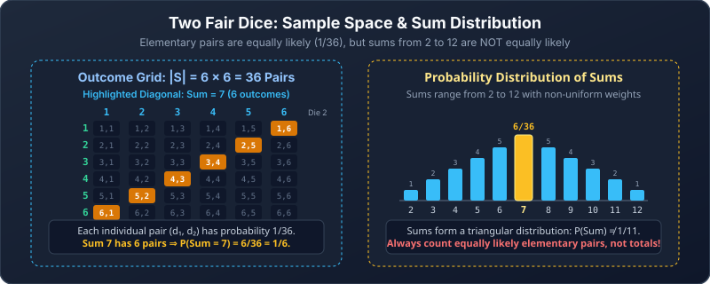

---
tags:
  - probability
  - foundations
---

# Probability Foundations

[[00 Probability|Dashboard]] · Next: [[02 Probability Rules and Puzzles]]

> [!abstract] Goal
> Turn a word problem into a sample space and an event before calculating.

## 1. Experiment, outcome, sample space, event

An **experiment** is a procedure whose result we observe. An **outcome** is one complete result. The **sample space** $S$ contains every possible outcome. An **event** is a collection of outcomes satisfying a condition.

We write H for heads and T for tails. A **fair coin** gives each probability $1/2$; a fair six-sided die gives each face probability $1/6$. **Independent** trials do not change one another's probabilities. Throughout the notes, separate coin flips and die rolls are assumed independent unless a dependence is stated. A random selection is **uniform** if every eligible individual object or outcome has the same chance.

> [!info] Card facts
> A standard deck has 52 distinct cards, no jokers, and four suits of 13 cards each. The ranks in each suit are ace, 2–10, jack, queen, and king. Thus there are 4 aces, 4 kings, and 12 face cards (jacks, queens, kings). Hearts and diamonds are red; clubs and spades are black. An ordinary hand is drawn without replacement and ignores order.

For two coin flips:

$$
S=\{HH,HT,TH,TT\}.
$$

“Exactly one head” is the event $E=\{HT,TH\}$. One outcome is HT; the event contains two outcomes. We keep the order because the first and second flips are different stages.

> [!question] Easy · Identify the sets
> Roll a die. Write the sample space and the event “a number greater than 4.”

> [!success]- Solution
> $S=\{1,2,3,4,5,6\}$ and $E=\{5,6\}$. The event is a subset of the sample space.

### A reliable way to build a sample space

First decide what one **complete outcome** must record. Then choose a representation:

| Experiment | Useful representation |
|---|---|
| One small action | List the outcomes |
| Several stages | Tree or ordered strings |
| Two numerical results | Ordered pairs or a table |
| Fixed positions with a known choice count at each stage | Product rule for the number of strings |

For example, flip a fair coin and independently roll a fair die. One complete outcome must record both results, so write $(H,1),(H,2),\ldots,(T,6)$. There are $2\cdot6=12$ equally likely outcomes. The event “heads and an even number” is

$$
\{(H,2),(H,4),(H,6)\},
$$

so its probability is $3/12=1/4$.

> [!tip] Completeness check
> Ask: **Could two physically different results receive the same label?** If yes, your labels may be too coarse to be equally likely. The totals 2 through 12 for two dice are the standard example: several pairs can produce the same total.

## 2. Equally likely outcomes

> [!note] Counting formula
> For a finite, nonempty sample space whose outcomes are equally likely,
> $$
> P(E)=\frac{\lvert E\rvert}{\lvert S\rvert}
> =\frac{\text{favourable outcomes}}{\text{all outcomes}}.
> $$

If four of nine balls are blue and each individual ball is equally likely to be drawn, then $P(\text{blue})=4/9$.

Probabilities satisfy

$$
0\le P(E)\le1,\qquad P(S)=1,\qquad P(\varnothing)=0.
$$

In a finite equally likely sample space, only the empty event has probability zero, and only the whole sample space has probability one. General distributions can assign zero probability to some outcomes; see [[06 Probability Models and Methods]].

A probability is a proportion: $1/4=0.25=25\%$. Multiply a decimal by 100 to express it as a percentage, and divide a percentage by 100 to use it in a formula. A 25% chance does not promise exactly one occurrence in every four trials.

### Worked example: dice sum of 7

Two fair dice produce $6\cdot6=36$ equally likely ordered pairs. The favourable pairs are

$$
(1,6),(2,5),(3,4),(4,3),(5,2),(6,1).
$$

Thus $P(\text{sum }7)=6/36=1/6$.

> [!warning] The sums are not equally likely
> There are 11 sums from 2 to 12, but the answer is not $1/11$. A sum of 2 has one pair; a sum of 7 has six. Count equally likely elementary outcomes.

> [!question] Easy · Die event
> What is the probability of a multiple of 3 on a fair six-sided die?

> [!success]- Solution
> The favourable outcomes are 3 and 6: $P=2/6=1/3$.

> [!question] Medium · Dice event
> Two fair dice are rolled. Find the probability that their sum is at least 10.

> [!success]- Solution
> Sums 10, 11, and 12 have 3, 2, and 1 ordered pairs respectively. These cases are disjoint:
> $P=(3+2+1)/36=1/6$.

## 3. Ordered and unordered outcomes

Use the same kind of outcome in the numerator and denominator.

Ignoring order is safe for counting probabilities only when the resulting groups are equally likely. In a uniform draw of distinct objects **without replacement**, every $r$-object set has exactly $r!$ possible draw orders, so all sets have equal probability.

> [!warning] Grouping can destroy equal likelihood
> In two independent fair coin flips, the four ordered outcomes HH, HT, TH, TT each have probability $1/4$. Ignoring order gives three categories: two heads, one of each, two tails. Their probabilities are $1/4$, $1/2$, $1/4$, not $1/3$ each, because “one of each” has two underlying orders.

| Problem | Equally likely outcomes to count |
|---|---|
| A code of length $r$ from $n$ reusable symbols | $n^r$ strings |
| An ordered draw of $r$ distinct objects from $n$ | $n!/(n-r)!$ lists |
| An unordered set of $r$ objects from $n$ | $\binom nr$ sets |

### Worked example: lottery

A lottery selects six distinct numbers uniformly from 40.

- Match the set, any order: $1/\binom{40}{6}=1/3{,}838{,}380$.
- Match the full ordered sequence: $1/[40\cdot39\cdot38\cdot37\cdot36\cdot35]$.

The second event is more restrictive and therefore has a smaller probability.

### Exactly three correct positions

A four-digit lottery string is uniformly random, with leading zeros and repeats allowed. For a fixed ticket, exactly three positions match when:

1. We choose the incorrect position: 4 choices.
2. We choose its incorrect digit: 9 choices.

So $P(\text{exactly three matches})=4\cdot9/10^4=0.0036$.

> [!question] Medium · Card hand
> A uniformly random two-card hand is drawn from a standard 52-card deck. What is the probability both cards are aces?

> [!success]- Solution
> Count unordered hands in both numerator and denominator:
> $$
> \frac{\binom42}{\binom{52}{2}}=\frac6{1326}=\frac1{221}.
> $$
> The ordered method agrees: $(4/52)(3/51)=1/221$. Each unordered pair has two draw orders in both numerator and denominator, so the factor of 2 cancels.

> [!question] Medium · Keep the counting model consistent
> A three-person committee is selected uniformly from 10 students. What is the probability that Amina is selected?

> [!success]- Solution
> The outcomes are unordered committees. There are $\binom{10}{3}$ in total. A committee containing Amina needs two of the other nine students:
> $$
> P(\text{Amina selected})=\frac{\binom92}{\binom{10}{3}}=\frac{36}{120}=\frac3{10}.
> $$
> Using unordered choices in both counts makes the ratio valid.

## 4. With replacement versus without replacement

**With replacement:** return the drawn object before drawing again. With fresh uniform draws, the original chances return.

**Without replacement:** the drawn object stays out. The pool changes.

A bag contains 3 red and 2 blue balls. Draw two balls:

| Model | Probability both are red |
|---|---|
| With replacement, independent draws | $\frac35\cdot\frac35=\frac9{25}$ |
| Without replacement | $\frac35\cdot\frac24=\frac3{10}$ |

After a red ball is drawn without replacement, only two red balls remain among four balls.

> [!tip] Read later fractions as “after the earlier result”
> The second fraction is the chance of the second result under the condition that the first happened. This is conditional probability, developed in [[03 Conditional Probability and Independence]].

> [!question] Easy · Replacement
> A box contains 4 green and 6 yellow balls. Two independent draws are made with replacement. Find the probability both are green.

> [!success]- Solution
> $(4/10)^2=4/25$.

> [!question] Medium · No replacement
> From the same box, draw twice without replacement. Find the probability of green first and yellow second.

> [!success]- Solution
> $(4/10)(6/9)=4/15$. Removing a green leaves six yellow balls among nine.

## Common mistakes

> [!warning]
> - Dividing favourable outcomes by total outcomes without checking equal likelihood.
> - Calling an event a single outcome even when it contains several outcomes.
> - Counting ordered outcomes in the numerator and unordered outcomes in the denominator.
> - Forgetting whether an object is replaced before the next draw.
> - Treating grouped outcomes, such as dice sums, as equally likely without checking their probabilities.

## Check before moving on

- [ ] I can name an outcome and an event separately.
- [ ] I check equal likelihood before dividing counts.
- [ ] I keep ordering consistent in numerator and denominator.
- [ ] I update the pool after a draw without replacement.

Source: [[Discrete Mathematics Lecture Notes - 30, 31, 32.pdf#page=3|Lectures 30–32, pp. 3–5]].
