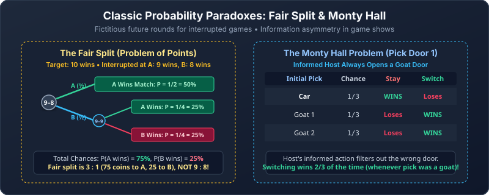

---
tags:
  - probability
  - probability-rules
---

# Probability Rules and Puzzles

[[01 Probability Foundations|Previous]] · [[00 Probability|Dashboard]] · [[03 Conditional Probability and Independence|Next]]

> [!abstract] Goal
> Break a complicated event into simpler events, then combine their probabilities correctly.

## 1. Complement rule: all minus the opposite

The complement $\overline E$ means “$E$ does not happen.” Exactly one of $E$ and $\overline E$ happens:

$$
P(\overline E)=1-P(E).
$$

For ten independent fair bits, “at least one zero” is the opposite of “all ones”:

$$
P(\text{at least one zero})=1-\left(\frac12\right)^{10}=\frac{1023}{1024}.
$$

> [!tip] First attempt for “at least one”
> Calculate **1 − probability of none**.

> [!question] Easy
> Roll a fair die twice independently. Find the probability of at least one six.

> [!success]- Solution
> No six on either roll has probability $(5/6)^2$. The answer is $1-25/36=11/36$.

## 2. Union rule: “or” includes overlap

$$
P(E\cup F)=P(E)+P(F)-P(E\cap F).
$$

Adding $P(E)$ and $P(F)$ counts the overlap twice, so subtract it once.

If events are **disjoint**, they cannot happen together and $P(E\cap F)=0$. Then simply add.

In probability, “$E$ or $F$” normally means **inclusive or**: $E$, $F$, or both. If a problem says **exactly one** or “either but not both,” remove the overlap from both events:

$$
P(\text{exactly one of }E,F)=P(E)+P(F)-2P(E\cap F).
$$

Choose an integer uniformly from 1 to 100. Let $E$ mean divisible by 2 and $F$ mean divisible by 5:

$$
P(E\cup F)=\frac{50}{100}+\frac{20}{100}-\frac{10}{100}=\frac35.
$$

> [!question] Medium
> Draw one card. Find the probability it is a heart or a king.

> [!success]- Solution
> There are 13 hearts, 4 kings, and one card in both sets:
> $(13+4-1)/52=4/13$.

> [!question] Easy · Exactly one condition
> On one fair die roll, find the probability the result is even or greater than 3, but not both.

> [!success]- Solution
> Even results are $\{2,4,6\}$ and results greater than 3 are $\{4,5,6\}$. The overlap is $\{4,6\}$; exactly one condition holds for $\{2,5\}$. Thus the probability is $2/6=1/3$. The formula agrees: $3/6+3/6-2(2/6)=1/3$.

## 3. Product rule: follow a sequence

The general multiplication rule is

$$
P(E\cap F)=P(E)P(F\mid E).
$$

Read it as: chance of the first event, multiplied by chance of the next event **after the first**.

The vertical bar in $P(F\mid E)$ is read **“given”**: find the chance of $F$ among outcomes where $E$ has occurred. This conditional is defined when $P(E)>0$. The events need not happen at different times; the formula also applies to two properties of the same outcome.

For independent events, learning that $E$ occurred leaves $F$'s probability unchanged:

$$
P(E\cap F)=P(E)P(F).
$$

> [!warning] “And” alone does not justify multiplying unconditional probabilities
> For draws without replacement, update the later chance. Independence is the special case in which no update is needed.

> [!question] Easy
> A bag contains 5 white and 3 black balls. Two balls are drawn without replacement. Find the probability of white first and black second.

> [!success]- Solution
> Follow the requested sequence and update the second denominator:
> $$
> \frac58\cdot\frac37=\frac{15}{56}.
> $$

## 4. Trees: multiply down, add across

A bag contains 2 red and 1 blue ball. Draw twice without replacement:

If the first ball is red, one red and one blue remain, so the next probabilities are $1/2$ each. If the first ball is blue, both remaining balls are red, so the next result is certainly red. RR means red then red; RB and BR are defined similarly. There is no BB path because there is only one blue ball.

~~~mermaid
flowchart TD
    A["Start"] -->|"2/3"| R["First red"]
    A -->|"1/3"| B["First blue"]
    R -->|"1/2"| RR["RR: 1/3"]
    R -->|"1/2"| RB["RB: 1/3"]
    B -->|"1"| BR["BR: 1/3"]
~~~

- Multiply branches along one path.
- Add leaf probabilities for different paths satisfying the event.
- Outgoing branches from a node sum to 1.
- All terminal leaf probabilities sum to 1.

The branches leaving one node must list all possible next results under the history at that node. Leaves represent complete, mutually exclusive routes, which is why their probabilities can be added.

For one ball of each colour, add the RB and BR leaves: $1/3+1/3=2/3$.

> [!question] Medium
> A bag has 3 red and 2 blue balls. Draw twice without replacement. Find the probability the colours differ.

> [!success]- Solution
> The disjoint paths are red-blue and blue-red:
> $$
> \frac35\frac24+\frac25\frac34=\frac35.
> $$

## 5. Birthday paradox

Assume birthdays are independent and uniformly distributed over 365 days, ignoring leap day.

For $n\le365$, all birthdays differ with probability

$$
P(\text{all different})=
\frac{365}{365}\frac{364}{365}\cdots\frac{365-n+1}{365}.
$$

Each new birthday must avoid the days already used. Therefore,

$$
P(\text{some shared birthday})=
1-\frac{365!}{(365-n)!\,365^n}.
$$

For 23 people the result is approximately $0.5073$, just above one half.

Why so few? We are looking for a match between **any pair**. Twenty-three people form $\binom{23}{2}=253$ pairs. This explains the intuition; those pair-match events are not all independent, so do not multiply their complements as though they were.

For 366 or more people, a match is certain by pigeonhole under the 365-day model.

> [!question] Easy
> Under this model, what is the probability that two people share a birthday?

> [!success]- Solution
> The second person's birthday must match the first: $1/365$.

> [!question] Medium
> Write the probability of a shared birthday among three people.

> [!success]- Solution
> $$
> 1-\frac{365\cdot364\cdot363}{365^3}\approx0.008204.
> $$
> Subtract the all-different event; this handles overlaps between matching pairs.

## 6. The fair split puzzle (problem of points)

This historic 1654 problem between Blaise Pascal and Pierre de Fermat helped launch probability theory:

Two players A and B bet equal stakes (e.g., 50 coins each, for a 100-coin pot) on a fair game ($P=1/2$ each round). The first to win 10 rounds takes the entire pot. The game is interrupted when **Player A has won 9 rounds** and **Player B has won 8 rounds**. How should the pot be divided fairly?

> [!warning] Common trap: current score ratio
> Splitting the pot according to current score ratio ($9:8$, giving A $53$ coins and B $47$ coins) is unfair because A is only 1 point away from victory while B needs 2 consecutive wins!

### Pascal and Fermat’s resolution: fictitious rounds
Divide the stakes in proportion to **each player’s probability of winning if the game had continued**.

1. **Maximum rounds remaining:** Player A needs $r = 1$ win; Player B needs $s = 2$ wins. In at most $r + s - 1 = 1 + 2 - 1 = 2$ more rounds, a champion must emerge.
2. **List the equally likely outcomes of 2 independent fair rounds:**
   $$
   S = \{AA, AB, BA, BB\}, \quad \text{each with probability } \left(\frac{1}{2}\right)^2 = \frac{1}{4}.
   $$
3. **Count winning outcomes:**
   - Player A needs at least 1 win: $AA, AB, BA$ (3 outcomes) $\implies P(\text{A wins}) = \frac{3}{4} = 75\%$.
   - Player B needs 2 wins: $BB$ (1 outcome) $\implies P(\text{B wins}) = \frac{1}{4} = 25\%$.

**Fair division:** Player A receives 75 coins and Player B receives 25 coins.

> [!question] Medium · Fair split
> In a game to 5 points, play is stopped when A has 4 points and B has 3 points. What is the fair split of a \$160 pot?

> [!success]- Solution
> A needs 1 point; B needs 2 points. In at most $1+2-1=2$ fictitious rounds, the outcomes are $AA, AB, BA, BB$. A wins the match in three outcomes ($AA, AB, BA$) with probability $3/4$, while B wins only in $BB$ with probability $1/4$. A receives $\frac{3}{4} \times 160 = \$120$ and B receives $\$40$.

---

## 7. Monty Hall

There are three doors: one car and two goats. You pick a door with no information about the car's location, so the initial chance of choosing the car is $1/3$. The host knows the car's location, always opens an unchosen goat door, and always offers a switch to the other unopened door.

| Your first choice | Chance | Staying | Switching |
|---|---|---|---|
| Car | $1/3$ | Wins | Loses |
| Goat | $2/3$ | Loses | Wins |

Switching wins **exactly when your original choice was wrong**. Thus:

$$
P(\text{stay wins})=\frac13,\qquad P(\text{switch wins})=\frac23.
$$

The host's action is informed. It does not turn the original choice into a 50–50 choice.

> [!warning] The host's rules matter
> These probabilities depend on the stated protocol. A host who opens a door randomly or selectively offers a switch creates a different experiment.

> [!question] Easy
> If your initial choice is a goat, why must switching win under the standard rules?

> [!success]- Solution
> The host cannot open your door or the car's door, so must reveal the other goat. The remaining unopened door contains the car.

---

## 8. Non-transitive dice

The lecture uses dice with three equally likely values each:

| Die | Values |
|---|---|
| A | 2, 6, 7 |
| B | 1, 5, 9 |
| C | 3, 4, 8 |

Each value appears on two faces of a physical six-sided die. Each independent matchup has $3\cdot3=9$ equally likely value pairs.

A beats B in five pairs: $(2,1),(6,1),(6,5),(7,1),(7,5)$. Similarly,

$$
P(A>B)=P(B>C)=P(C>A)=\frac59.
$$

~~~mermaid
flowchart LR
    A["A"] -->|"beats with 5/9"| B["B"]
    B -->|"beats with 5/9"| C["C"]
    C -->|"beats with 5/9"| A
~~~

There is no die that beats both others more often than it loses. A pairwise advantage need not be transitive.

**Transitive** would mean “A beats B more often, and B beats C more often, therefore A beats C more often.” These dice break that implication: C has the advantage over A. “Beats” compares how often a higher value is rolled; it does not mean winning every roll.

> [!question] Medium
> Your opponent chooses B. Which die should you choose? Verify the winning probability.

> [!success]- Solution
> Choose A. Against B's values 1, 5, and 9, A's values 2, 6, and 7 win 1, 2, and 2 times respectively. Total: $5/9$.

## Common mistakes

> [!warning]
> - Reading “or” as “exactly one” when the overlap should be included.
> - Adding overlapping events without subtracting the intersection.
> - Multiplying $P(E)P(F)$ for dependent events instead of using $P(E)P(F\mid E)$.
> - Adding probabilities down a tree or multiplying separate completed paths.
> - Treating the host’s revealed door in Monty Hall as an uninformed random choice.
> - Multiplying birthday pair probabilities as though the pair-match events were independent.

## Check before moving on

- [ ] I use complements for “at least one.”
- [ ] I remove overlap when adding events.
- [ ] I multiply conditional branch probabilities down a tree.
- [ ] I can explain the assumptions behind each puzzle.

Source: [[Discrete Mathematics Lecture Notes - 30, 31, 32.pdf#page=5|Lectures 30–32, pp. 5–9]].
