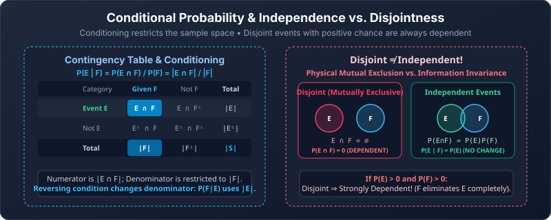

---
tags:
  - probability
  - conditional-probability
  - independence
---

# Conditional Probability and Independence

Navigation: [[02 Probability Rules and Puzzles|← Prev: Probability Rules & Puzzles]] · [[Discrete Mathematics/index|Table of Contents]] · [[04 Bernoulli Trials and Binomial Distribution|Next: 04. Bernoulli Trials & Binomial Distribution →]]

> [!abstract] Goal
> Understand what “given” changes, and recognize when learning one event tells you nothing about another.

## 1. “Given” changes the group you are looking at

Roll a fair die. Let $E$ mean “greater than 3” and $F$ mean “even.”

Before any information, $E=\{4,5,6\}$ has probability $3/6$.

Given $F$, only $\{2,4,6\}$ remains possible. Of those, $\{4,6\}$ satisfies $E$:

$$
P(E\mid F)=\frac23.
$$

> [!note] Conditional probability
> Provided $P(F)>0$,
> $$
> P(E\mid F)=\frac{P(E\cap F)}{P(F)}.
> $$
> **Inside the group where $F$ happened, what fraction also satisfies $E$?**

For equally likely outcomes, this becomes $\lvert E\cap F\rvert/\lvert F\rvert$. For unequal probabilities, use probability weights instead of raw counts.

Why divide by $P(F)$? Before the information, the surviving outcomes carry total probability $P(F)$. After conditioning, they are all the possibilities being considered, so their weights must be rescaled to total 1. If $P(F)=0$, this elementary definition cannot be used: there is no positive-probability group to divide by.

### Lecture example: consecutive zeros

A uniformly random four-bit string starts with zero. The remaining possibilities are:

| String | Contains consecutive zeros? |
|---|---|
| 0000 | Yes |
| 0001 | Yes |
| 0010 | Yes |
| 0011 | Yes |
| 0100 | Yes |
| 0101 | No |
| 0110 | No |
| 0111 | No |

Five of the eight surviving strings qualify, so the conditional probability is $5/8$.

> [!question] Easy
> A card is known to be a face card (jack, queen, or king). What is the probability it is a king?

> [!success]- Solution
> There are 12 equally likely face cards and 4 kings: $4/12=1/3$. The denominator is the given group, not all 52 cards.

> [!question] Medium
> Two fair coins are tossed. Given at least one head, what is the probability of two heads?

> [!success]- Solution
> The surviving equally likely outcomes are HH, HT, TH. Only HH qualifies: $1/3$.
> “At least one is heads” is different information from “the first is heads,” which would give $1/2$.

## 2. Reversing the condition changes the question

Suppose a class has 10 students: 4 wear glasses, 3 play chess, and 2 do both.

$$
P(\text{chess}\mid\text{glasses})=\frac24=\frac12,
$$

but

$$
P(\text{glasses}\mid\text{chess})=\frac23.
$$

The overlap stays the same. The denominator changes.

### A two-way table makes the denominator visible

The class information can be organized as follows:

|  | Plays chess | Does not play chess | Total |
|---|---:|---:|---:|
| Wears glasses | 2 | 2 | 4 |
| Does not wear glasses | 1 | 5 | 6 |
| **Total** | **3** | **7** | **10** |

To find $P(\text{chess}\mid\text{glasses})$, read only the glasses row: 2 of its 4 students play chess. To reverse the condition, read only the chess column: 2 of its 3 students wear glasses. A table is often the safest method when a problem gives counts or percentages for two categories.

To fill the table, begin with the overlap 2. The remaining glasses count is $4-2=2$; the remaining chess count is $3-2=1$; the neither count is $10-(2+2+1)=5$.

> [!question] Medium · Build and use a table
> Of 20 students, 12 study French, 9 study German, and 5 study both. A student is chosen uniformly. Given that the student does not study French, what is the probability they study German?

> [!success]- Solution
> The given group contains $20-12=8$ students. Of the 9 German students, 5 also study French, leaving $9-5=4$ who meet the condition. Therefore $P(\text{German}\mid\text{not French})=4/8=1/2$. The denominator is 8 because only the non-French students remain.

> [!tip] Translate before calculating
> “Probability of A given B” means **restrict to B**, then ask about A.

> [!question] Easy
> If $P(A)=0.4$, $P(B)=0.5$, and $P(A\cap B)=0.2$, find both conditional probabilities.

> [!success]- Solution
> $P(A\mid B)=0.2/0.5=0.4$ and $P(B\mid A)=0.2/0.4=0.5$. They need not agree.

## 3. General multiplication rule

Rearrange the definition:

$$
P(E\cap F)=P(E)P(F\mid E)=P(F)P(E\mid F).
$$

For three stages:

$$
P(A\cap B\cap C)=P(A)P(B\mid A)P(C\mid A\cap B).
$$

This is the precise reason probability trees work.

### Worked example: best-of-three series

As in the lecture, suppose the first game is won with probability $1/2$. Each later game's win probability is $2/3$ after a win and $1/3$ after a loss, depending only on the previous result. Stop when either side has two wins.

W means our team wins a game and L means it loses. After W, the next loss probability is $1-2/3=1/3$; after L, it is $1-1/3=2/3$. For example, WLW has factors $1/2$ (first win), $1/3$ (loss after a win), and $1/3$ (win after a loss). WW is already a complete path: the series ends, so no third-game factor is needed.

The paths on which our team wins are:

| Path | Probability |
|---|---|
| WW | $(1/2)(2/3)=1/3$ |
| WLW | $(1/2)(1/3)(1/3)=1/18$ |
| LWW | $(1/2)(1/3)(2/3)=1/9$ |

Let $A$ be “win series” and $B$ be “win first game.”

$$
P(A)=\frac13+\frac1{18}+\frac19=\frac12,
\qquad P(A\cap B)=\frac13+\frac1{18}=\frac7{18}.
$$

Hence

$$
P(A\mid B)=\frac{7/18}{1/2}=\frac79.
$$

Here $P(B\mid A)$ also equals $7/9$ because $P(A)=P(B)$. That is a feature of these numbers, not a general rule.

> [!question] Medium
> In this series, what is the probability of winning the series given a loss in the first game?

> [!success]- Solution
> After the loss, both remaining games must be won:
> $(1/3)(2/3)=2/9$. Equivalently, divide $P(LWW)=1/9$ by $P(L)=1/2$.

## 4. Independence

Events $E$ and $F$ are independent when knowing one happened does not change the other's probability.

> [!note] Test independence
> $$
> P(E\cap F)=P(E)P(F).
> $$
> Equivalently, if $P(F)>0$, then $P(E\mid F)=P(E)$.

### Lecture example: first bit and parity

Choose a four-bit string uniformly.

**Parity** means whether a count is even or odd. Zero is even. Choosing which positions contain 1 determines the entire bit string; all remaining positions contain 0.

- $E$: begins with 1. Eight strings qualify, so $P(E)=1/2$.
- $F$: has an even number of ones. There are $\binom40+\binom42+\binom44=8$, so $P(F)=1/2$.
- Both: after the initial 1, the last three positions must contain an odd number of ones. There are $\binom31+\binom33=4$, so $P(E\cap F)=1/4$.

Since $1/4=(1/2)(1/2)$, the events are independent.

### Independence versus disjointness

| Concept | Meaning | Mathematical test |
|---|---|---|
| Disjoint | Cannot occur together | $E\cap F=\varnothing$ |
| Independent | One does not change the other's chance | $P(E\cap F)=P(E)P(F)$ |

Two disjoint events with positive probabilities are **dependent**. Once one happens, the other becomes impossible.

> [!question] Easy
> On one die roll, are “roll 1” and “roll 2” independent?

> [!success]- Solution
> No. Their intersection has probability 0, while the product of their probabilities is $1/36$. They are disjoint, not independent.

> [!question] Medium
> On one fair die roll, let $E$ be “even” and $F$ be “divisible by 3.” Are they independent?

> [!success]- Solution
> $P(E)=1/2$, $P(F)=1/3$, and $E\cap F=\{6\}$ has probability $1/6$. The product matches the intersection, so yes.

## 5. Several independent trials

For independent trials, a specified sequence has probability equal to the product of its individual probabilities. If a coin has heads probability $p$ on every flip, then

$$
P(HHT)=p\cdot p\cdot(1-p).
$$

For more than two events, independence of every pair alone does not always justify multiplying all their probabilities. Repeated-trial problems assume joint independence: earlier outcomes together do not affect the next trial.

### Pairwise independence is weaker than joint independence

Toss two fair coins independently. Let

- $A$: the first coin is heads;
- $B$: the second coin is heads;
- $C$: the two coins show the same face.

Each event has probability $1/2$. Each pair has intersection probability $1/4$, so every pair is independent. However,

$$
A\cap B\cap C=\{HH\},
$$

whose probability is $1/4$, while $P(A)P(B)P(C)=1/8$. The three events are not jointly independent. This distinction matters only when three or more events are involved.

For three events, joint (or **mutual**) independence requires all three pair equations **and** the triple equation. For more events, the product rule must hold for every subcollection, not just for pairs or for the entire collection.

> [!question] Medium
> For the events above, find $P(C\mid A\cap B)$. Use it to explain why joint independence fails.

> [!success]- Solution
> If both $A$ and $B$ occur, the outcome must be HH, so $C$ is certain:
> $$
> P(C\mid A\cap B)=1\ne P(C)=\frac12.
> $$
> Learning $A$ alone or $B$ alone does not change $C$, but learning both together does.

> [!question] Easy
> Three independent components each work with probability $0.9$. All three must work. What is the probability the system works?

> [!success]- Solution
> $0.9^3=0.729$.

## Common mistakes

> [!warning]
> - Keeping the original sample-space denominator after information has restricted the possibilities.
> - Reversing $P(A\mid B)$ and $P(B\mid A)$.
> - Assuming events are independent merely because they look unrelated.
> - Confusing disjoint events with independent events.
> - Checking only pairwise independence when a product involving three or more events is required.

## Check before moving on

- [ ] I use the given event as the denominator.
- [ ] I can explain why reversed conditionals differ.
- [ ] I update later probabilities in dependent experiments.
- [ ] I distinguish independent events from disjoint events.

Sources: [[Discrete Mathematics Lecture Notes - 30, 31, 32.pdf#page=10|Lectures 30–32, pp. 10–12]]; [[Discrete Mathematics Lecture Notes - 33.pdf#page=7|Lecture 33, p. 7]].

---

Navigation: [[02 Probability Rules and Puzzles|← Prev: Probability Rules & Puzzles]] · [[Discrete Mathematics/index|Table of Contents]] · [[04 Bernoulli Trials and Binomial Distribution|Next: 04. Bernoulli Trials & Binomial Distribution →]]
