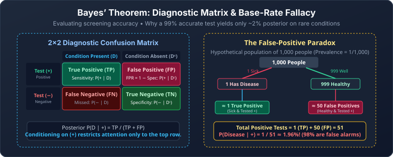

---
aliases:
  - Bayes Theorem
---

# Bayes’ Theorem and Naive Bayes

[[04 Bernoulli Trials and Binomial Distribution|← Prev: Bernoulli Trials & Binomial Distribution]]

> [!abstract] Goal
> Use observed evidence to update the probability of a possible explanation.

## 1. Bayes reverses a conditional

Often we know how likely some evidence is **if a cause is present**. We want to know how likely that cause is **after seeing the evidence**.

Write the same intersection in two ways:

$$
P(F\cap E)=P(E\mid F)P(F)=P(F\mid E)P(E).
$$

Divide by $P(E)>0$:

> [!note] Bayes’ theorem
> $$
> P(F\mid E)=\frac{P(E\mid F)P(F)}{P(E)}.
> $$
> The likelihood form assumes $P(F)>0$ so that $P(E\mid F)$ is defined.

| Part | Symbol | Plain meaning |
|---|---|---|
| Prior | $P(F)$ | Chance of the explanation before the evidence |
| Likelihood | $P(E\mid F)$ | How often this explanation produces the evidence |
| Evidence probability | $P(E)$ | Overall chance of seeing the evidence |
| Posterior | $P(F\mid E)$ | Updated chance of the explanation |

> [!tip] A useful reading
> **Posterior = prior × likelihood, divided by all the ways the evidence can occur.**

### A repeatable Bayes workflow

1. Define the explanation $F$ and the observed evidence $E$.
2. List every mutually exclusive explanation that could produce $E$.
3. For each route, multiply **prior × likelihood**.
4. Add all route weights to get $P(E)$.
5. Divide the target route weight by the total.

To **normalize** the route weights means to divide each weight by their total, so the resulting probabilities add to 1. This is the final step, after restricting attention to the evidence. Probability weights and expected counts give the same posterior because multiplying every weight by one common population size cancels from the fraction.

> [!question] Easy
> If $P(F)=0.3$, $P(E\mid F)=0.8$, and $P(E)=0.4$, find $P(F\mid E)$.

> [!success]- Solution
> $(0.8)(0.3)/0.4=0.6$. Seeing $E$ raised the probability of $F$ from 0.3 to 0.6.

## 2. Total probability supplies the denominator

Evidence $E$ can happen with $F$ or with $\overline F$. These routes do not overlap:

$$
P(E)=P(E\mid F)P(F)+P(E\mid\overline F)P(\overline F).
$$

Therefore,

$$
P(F\mid E)=
\frac{P(E\mid F)P(F)}
{P(E\mid F)P(F)+P(E\mid\overline F)P(\overline F)}.
$$

> [!warning] Keep the complements visible
> The second denominator term describes evidence **without** $F$. Both occurrences of $F$ in that term must be complemented.

### Worked example: two boxes

Choose either box with probability $1/2$.

- Box 1: 7 red, 2 green.
- Box 2: 3 red, 4 green.

A red ball is drawn. Let $B_1$ mean box 1 and $R$ mean red:

$$
P(B_1\mid R)=
\frac{(7/9)(1/2)}
{(7/9)(1/2)+(3/7)(1/2)}
=\frac{49}{76}\approx0.6447.
$$

Box 1 is more likely after observing red because a red result is more common in that box.

### Solve the same update using whole-number counts

Imagine repeating this experiment 126 times. The model predicts 63 selections of each box. Among them:

| Route | Predicted selections | Red results |
|---|---:|---:|
| Box 1 | 63 | $63(7/9)=49$ |
| Box 2 | 63 | $63(3/7)=27$ |
| Total | 126 | 76 |

Once red is observed, restrict attention to the 76 red results. Of those, 49 came from box 1, giving $49/76$. These counts explain the model; they are not a guarantee that a real batch of 126 trials will have exactly these results.

> [!question] Medium
> A factory uses machine A for 60% of its items and B for 40%. Defect rates are 2% for A and 5% for B. Given a defective item, what is the probability it came from B?

> [!success]- Solution
> Defective routes: A contributes $0.6(0.02)=0.012$; B contributes $0.4(0.05)=0.020$.
> $$
> P(B\mid D)=\frac{0.020}{0.012+0.020}=0.625.
> $$

## 3. Base rates: rare explanations start with little weight

The lecture's screening example is a hypothetical probability model:

- Prevalence: $P(D)=1/100{,}000$.
- True-positive rate: $P(+\mid D)=0.99$.
- True-negative rate: $P(-\mid\overline D)=0.995$.
- Consequently, false-positive rate: $P(+\mid\overline D)=0.005$.

The true-positive rate is also called **sensitivity**. The true-negative rate is also called **specificity**. A false-positive rate is the complement of specificity, not the complement of sensitivity.

### The 2×2 diagnostic terminology reference

| Reality \ Test Result | Test Positive ($+$) | Test Negative ($-$) |
|---|---|---|
| **Has Condition ($D$)** | **True Positive ($TP$)** Rate: $P(+\mid D)$ = Sensitivity | **False Negative ($FN$)** Rate: $P(-\mid D) = 1 - \text{Sensitivity}$ |
| **Healthy ($\bar{D}$)** | **False Positive ($FP$)** Rate: $P(+\mid \bar{D}) = 1 - \text{Specificity}$ | **True Negative ($TN$)** Rate: $P(-\mid \bar{D})$ = Specificity |

- **Sensitivity:** $P(+\mid D)$, how reliably the test catches the disease.
- **Specificity:** $P(-\mid \bar{D})$, how reliably the test clears healthy patients.
- **False Positive Rate:** $P(+\mid \bar{D}) = 1 - \text{Specificity}$.
- **Positive Predictive Value / Posterior:** $P(D\mid +) = \frac{TP}{TP + FP}$.

Bayes gives

$$
P(D\mid+)=
\frac{0.99(0.00001)}
{0.99(0.00001)+0.005(0.99999)}
\approx0.001976=0.1976\%.
$$

### See it as a population table

In a hypothetical population of 10,000,000, the expected counts are:

| Group | Population | Positive results |
|---|---:|---:|
| Has the condition | 100 | 99 |
| Does not have it | 9,999,900 | 49,999.5 |

Among positive results, the fraction from the first group is $99/(99+49{,}999.5)$.

Expected counts can be fractional: they are averages predicted by the model, not a literal half-person.

> [!important] The lesson
> $P(+\mid D)$ and $P(D\mid+)$ answer different questions. Even a small false-positive rate can generate many false positives when the condition is very rare.

### Steve: librarian or farmer

The lecture assumes 2,000 farmers per librarian. A description fits 40% of librarians but 1% of farmers.

Use prior proportions rather than separately calculating their normalized probabilities:

$$
P(L\mid\text{description})=
\frac{1(0.40)}{1(0.40)+2000(0.01)}
=\frac1{51}\approx1.96\%.
$$

The description fits a librarian more often, but farmers are much more common.

> [!question] Medium
> An alert detects 90% of faulty items and falsely flags 10% of good items. Only 1% of items are faulty. What fraction of flagged items are faulty?

> [!success]- Solution
> $$
> \frac{0.9(0.01)}{0.9(0.01)+0.1(0.99)}
> =\frac{0.009}{0.108}=\frac1{12}\approx8.33\%.
> $$
> A 90% detection rate does not mean 90% of alerts are correct.

> [!question] Medium · Evidence can be negative
> A device is faulty with probability $0.1$. An alarm sounds with probability $0.8$ if it is faulty and $0.2$ if it is working. Given that no alarm sounds, what is the probability it is faulty?

> [!success]- Solution
> Let $F$ mean faulty and $N$ mean no alarm. First complement the likelihoods within each group: $P(N\mid F)=0.2$ and $P(N\mid\overline F)=0.8$. Then
> $$
> P(F\mid N)=\frac{0.1(0.2)}{0.1(0.2)+0.9(0.8)}
> =\frac{0.02}{0.74}=\frac1{37}\approx2.70\%.
> $$
> No alarm lowers the faulty probability from 10% to about 2.70%, but does not make a fault impossible.

## 4. Generalized Bayes: several possible sources

Suppose $F_1,\ldots,F_m$ form a **partition**: they do not overlap and together cover the sample space. Assume the source probabilities used in the conditionals are positive.

$$
P(E)=\sum_{i=1}^{m}P(E\mid F_i)P(F_i).
$$

Thus, when $P(E)>0$,

$$
P(F_j\mid E)=
\frac{P(E\mid F_j)P(F_j)}
{\sum_{i=1}^{m}P(E\mid F_i)P(F_i)}.
$$

You are still dividing **one route's contribution** by **all routes' contributions**.

Here $\sum_{i=1}^{m}$ means add one term for each source. The index $j$ selects the particular source asked about. A partition means every outcome belongs to exactly one source; overlapping or missing sources would make this denominator incorrect.

> [!question] Medium
> Three machines produce 50%, 30%, and 20% of items. Their defect rates are 1%, 2%, and 4%. Given a defective item, find the probability it came from machine 3.

> [!success]- Solution
> The contributions are $0.005$, $0.006$, and $0.008$. Total defect probability is $0.019$.
> Machine 3's posterior is $0.008/0.019=8/19\approx42.11\%$.

## 5. Naive Bayes and spam filtering

Let $S$ mean spam and $W$ mean a particular word appears.

For “Rolex,” the lecture gives:

$$
P(W\mid S)=250/2000=0.125,\qquad
P(W\mid\overline S)=5/1000=0.005.
$$

Assume incoming messages have equal spam and non-spam priors. Then:

$$
P(S\mid W)=\frac{0.125}{0.125+0.005}=\frac{25}{26}\approx0.9615.
$$

A filter with a threshold of 0.9 classifies it as spam.

> [!warning] Training-set proportions are not automatically incoming priors
> The lecture's training set has 2,000 spam and 1,000 non-spam messages, but the problem explicitly assumes equal incoming priors. Use the stated model.

### Several words

For features $E_1,\ldots,E_k$, naive Bayes assumes they are **conditionally independent within each class**:

A **feature** is a recorded property such as “contains the word stock.” Within spam, learning that one feature occurs is assumed not to change the chances of the others; the same assumption is made separately within non-spam. The word “naive” refers to this simplifying assumption.

$$
P(E_1\cap\cdots\cap E_k\mid S)=\prod_iP(E_i\mid S).
$$

This is not a claim that words are independent overall.

The product symbol $\prod_i$ means multiply the likelihoods for all observed features. With two features, it is simply $P(E_1\mid S)P(E_2\mid S)$.

Compute two unnormalized scores:

$$
a=P(S)\prod_iP(E_i\mid S),\qquad
b=P(\overline S)\prod_iP(E_i\mid\overline S).
$$

Then, if $a+b>0$:

$$
P(S\mid E_1\cap\cdots\cap E_k)=\frac{a}{a+b}.
$$

$a$ is the joint probability of spam **and** all the specified evidence; $b$ is the joint probability of non-spam **and** that evidence. Their sum is the total probability of the evidence. Thus $a$ alone is not the posterior: the two posterior probabilities are $a/(a+b)$ and $b/(a+b)$, and they sum to 1. If both scores are zero, the model regards that evidence as impossible, so this update is undefined.

For the lecture's words “stock” and “undervalued,” the within-class likelihoods multiply to $0.2(0.1)=0.02$ for spam and $0.06(0.025)=0.0015$ for non-spam. With equal priors:

$$
\frac{0.02}{0.02+0.0015}=\frac{40}{43}\approx0.9302.
$$

The 0.9 threshold is exceeded. In real language, related words can violate the independence assumption. Misspellings and changed wording can also weaken learned signals.

> [!question] Easy
> With equal priors, a word appears in 20% of spam and 5% of non-spam messages. Find the spam posterior.

> [!success]- Solution
> $0.20/(0.20+0.05)=0.8$. It does not exceed a threshold of 0.9.

> [!question] Medium
> Assume two features are conditionally independent. Their likelihoods are $0.5,0.4$ in spam and $0.1,0.2$ in non-spam. The spam prior is $0.2$. Find the posterior when both features occur.

> [!success]- Solution
> $a=0.2(0.5)(0.4)=0.04$; $b=0.8(0.1)(0.2)=0.016$.
> The posterior is $0.04/0.056=5/7\approx0.7143$. Unequal priors do not cancel.

## Common mistakes

> [!warning]
> - Reporting the likelihood $P(E\mid F)$ when the question asks for the posterior $P(F\mid E)$.
> - Omitting a route that can produce the evidence from the denominator.
> - Ignoring the prior or base rate.
> - Using the true-negative rate where the false-positive rate is required.
> - Cancelling priors when they are not equal.
> - Multiplying naive-Bayes feature likelihoods without stating conditional independence within each class.

## Check before moving on

- [ ] I identify prior, likelihood, evidence probability, and posterior.
- [ ] I include every route to the evidence in the denominator.
- [ ] I convert true-negative rates to false-positive rates when needed.
- [ ] I can explain the base-rate effect using counts.
- [ ] I multiply features only under the conditional-independence assumption.

---

[[06 Probability Models and Methods|Next: 06. Probability Models & Methods →]]
