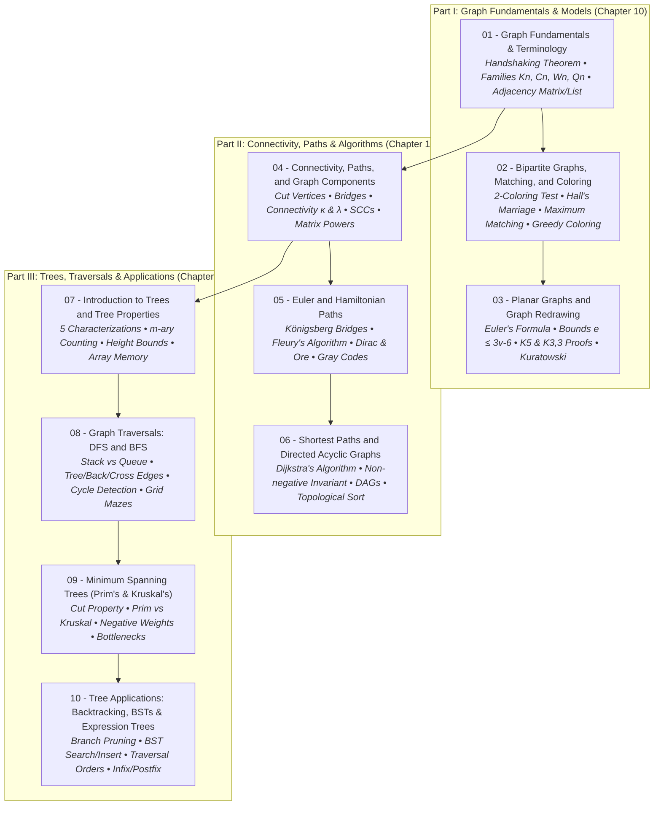

# Graph Theory and Trees — Master Course Index

> [!abstract] Course Knowledge Base & Navigation
> **Course**: Discrete Mathematics (Chapters 10 & 11)  
> **Textbook Style**: Kenneth H. Rosen, *Discrete Mathematics and Its Applications* (8th Edition)  
> **Lectures**: Lecture Notes 17 to 26 (by Mufassir Ahmad Chowdhury, SUST)  
> **Format**: Textbook-grade notes with formal definitions, theorems, vector SVG architecture, worked examples, pseudocode, and interactive self-check quizzes.

## 📊 Course Fast Facts & Visual Assets

> [!summary] Knowledge Base Architecture
> - **10 Exhaustive Topic Modules**: Complete coverage of Graphs (Ch 10) & Trees (Ch 11).
> - **40 Custom Vector SVG Diagrams**: High-resolution topological models, planarity drawings, traversal trees, and data structures.
> - **Kenneth Rosen Style Pseudocode**: Formal `procedure Name(G: graph...)` specifications with loop invariants.
> - **Step-by-Step Execution Traces**: Full state transition tables for Dijkstra, Prim, Kruskal, BFS, DFS, and Expression stacks.
> - **Self-Check Quizzes**: End-of-chapter concept check questions with collapsible textbook explanations.

---

## 🗺️ Curriculum Roadmap & Dependency Graph

---

## 📑 Detailed Module Directory

| Module | Title | Key Topics & Algorithms Covered | Vector SVGs | Source Lectures |
| :---: | :--- | :--- | :---: | :---: |
| **01** | [[01 - Graph Fundamentals & Terminology\|Graph Fundamentals & Terminology]] | Sets definition $G=(V,E)$, Directed vs Undirected, Handshaking Theorem, Degree parity, $K_n, C_n, W_n, Q_n$, Adjacency List vs Matrix | 5 SVGs | Lectures 17, 18 |
| **02** | [[02 - Bipartite Graphs, Matching, and Coloring\|Bipartite Graphs, Matching, and Coloring]] | Bipartition test, Odd cycles, Hall's Marriage Theorem, Maximal vs Maximum matching, Chromatic number $\chi(G)$, Greedy coloring, Exam scheduling | 3 SVGs | Lectures 19, 20 |
| **03** | [[03 - Planar Graphs and Graph Redrawing\|Planar Graphs and Graph Redrawing]] | Planar embeddings, Euler's formula ($v - e + r = 2$), Bounds ($e \le 3v-6$), Non-planarity of $K_5$ & $K_{3,3}$, Kuratowski's theorem | 6 SVGs | Lectures 19, 20 |
| **04** | [[04 - Connectivity, Paths, and Graph Components\|Connectivity, Paths, and Graph Components]] | Paths, Connected components, Cut vertices, Bridges, $\kappa(G) \le \lambda(G) \le \min \deg$, Strongly connected components (SCC), Path counting ($A^r$) | 5 SVGs | Lecture 21 |
| **05** | [[05 - Euler and Hamiltonian Paths\|Euler and Hamiltonian Paths]] | Königsberg bridges, Euler circuit/path theorem, Fleury's algorithm, Hamiltonian paths, Dirac's and Ore's theorems, Gray codes | 3 SVGs | Lecture 22 |
| **06** | [[06 - Shortest Paths and Directed Acyclic Graphs (DAGs)\|Shortest Paths and Directed Acyclic Graphs (DAGs)]] | Weighted graphs, Dijkstra's algorithm (step-by-step trace), Non-negative weights requirement, DAGs, Kahn's topological sort | 3 SVGs | Lecture 22 |
| **07** | [[07 - Introduction to Trees and Tree Properties\|Introduction to Trees and Tree Properties]] | 5 Equivalent tree definitions, Rooted trees, $m$-ary trees, Height & leaf counting formulas ($l \le m^h$), Array & struct representations, Spanning trees | 6 SVGs | Lecture 23 |
| **08** | [[08 - Graph Traversals: DFS and BFS\|Graph Traversals: DFS and BFS]] | Stacks & Queues, Depth-First Search (DFS), Breadth-First Search (BFS), Tree/Back/Cross edges, Cycle detection, Grid puzzle solving | 3 SVGs | Lectures 23, 24 |
| **09** | [[09 - Minimum Spanning Trees (Prim's & Kruskal's)\|Minimum Spanning Trees (Prim's & Kruskal's)]] | Greedy MST, Prim's algorithm, Kruskal's algorithm, Negative weights, Prim vs Dijkstra comparison, Prim vs Kruskal complexity | 2 SVGs | Lecture 25 |
| **10** | [[10 - Tree Applications: Backtracking, BSTs, and Expression Trees\|Tree Applications: Backtracking, BSTs, and Expression Trees]] | Backtracking with pruning, Binary Search Trees (BST), Preorder / Inorder / Postorder traversals, Expression trees (Prefix, Infix, Postfix) | 4 SVGs | Lecture 26 |

## 💡 Note Reading Strategy & Obsidian Features

> [!tip] Best Practices for Studying
> - **Interactive Live Preview**: Click on any diagram to expand vector details.
> - **Self-Testing Mode**: Attempt the concept check questions before revealing the collapsible solutions.
> - **Algorithmic Traces**: Follow the variable execution tables line-by-line while tracing through the SVG diagrams.
