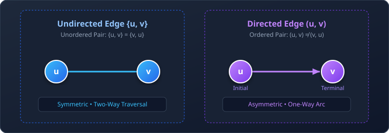
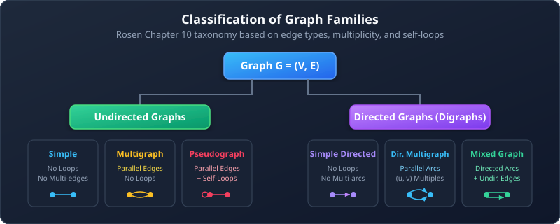
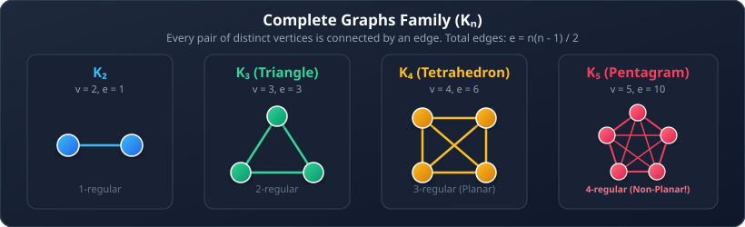
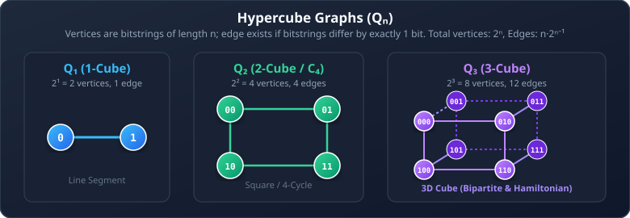
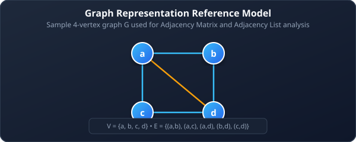

# 01. Graph Fundamentals & Terminology

**Course**: Discrete Mathematics  
**Textbook Reference**: Kenneth H. Rosen, *Discrete Mathematics and Its Applications*, Chapter 10, Sections 10.1–10.3  
**Navigation**: [[00 - Graph Theory & Trees Index|← Master Index]] | [[02 - Bipartite Graphs, Matching, and Coloring|Next: Bipartite Graphs, Matching & Coloring →]]

>[!abstract] Module Objectives
>- Master the formal set-theoretic definitions of undirected and directed graphs.
>- Understand the distinctions among simple graphs, multigraphs, pseudographs, and mixed graphs.
>- Apply the **Handshaking Theorem** and the **Even Odd-Degree Vertex Theorem**.
>- Analyze standard graph families: complete graphs ($K_n$), cycles ($C_n$), wheels ($W_n$), and hypercubes ($Q_n$).
>- Compare computer representations: **Adjacency Lists** vs. **Adjacency Matrices**.

---

## 1. Set-Theoretic Definition of a Graph

A graph is not defined by its visual layout on paper; it is formally defined as a mathematical pair of sets.

>[!note] Definition 1: Graph
>A **graph** $G = (V, E)$ consists of:
>1. $V$: A non-empty set of **vertices** (or **nodes**).
>2. $E$: A set of **edges**. Each edge has either one or two vertices associated with it, called its **endpoints**.

- **Undirected Edge**: An unordered pair $\{u, v\}$, where $\{u, v\} = \{v, u\}$. The connection is symmetric.
- **Directed Edge (Arc)**: An ordered pair $(u, v)$, starting at initial vertex $u$ and ending at terminal vertex $v$. Direction matters strictly: $(u, v) \ne (v, u)$.

## 2. Classification of Graph Types

Graphs are classified based on whether edges have direction, whether multiple edges are allowed between the same pair of vertices, and whether self-loops are permitted.

| Graph Type | Edges | Multiple Edges Allowed? | Loops Allowed? |
| :--- | :--- | :---: | :---: |
| **Simple Graph** | Undirected | No | No |
| **Multigraph** | Undirected | **Yes** | No |
| **Pseudograph** | Undirected | **Yes** | **Yes** |
| **Simple Directed Graph** | Directed | No | No |
| **Directed Multigraph** | Directed | **Yes** | **Yes** |
| **Mixed Graph** | Both directed and undirected | **Yes** | **Yes** |

>[!example] Example 1: Real-World Graph Models
>- **Web Graph**: Directed graph where vertices are web pages and directed edges are hyperlinks ($u \to v$).
>- **Road Map**: Mixed graph where two-way roads are undirected edges and one-way streets are directed edges.
>- **Airline Flight System**: Directed multigraph where multiple flights between cities on the same day represent parallel directed edges.
>- **Call Graph in Software**: Directed graph where vertices represent functions and directed edges represent function invocations.

## 3. Vertex Adjacency, Neighborhood, and Degree

### 3.1 Undirected Graph Terminology
Let $G = (V, E)$ be an undirected graph:
- **Adjacent (Neighbors)**: Two vertices $u$ and $v$ are adjacent if $\{u, v\} \in E$.
- **Incident**: The edge $e = \{u, v\}$ is incident with vertices $u$ and $v$.
- **Neighborhood**: The set of all neighbors of vertex $v$, denoted $N(v)$:
  $$N(v) = \{u \in V \mid \{u, v\} \in E\}$$
- **Neighborhood of a Subset $A \subseteq V$**:
  $$N(A) = \bigcup_{v \in A} N(v)$$

### 3.2 Degree of a Vertex ($\deg(v)$)
The **degree** of a vertex $v$, denoted $\deg(v)$, is the number of edges incident with it.

>[!important] The Self-Loop Rule
>A self-loop at vertex $v$ contributes **$2$** to $\deg(v)$ because the edge departs and returns to the same vertex, touching it twice.
>- **Isolated Vertex**: A vertex with degree $0$ ($\deg(v) = 0$). It connects to no other vertex.
>- **Pendant Vertex**: A vertex with degree $1$ ($\deg(v) = 1$).

## 4. Fundamental Degree Theorems

### 4.1 Theorem 1: The Handshaking Theorem

>[!important] Theorem 1 (The Handshaking Theorem)
>Let $G = (V, E)$ be an undirected graph with $m = |E|$ edges. Then:
>$$2m = \sum_{v \in V} \deg(v)$$

#### Mathematical Rationale:
Every edge has exactly two endpoints. When we sum the degrees of all vertices, every edge is counted exactly once at each of its two endpoints, and thus every edge is counted exactly twice.

>[!tip] Immediate Corollary
>The sum of degrees of all vertices in any undirected graph is **always even**, because $\sum \deg(v) = 2m$.

### 4.2 Theorem 2: Even Number of Odd-Degree Vertices

>[!important] Theorem 2
>An undirected graph has an **even number** of vertices of odd degree.

#### Rosen-Style Formal Proof:
Let $V_1$ be the set of vertices of even degree, and $V_2$ be the set of vertices of odd degree in graph $G = (V, E)$. Then:

$$2m = \sum_{v \in V} \deg(v) = \sum_{v \in V_1} \deg(v) + \sum_{v \in V_2} \deg(v)$$

1. The total sum $2m$ is an **even** integer.
2. The sum $\sum_{v \in V_1} \deg(v)$ is a sum of even integers, so it is **even**.
3. Therefore, the remaining sum over odd-degree vertices must also be **even**:
   $$\sum_{v \in V_2} \deg(v) = 2m - \sum_{v \in V_1} \deg(v) = \text{Even} - \text{Even} = \text{Even}$$
4. In $\sum_{v \in V_2} \deg(v)$, every individual term $\deg(v)$ is an odd integer.
5. The sum of an odd number of odd integers is odd; the sum of an even number of odd integers is even.
6. Consequently, for the sum to be even, the number of terms $|V_2|$ must be **even**. $\blacksquare$

### 4.3 Degrees in Directed Graphs
In a directed graph $G = (V, E)$:
- **In-Degree ($\deg^-(v)$)**: The number of directed edges having $v$ as their terminal vertex (edges pointing **into** $v$).
- **Out-Degree ($\deg^+(v)$)**: The number of directed edges having $v$ as their initial vertex (edges pointing **out of** $v$).
- *A loop at $v$ contributes $1$ to $\deg^-(v)$ and $1$ to $\deg^+(v)$.*

>[!important] Theorem 3 (Directed Handshaking Theorem)
>Let $G = (V, E)$ be a directed graph. Then:
>$$\sum_{v \in V} \deg^-(v) = \sum_{v \in V} \deg^+(v) = |E|$$

## 5. Standard Families of Simple Graphs

### 5.1 Complete Graphs ($K_n$)
A **complete graph** on $n$ vertices, denoted $K_n$, is a simple graph containing exactly one edge between every pair of distinct vertices.

- **Number of Vertices**: $|V| = n$
- **Regularity**: Every vertex has degree $n - 1$ ($K_n$ is $(n-1)$-regular).
- **Number of Edges**:
  $$|E| = \binom{n}{2} = \frac{n(n - 1)}{2}$$

### 5.2 Cycle Graphs ($C_n$)
A **cycle** $C_n$ ($n \ge 3$) consists of $n$ vertices $v_1, v_2, \dots, v_n$ and edges $\{v_1, v_2\}, \{v_2, v_3\}, \dots, \{v_{n-1}, v_n\}, \{v_n, v_1\}$.
- **Number of Vertices**: $|V| = n$
- **Number of Edges**: $|E| = n$
- **Regularity**: Every vertex has degree $2$ ($C_n$ is $2$-regular).

### 5.3 Wheel Graphs ($W_n$)
A **wheel graph** $W_n$ ($n \ge 3$) is obtained by taking a cycle $C_n$ and adding one additional central "hub" vertex connected to every vertex of the cycle.
- **Number of Vertices**: $|V| = n + 1$
- **Number of Edges**:
  $$|E| = n \text{ (rim edges)} + n \text{ (spoke edges)} = 2n$$
- **Degrees**: Hub vertex has degree $n$; every rim vertex has degree $3$.

>[!tip] A Graph Is Not Its Picture
>A graph is defined entirely by its vertex and edge sets, **not by its visual representation**. Any layout that preserves which pairs of vertices are adjacent is a valid depiction of the graph.

### 5.4 $n$-Cubes / Hypercubes ($Q_n$)
The **$n$-dimensional hypercube** $Q_n$ is a graph whose vertices represent the $2^n$ bit strings of length $n$. Two vertices are connected by an edge if and only if their bit strings differ in **exactly one bit position**.

- **Number of Vertices**: $|V| = 2^n$
- **Regularity**: Each bit string can differ in $n$ independent bit positions, so every vertex has degree $n$ ($Q_n$ is $n$-regular).
- **Number of Edges**:
  $$|E| = \frac{n \times 2^n}{2} = n \cdot 2^{n-1}$$

## 6. Computer Representation of Graphs

How do we store graphs in computer memory? Two standard data structures are used:

### 6.1 Adjacency List
An **Adjacency List** associates each vertex in the graph with a list of its neighboring vertices.

| Vertex | Adjacent Vertices |
| :---: | :--- |
| **a** | b, c, d |
| **b** | a, d |
| **c** | a, d |
| **d** | a, b, c |

- **Space Complexity**: $\Theta(|V| + |E|)$.
- **Edge Lookup Time**: $O(\deg(u))$ to check if $\{u, v\} \in E$.
- **Best Suited For**: **Sparse graphs** ($|E| \ll |V|^2$), where storing mostly zeros in a matrix would be wasteful.

### 6.2 Adjacency Matrix
Let $G = (V, E)$ be a simple graph with $n$ vertices ordered as $v_1, v_2, \dots, v_n$. The **Adjacency Matrix** $\mathbf{A} = [a_{ij}]$ is an $n \times n$ matrix where:

$$a_{ij} = \begin{cases} 1 & \text{if } \{v_i, v_j\} \in E \\ 0 & \text{otherwise} \end{cases}$$

For the sample graph above:

$$\mathbf{A} = \begin{pmatrix} 0 & 1 & 1 & 1 \\ 1 & 0 & 0 & 1 \\ 1 & 0 & 0 & 1 \\ 1 & 1 & 1 & 0 \end{pmatrix}$$

>[!important] Key Properties of the Adjacency Matrix
>1. **Symmetry**: For undirected graphs, $\mathbf{A} = \mathbf{A}^T$ (symmetric across the main diagonal: $a_{ij} = a_{ji}$).
>2. **Zero Diagonal**: For simple graphs (no self-loops), all diagonal entries are zero ($a_{ii} = 0$).
>3. **Row Sums**: The sum of entries in row $i$ equals $\deg(v_i)$ (for simple undirected graphs).
>4. **Space Complexity**: $\Theta(|V|^2)$ regardless of the number of edges.
>5. **Edge Lookup Time**: $\Theta(1)$ constant time lookup.
>6. **Best Suited For**: **Dense graphs** ($|E| \approx |V|^2$).

### 6.3 Detailed Comparison: Matrix vs. List

| Criterion | Adjacency List | Adjacency Matrix |
| :--- | :--- | :--- |
| **Memory Space** | $\Theta(V + E)$ (Minimal for sparse) | $\Theta(V^2)$ (Fixed, wastes space if sparse) |
| **Check if $\{u, v\} \in E$** | $O(\deg(u))$ (Must scan list) | $\Theta(1)$ (Instant array index access) |
| **Find All Neighbors of $u$** | $\Theta(\deg(u))$ (Optimal) | $\Theta(V)$ (Must scan entire row) |
| **Add a Vertex** | $O(1)$ | $O(V^2)$ (Requires resizing matrix) |
| **Recommended Regime** | **Sparse Graphs** ($E \ll V^2$) | **Dense Graphs** ($E \approx V^2$) |

---

## 7. Worked Problem Examples

### Problem 1.1: Applying Handshaking to Find Edge Count
**Problem**: How many edges are in a graph with $15$ vertices, each of degree $4$?  
**Solution**:
1. By the Handshaking Theorem:
   $$2m = \sum_{v \in V} \deg(v) = 15 \times 4 = 60$$
2. Solving for $m$:
   $$m = \frac{60}{2} = 30 \text{ edges}$$

### Problem 1.2: Graph Existence via Odd-Degree Parity
**Problem**: Can a simple graph exist having vertices with degrees $3, 3, 3, 2, 2, 1$?  
**Solution**:
1. Count the number of vertices with odd degrees:
   - Degree 3: 3 vertices
   - Degree 1: 1 vertex
   - Total odd-degree vertices $= 3 + 1 = 4$.
2. Since $4$ is an even number, this degree sequence does not violate Theorem 2.
3. Check Handshaking sum:
   $$\sum \deg(v) = 3 + 3 + 3 + 2 + 2 + 1 = 14 \implies 2m = 14 \implies m = 7$$
4. Since the sum is even and odd vertices are even in number, such a graph can exist.

### Problem 1.3: Hypercube Properties
**Problem**: How many vertices and edges are in the 4-dimensional hypercube $Q_4$? What is the degree of each vertex?  
**Solution**:
1. Number of vertices: $|V| = 2^4 = 16$.
2. Regularity: Every vertex has degree $n = 4$.
3. Number of edges:
   $$|E| = n \cdot 2^{n-1} = 4 \cdot 2^{4-1} = 4 \cdot 8 = 32 \text{ edges}$$
   *(Verification via Handshaking: $2m = 16 \times 4 = 64 \implies m = 32$.)*

---

## 6. Self-Check & Concept Verification

> [!question] Concept Check 1: Handshaking Theorem Application
> A connected graph has 20 vertices: 10 vertices have degree 3, 6 vertices have degree 4, and 4 vertices have degree 5. How many edges does the graph have?
> - [ ] 34 edges
> - [ ] 37 edges
> - [ ] 74 edges
> - [ ] Cannot be determined
>
> > [!check]- Solution & Kenneth Rosen Explanation
> > Calculate the degree sum:
> > $$\sum_{v \in V} \deg(v) = (10 \times 3) + (6 \times 4) + (4 \times 5) = 30 + 24 + 20 = 74$$
> > By the Handshaking Theorem ($2m = \sum \deg(v)$):
> > $$2m = 74 \implies m = \frac{74}{2} = 37 \text{ edges}$$
> > **Correct Answer: 37 edges**.

> [!question] Concept Check 2: Hypercube Degrees & Edge Count
> What is the degree of every vertex in the 6-dimensional hypercube $Q_6$, and how many total edges does it contain?
> - [ ] Degree 6, 192 edges
> - [ ] Degree 6, 64 edges
> - [ ] Degree 12, 192 edges
> - [ ] Degree 64, 384 edges
>
> > [!check]- Solution & Kenneth Rosen Explanation
> > For $Q_n$:
> > 1. Total vertices $= 2^n = 2^6 = 64$.
> > 2. Each vertex differs by 1 bit in $n = 6$ positions $\implies$ degree of every vertex is **6**.
> > 3. Total edges $= n \cdot 2^{n-1} = 6 \cdot 2^5 = 6 \times 32 = 192$ edges.
> > **Correct Answer: Degree 6, 192 edges**.
