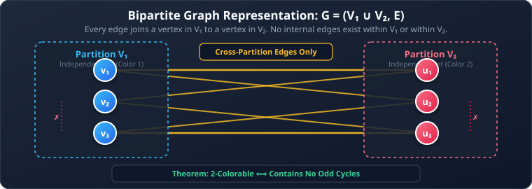
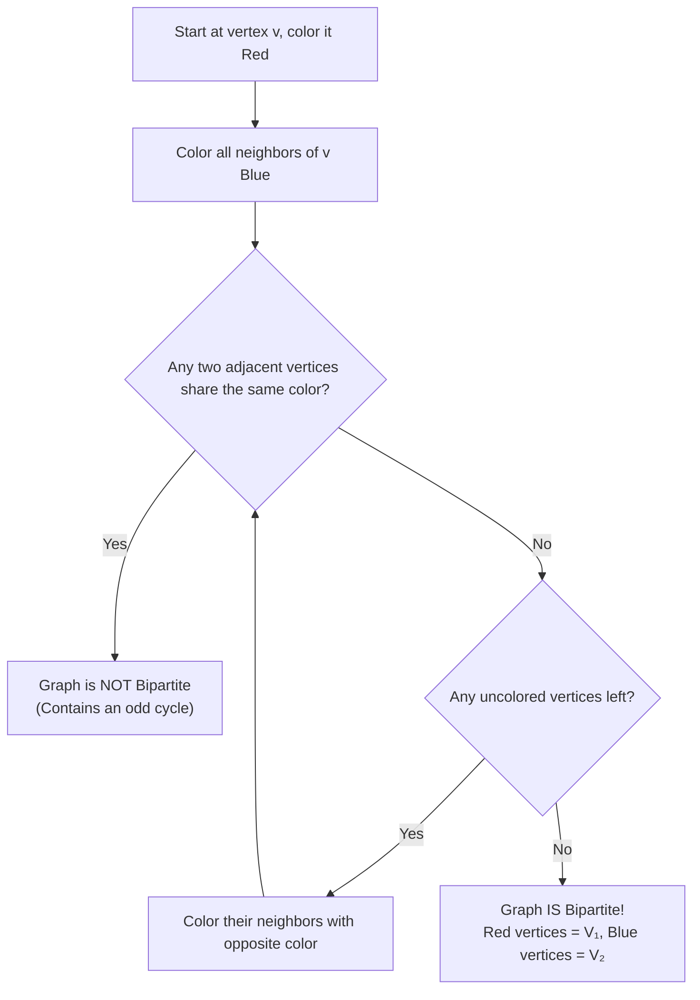
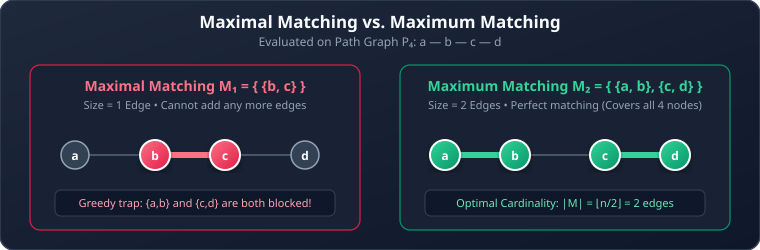
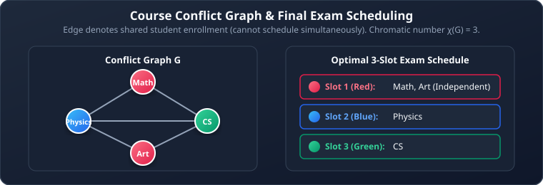

# 02. Bipartite Graphs, Matching, and Coloring

**Course**: Discrete Mathematics  
**Textbook Reference**: Kenneth H. Rosen, *Discrete Mathematics and Its Applications*, Chapter 10, Sections 10.2 & 10.8  
**Navigation**: [[01 - Graph Fundamentals & Terminology|← Prev: Graph Fundamentals]] | [[00 - Graph Theory & Trees Index|Master Index]] | [[03 - Planar Graphs and Graph Redrawing|Next: Planar Graphs →]]

>[!abstract] Module Objectives
>- Master the definition and characterization of **Bipartite Graphs**.
>- Apply the **2-Coloring Test** and understand the **Odd Cycle Criterion**.
>- Understand **Matchings**, differentiate between **Maximal** and **Maximum** matchings, and apply **Hall's Marriage Theorem**.
>- Solve the **Bipartite Friendship Ratio Problem**.
>- Determine the **Chromatic Number** $\chi(G)$ for standard graph families.
>- Implement the **Greedy Coloring Algorithm**, understand its order-dependence, and apply graph coloring to **Exam Scheduling**.

---

## 1. Bipartite Graphs

### 1.1 Formal Definition

>[!note] Definition 1: Bipartite Graph
>A simple graph $G = (V, E)$ is **bipartite** if its vertex set $V$ can be partitioned into two disjoint subsets $V_1$ and $V_2$ such that every edge in $E$ connects a vertex in $V_1$ to a vertex in $V_2$. No edge connects two vertices within the same subset.
>
>The pair $(V_1, V_2)$ is called a **bipartition** of $V$.



### 1.2 The Characterization Theorems

>[!important] Theorem 1: Bipartite $\iff$ 2-Colorable
>A simple graph is bipartite if and only if it is **2-colorable** (its vertices can be colored using at most two colors such that no two adjacent vertices share the same color).

>[!important] Theorem 2: The Odd-Cycle Criterion
>A graph is bipartite if and only if it contains **no simple cycles of odd length**.

#### Why Odd Cycles Break Bipartiteness:
Consider an odd cycle, such as a triangle $C_3$ on vertices $\{1, 2, 3\}$:
1. Color vertex $1$ **Red**.
2. Its neighbor vertex $2$ must be colored **Blue**.
3. Vertex $3$ is adjacent to both $1$ and $2$. Because its neighbors are already Red and Blue, vertex $3$ cannot be assigned either color without causing a conflict!
4. Alternating two colors around an odd cycle always forces the first and last vertices to clash.

### 1.3 The 2-Coloring Test (Bipartition Algorithm)

To determine whether an arbitrary, unorganized graph is bipartite:
1. Choose an arbitrary starting vertex and color it **Color 1 (Red)**.
2. Color all of its uncolored neighbors with **Color 2 (Blue)**.
3. For each newly colored vertex, color its uncolored neighbors with the opposite color.
4. **Outcome**:
   - If an edge is ever encountered connecting two vertices of the **same color**, the algorithm terminates: the graph contains an odd cycle and is **NOT bipartite**.
   - If the entire graph is colored without conflicts, the graph **IS bipartite**, and the two color classes constitute the bipartition $V_1$ and $V_2$.



### 1.4 Complete Bipartite Graphs ($K_{m,n}$)

>[!note] Definition 2: Complete Bipartite Graph ($K_{m,n}$)
>The **complete bipartite graph** $K_{m,n}$ is a graph whose vertex set is partitioned into $V_1$ with $m$ vertices and $V_2$ with $n$ vertices, such that there is an edge between **every** vertex in $V_1$ and **every** vertex in $V_2$.

- **Total Vertices**: $|V| = m + n$
- **Total Edges**: $|E| = m \times n$
- **Special Case**: The utility graph $K_{3,3}$ has $3 + 3 = 6$ vertices and $3 \times 3 = 9$ edges.

## 2. Graph Matching & Applications

### 2.1 Matching Concepts

>[!note] Definition 3: Matching
>A **matching** $M$ in a graph $G = (V, E)$ is a subset of edges such that no two edges in $M$ share a common vertex (no vertex is incident with more than one edge in $M$).

- **Complete Matching from $V_1$ to $V_2$**: A matching where every vertex of $V_1$ is incident with an edge in $M$ (size $|M| = |V_1|$).
- **Perfect Matching**: A matching where every vertex in the entire graph is matched. In a bipartite graph, a perfect matching requires $|V_1| = |V_2|$.
- **Maximal vs. Maximum Matching**:
  - **Maximal Matching**: A matching that cannot be enlarged by adding any remaining edge without violating the matching property (a local dead end).
  - **Maximum Matching**: A matching containing the largest possible number of edges among all matchings in the graph (a global optimum).



### 2.2 Hall's Marriage Theorem

>[!important] Theorem 3: Hall's Marriage Theorem (Hall's Condition)
>Let $G = (V, E)$ be a bipartite graph with bipartition $(V_1, V_2)$. A complete matching from $V_1$ to $V_2$ exists if and only if for every subset $A \subseteq V_1$:
>$$|N(A)| \ge |A|$$
>
>In words: Every group of $k$ vertices in $V_1$ must collectively have at least $k$ neighbors in $V_2$.

>[!example] Example 1: Verifying Hall's Condition
>Suppose 3 job applicants $V_1 = \{p_1, p_2, p_3\}$ qualify for 4 jobs $V_2 = \{j_1, j_2, j_3, j_4\}$ with qualifications:
>- $N(p_1) = \{j_1, j_2\}$
>- $N(p_2) = \{j_2, j_3\}$
>- $N(p_3) = \{j_3, j_4\}$
>
>To verify Hall's Condition, check every non-empty subset of $V_1$:
>- Singletons: $|N(p_1)| = 2 \ge 1$, $|N(p_2)| = 2 \ge 1$, $|N(p_3)| = 2 \ge 1$. (Passed)
>- Pairs:
>  - $N(\{p_1, p_2\}) = \{j_1, j_2, j_3\} \implies |N| = 3 \ge 2$. (Passed)
>  - $N(\{p_2, p_3\}) = \{j_2, j_3, j_4\} \implies |N| = 3 \ge 2$. (Passed)
>  - $N(\{p_1, p_3\}) = \{j_1, j_2, j_3, j_4\} \implies |N| = 4 \ge 2$. (Passed)
>- All 3: $N(\{p_1, p_2, p_3\}) = \{j_1, j_2, j_3, j_4\} \implies |N| = 4 \ge 3$. (Passed)
>
>Since $|N(A)| \ge |A|$ holds for all subsets, a complete matching is guaranteed to exist. A valid matching is:
>$$M = \{\{p_1, j_1\}, \{p_2, j_2\}, \{p_3, j_3\}\}$$

### 2.3 The Bipartite Friendship Ratio Problem

**Problem**: In a group of $M$ male students and $F$ female students, friendships exist only between males and females (forming a bipartite graph). Let:
- $A$ = Average number of female friends per male student.
- $B$ = Average number of male friends per female student.

Determine the ratio $\frac{A}{B}$.

#### Derivation:
Let $E$ be the total number of friendship edges in the bipartite graph:
1. $A = \frac{\text{Total Friendships}}{M} = \frac{|E|}{M}$
2. $B = \frac{\text{Total Friendships}}{F} = \frac{|E|}{F}$
3. Taking the ratio:
   $$\frac{A}{B} = \frac{\frac{|E|}{M}}{\frac{|E|}{F}} = \frac{F}{M} = \frac{\text{Total Female Students}}{\text{Total Male Students}}$$

>[!tip] Elegant Insight
>The ratio $\frac{A}{B}$ depends **only on the population sizes** of the two groups! The specific arrangement of who is friends with whom cancels out completely.

## 3. Graph Coloring & Chromatic Number

### 3.1 Basic Definitions

>[!note] Definition 4: Graph Coloring & Chromatic Number
>- A **proper vertex coloring** of a graph $G$ is an assignment of colors to the vertices such that no two adjacent vertices receive the same color.
>- The **chromatic number** of $G$, denoted $\chi(G)$, is the **minimum number of colors** needed for a proper vertex coloring.

### 3.2 Chromatic Numbers for Standard Graph Families

| Graph Family | Notation | Chromatic Number $\chi(G)$ | Reason |
| :--- | :---: | :---: | :--- |
| **Complete Graph** | $K_n$ | **$n$** | Every pair of vertices is adjacent, so all $n$ vertices require distinct colors. |
| **Complete Bipartite** | $K_{m,n}$ | **$2$** (for $m,n \ge 1$) | Color set $V_1$ Color 1 and set $V_2$ Color 2. |
| **Even Cycle** | $C_{2k}$ | **$2$** | Colors alternate cleanly around the cycle: $1, 2, 1, 2, \dots$ |
| **Odd Cycle** | $C_{2k+1}$ | **$3$** | Alternating 2 colors leaves the last vertex clashing with the first; a 3rd color is required. |
| **Wheel Graph** | $W_n$ | **$3$** (if $n$ is even)<br/>**$4$** (if $n$ is odd) | Rim $C_n$ needs 2 or 3 colors; the hub vertex is connected to all rim vertices and needs a unique color. |
| **Planar Graph** | Any planar $G$ | **$\le 4$** | **Four Color Theorem** (Appel and Haken, 1976). |

### 3.3 The Greedy Coloring Algorithm

Finding the exact chromatic number of a general graph is NP-hard. The **Greedy Coloring Algorithm** provides an efficient heuristic:

```pascal
procedure greedy_coloring(G: simple graph with vertices v1, v2, ..., vn)
    c(v1) := 1
    for i := 2 to n do
    begin
        assigned_colors := { c(vj) | vj is adjacent to vi and j < i }
        k := 1
        while k in assigned_colors do
            k := k + 1
        c(vi) := k
    end
    return c(v1), c(v2), ..., c(vn)
```

>[!warning] Vertex Order Sensitivity
>The greedy algorithm always produces a valid proper coloring, but the total number of colors used can **depend heavily on the order** in which vertices are processed!
>- For a 6-cycle $C_6$ ($\chi(C_6) = 2$):
>  - Ordering in cyclic order $v_1, v_2, v_3, v_4, v_5, v_6$ produces the optimal **$2$-coloring**.
>  - Ordering in crisscross order $v_1, v_4, v_2, v_5, v_3, v_6$ forces the algorithm to use **$3$ colors**!

### 3.4 Application: Exam Scheduling

**Problem**: Construct an exam timetable with the minimum number of time slots such that no student has two exams at the same time.

#### Modeling Procedure:
1. **Vertices**: Represent each academic course as a vertex.
2. **Edges**: Draw an edge between two courses if there is at least one student enrolled in both.
3. **Coloring**: A proper coloring assigns colors (time slots) such that adjacent vertices (conflicting exams) receive different colors.
4. **Minimum Time Slots**: The minimum number of exam periods required is exactly the chromatic number $\chi(G)$.



> [!example] Tracing the Exam Scheduling Graph:
> - **Courses (Vertices)**: Math, Physics, CS, and Art.
> - **Shared Enrollments (Edges)**: Math is adjacent to Physics and CS; Physics is adjacent to CS; Art is adjacent to Physics and CS.
> - **Clique & Chromatic Number**: Since {Math, Physics, CS} forms a triangle ($K_3$), at least 3 distinct time slots are required ($\chi(G) = 3$).
> - **Optimal 3-Slot Timetable**:
>   - **Slot 1 (Red)**: Math, Art (an independent set, non-conflicting).
>   - **Slot 2 (Blue)**: Physics.
>   - **Slot 3 (Green)**: CS.

---

## 4. Worked Problem Examples

### Problem 2.1: Determining if a Graph is Bipartite
**Problem**: Determine whether the cycle graph $C_5$ is bipartite.  
**Solution**:
1. $C_5$ is a cycle of length $5$.
2. Length $5$ is an odd number.
3. By Theorem 2 (Odd-Cycle Criterion), a graph is bipartite if and only if it contains no odd cycles.
4. Since $C_5$ is itself an odd cycle of length 5, it cannot be 2-colored and is **not bipartite**.

### Problem 2.2: Chromatic Number of a Wheel Graph
**Problem**: Find the chromatic number of the wheel graph $W_5$.  
**Solution**:
1. $W_5$ consists of an odd cycle rim $C_5$ plus a central hub vertex $w$.
2. The rim $C_5$ is an odd cycle, requiring $\chi(C_5) = 3$ colors.
3. The central hub vertex $w$ is connected to every single vertex on the rim.
4. Therefore, $w$ cannot share a color with any of the rim vertices.
5. It requires an additional, unique 4th color:
   $$\chi(W_5) = \chi(C_5) + 1 = 3 + 1 = 4$$

### Problem 2.3: Hall's Condition Failure
**Problem**: Let $V_1 = \{a, b, c\}$ and $V_2 = \{x, y\}$. Can a complete matching from $V_1$ to $V_2$ exist?  
**Solution**:
1. Take subset $A = V_1 = \{a, b, c\}$, so $|A| = 3$.
2. The neighborhood $N(A) \subseteq V_2$, so $|N(A)| \le |V_2| = 2$.
3. Here $|N(A)| \le 2 < |A| = 3$, which violates Hall's Condition $|N(A)| \ge |A|$.
4. Therefore, no complete matching from $V_1$ to $V_2$ can exist (Pigeonhole Principle: 3 applicants cannot be matched to 2 jobs without sharing).

---

## 6. Self-Check & Concept Verification

> [!question] Concept Check 1: Bipartite Cycle Criterion
> For which integers $n \ge 3$ is the cycle graph $C_n$ bipartite?
> - [ ] All integers $n \ge 3$
> - [ ] Exactly when $n$ is odd
> - [ ] Exactly when $n$ is even
> - [ ] Never bipartite
>
> > [!check]- Solution & Kenneth Rosen Explanation
> > By Theorem 1, a graph is bipartite if and only if it contains no odd cycles.
> > If $n$ is even (e.g., $C_4, C_6$), alternating colors (Blue, Red, Blue, Red) 2-colors the vertices without conflict.
> > If $n$ is odd (e.g., $C_3, C_5$), the closure edge forces two adjacent vertices to share the same color.
> > **Correct Answer: Exactly when $n$ is even**.

> [!question] Concept Check 2: Chromatic Number of Complete Bipartite Graphs
> What is the chromatic number $\chi(K_{m,n})$ for any $m, n \ge 1$?
> - [ ] $\chi(K_{m,n}) = m + n$
> - [ ] $\chi(K_{m,n}) = \max(m, n)$
> - [ ] $\chi(K_{m,n}) = 2$
> - [ ] $\chi(K_{m,n}) = 1$
>
> > [!check]- Solution & Kenneth Rosen Explanation
> > Any bipartite graph with at least one edge has $\chi(G) = 2$.
> > Color all vertices in the first partition $V_1$ with Color 1, and all vertices in the second partition $V_2$ with Color 2. Since no edges exist within $V_1$ or within $V_2$, this 2-coloring is valid.
> > **Correct Answer: 2**.
