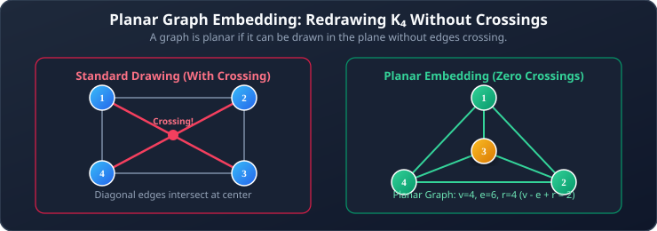
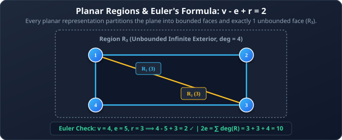
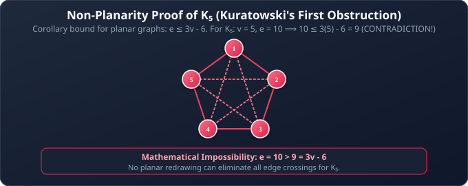
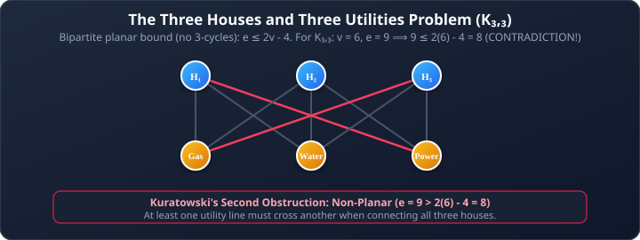
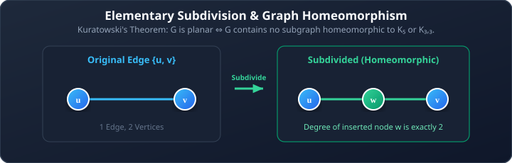
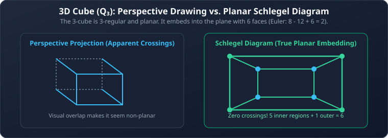

# 03. Planar Graphs and Graph Redrawing

**Course**: Discrete Mathematics  
**Textbook Reference**: Kenneth H. Rosen, *Discrete Mathematics and Its Applications*, Chapter 10, Section 10.7  
**Navigation**: [[02 - Bipartite Graphs, Matching, and Coloring|← Prev: Bipartite Graphs & Coloring]] | [[00 - Graph Theory & Trees Index|Master Index]] | [[04 - Connectivity, Paths, and Graph Components|Next: Connectivity & Paths →]]

>[!abstract] Module Objectives
>- Define **Planar Graphs** and planar representations.
>- Master **Euler's Formula** ($v - e + r = 2$) relating vertices, edges, and regions.
>- Apply the necessary planarity inequalities ($e \le 3v - 6$ and $e \le 2v - 4$).
>- Prove rigorously why $K_5$ and $K_{3,3}$ are non-planar.
>- Understand **Kuratowski's Theorem** and graph subdivisions.
>- Perform planar redrawing using **exterior routing** and **Schlegel diagrams**.

---

## 1. What is a Planar Graph?

>[!note] Definition 1: Planar Graph
>A graph is **planar** if it can be drawn in a single two-dimensional plane such that no two edges intersect or cross each other (except at a shared endpoint).
>
>Such a crossing-free drawing is called a **planar representation** (or **planar embedding**).

>[!important] A Graph is Not Its Drawing
>Planarity is an **intrinsic property of the graph**, not of any single drawing. A graph drawn with crossings is still planar if there exists **some** alternative layout that eliminates all crossings.

## 2. Regions of a Planar Graph

A planar representation of a graph splits the plane into contiguous geometric areas called **regions** (or **faces**).

- **Interior Regions**: The bounded spaces enclosed by edges ($R_1, R_2, R_3$).
- **Exterior Region**: The single unbounded infinite space surrounding the entire graph ($R_4$). Every planar drawing has **exactly one** exterior region.
- **Degree of a Region ($\deg(R)$)**: The number of boundary edges enclosing region $R$.

>[!important] Sum of Region Degrees
>Every boundary edge either borders two distinct regions, or borders the same region on both sides. Therefore, summing the degrees of all regions counts every edge exactly twice:
>$$\sum_{i=1}^{r} \deg(R_i) = 2e$$

## 3. Euler's Formula

>[!important] Theorem 1: Euler's Formula
>Let $G$ be a connected planar simple graph with $v$ vertices, $e$ edges, and $r$ regions. Then:
>
>$$v - e + r = 2 \quad \iff \quad r = e - v + 2$$

>[!example] Example 1: Verifying Euler's Formula on $K_4$
>In the planar drawing of $K_4$:
>- Vertices $v = 4$
>- Edges $e = 6$
>- Regions $r = 4$ (3 interior triangles + 1 unbounded exterior)
>
>Checking the formula:
>$$v - e + r = 4 - 6 + 4 = 2 \quad \text{(Verified!)}$$

## 4. Fundamental Planarity Inequalities

Using Euler's formula, we derive upper bounds on the maximum number of edges a planar graph can support.

### 4.1 General Bound for Simple Planar Graphs

>[!important] Corollary 1: The $3v - 6$ Edge Bound
>If $G$ is a connected planar simple graph with $v \ge 3$ vertices and $e$ edges, then:
>$$e \le 3v - 6$$

#### Formal Derivation:
1. In any simple graph with $v \ge 3$, every region must be bounded by at least $3$ edges ($\deg(R_i) \ge 3$).
2. By the region degree sum:
   $$2e = \sum_{i=1}^{r} \deg(R_i) \ge 3r$$
3. From Euler's formula, $r = e - v + 2$. Substituting this into the inequality:
   $$2e \ge 3(e - v + 2) = 3e - 3v + 6$$
4. Rearranging:
   $$3v - 6 \ge 3e - 2e \implies \mathbf{e \le 3v - 6}$$

### 4.2 Triangle-Free Planar Graphs (Bipartite Bound)

>[!important] Corollary 2: The $2v - 4$ Edge Bound (No Triangles)
>If $G$ is a connected planar simple graph with $v \ge 3$ vertices and **no simple cycles of length 3 (no triangles)**, then:
>$$e \le 2v - 4$$

#### Formal Derivation:
1. Because there are no triangles, every region must be bounded by at least $4$ edges ($\deg(R_i) \ge 4$).
2. Therefore:
   $$2e = \sum_{i=1}^{r} \deg(R_i) \ge 4r = 4(e - v + 2) = 4e - 4v + 8$$
3. Rearranging:
   $$4v - 8 \ge 4e - 2e = 2e \implies \mathbf{e \le 2v - 4}$$

### 4.3 Vertex Degree Bound

>[!important] Corollary 3: Small Degree Vertex
>If $G$ is a connected planar simple graph, then $G$ contains at least one vertex of degree at most $5$:
>$$\exists v \in V \text{ such that } \deg(v) \le 5$$

## 5. Proving Non-Planarity: The Two Obstructions

Any graph that violates the planarity inequalities cannot be planar.

### 5.1 Proof That $K_5$ is Non-Planar

**Theorem**: The complete graph $K_5$ is non-planar.  
**Proof by Contradiction**:
1. For $K_5$:
   $$v = 5$$
   $$e = \binom{5}{2} = \frac{5 \times 4}{2} = 10$$
2. If $K_5$ were planar, it would have to satisfy Corollary 1 ($e \le 3v - 6$):
   $$10 \le 3(5) - 6 = 15 - 6 = 9$$
3. This yields $10 \le 9$, which is **strictly false**!
4. Therefore, $K_5$ cannot be drawn in a plane without crossings. $\blacksquare$

### 5.2 Proof That $K_{3,3}$ is Non-Planar (Three Utilities Problem)

**Theorem**: The complete bipartite utility graph $K_{3,3}$ is non-planar.  
**Proof by Contradiction**:
1. For $K_{3,3}$:
   $$v = 3 + 3 = 6$$
   $$e = 3 \times 3 = 9$$
2. Because $K_{3,3}$ is bipartite, it contains **no odd cycles** (and thus no triangles of length 3).
3. Therefore, if $K_{3,3}$ were planar, it would have to satisfy Corollary 2 ($e \le 2v - 4$):
   $$9 \le 2(6) - 4 = 12 - 4 = 8$$
4. This yields $9 \le 8$, which is **strictly false**!
5. Consequently, $K_{3,3}$ cannot be drawn in a plane without crossings. $\blacksquare$

## 6. Kuratowski's Theorem

Why are $K_5$ and $K_{3,3}$ so famous? Because they are the **only fundamental reasons** any graph fails to be planar!

>[!note] Definition 2: Elementary Subdivision & Homeomorphism
>- An **elementary subdivision** is obtained by taking an edge $\{u, v\}$ and inserting a new vertex $w$ of degree 2 into the edge, replacing $\{u, v\}$ with $\{u, w\}$ and $\{w, v\}$.
>- Two graphs $G_1$ and $G_2$ are **homeomorphic** if they can both be obtained from the same graph by a sequence of elementary subdivisions.

>[!important] Theorem 2: Kuratowski's Theorem (1930)
>A graph is planar if and only if it does not contain a subgraph that is **homeomorphic to (or a subdivision of)** $K_5$ or $K_{3,3}$.

## 7. Planar Redrawing Techniques

### 7.1 Exterior Rerouting
To eliminate crossings in graphs like $K_4$:
1. Identify the crossing edges.
2. Select one crossing edge and redraw it as an arc curving around the **outside boundary** of the exterior region.

### 7.2 Schlegel Diagrams (For 3D Meshes and $Q_3$)
The 3-cube $Q_3$ drawn in standard isometric 3D perspective shows overlapping edges:

- A **Schlegel diagram** projects a 3D polyhedron onto a 2D plane by shrinking one face and nesting it inside the opposite face, connecting corresponding vertices with non-crossing straight lines.

---

## 8. Worked Problem Examples

### Problem 3.1: Finding Number of Regions
**Problem**: A connected planar simple graph has $20$ vertices, each of degree $3$. How many regions does its planar representation divide the plane into?  
**Solution**:
1. Find total edges using the Handshaking Theorem:
   $$2e = \sum \deg(v) = 20 \times 3 = 60 \implies e = 30$$
2. Apply Euler's formula:
   $$r = e - v + 2 = 30 - 20 + 2 = 12 \text{ regions}$$

### Problem 3.2: Testing Planarity via Inequalities
**Problem**: A simple graph has $v = 11$ vertices and $e = 29$ edges. Can this graph be planar?  
**Solution**:
1. Check the necessary planarity condition $e \le 3v - 6$:
   $$3v - 6 = 3(11) - 6 = 33 - 6 = 27$$
2. Compare edge count:
   $$e = 29 > 27$$
3. Since $29 \not\le 27$, the graph violates the planarity inequality and **cannot be planar**.

### Problem 3.3: Bipartite Graph Planarity Test
**Problem**: Can a connected bipartite planar simple graph have $v = 8$ vertices and $e = 13$ edges?  
**Solution**:
1. Since the graph is bipartite, it contains no triangles ($C_3$).
2. It must satisfy the triangle-free bound $e \le 2v - 4$:
   $$2v - 4 = 2(8) - 4 = 16 - 4 = 12$$
3. Here $e = 13 > 12$, violating the inequality.
4. Therefore, no such bipartite planar graph can exist.

---

## 6. Self-Check & Concept Verification

> [!question] Concept Check 1: Euler's Formula Calculation
> A connected planar graph has 10 vertices, and each region is bounded by exactly 3 edges. How many regions and edges does this graph have?
> - [ ] 16 regions, 24 edges
> - [ ] 12 regions, 20 edges
> - [ ] 8 regions, 14 edges
> - [ ] 10 regions, 18 edges
>
> > [!check]- Solution & Kenneth Rosen Explanation
> > Each region has degree 3 $\implies 2e = \sum \deg(R) = 3r \implies r = \frac{2e}{3}$.
> > Substitute into Euler's formula ($v - e + r = 2$):
> > $$10 - e + \frac{2e}{3} = 2 \implies 10 - 2 = e - \frac{2e}{3} \implies 8 = \frac{e}{3} \implies e = 24$$
> > Then $r = \frac{2(24)}{3} = 16$.
> > **Correct Answer: 16 regions, 24 edges**.

> [!question] Concept Check 2: Kuratowski's Theorem
> Which two graphs are the fundamental non-planar obstruction building blocks?
> - [ ] $K_4$ and $K_{3,3}$
> - [ ] $K_5$ and $K_{3,3}$
> - [ ] $K_5$ and $C_5$
> - [ ] $Q_3$ and $W_5$
>
> > [!check]- Solution & Kenneth Rosen Explanation
> > Kuratowski's Theorem states that a graph is planar if and only if it does NOT contain a subgraph that is homeomorphic to (or can be formed by edge subdivisions of) $K_5$ or $K_{3,3}$.
> > **Correct Answer: $K_5$ and $K_{3,3}$**.
