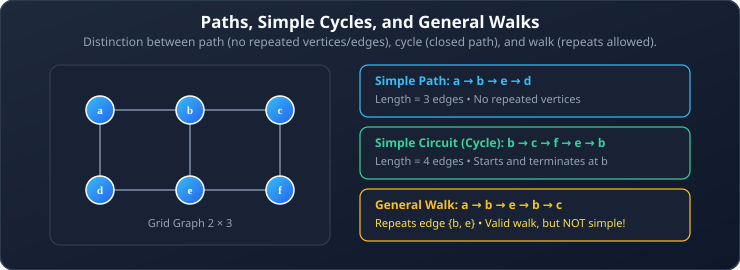
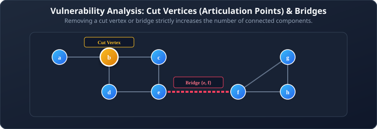
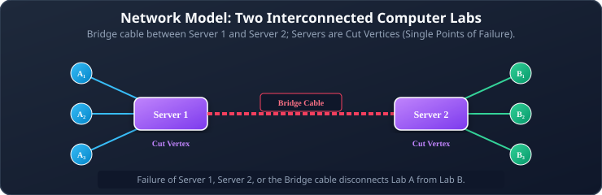
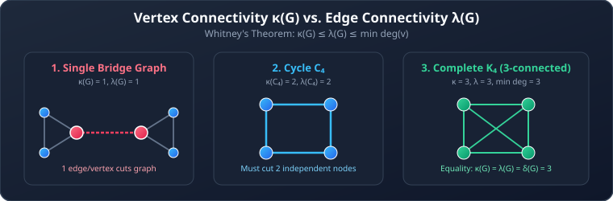
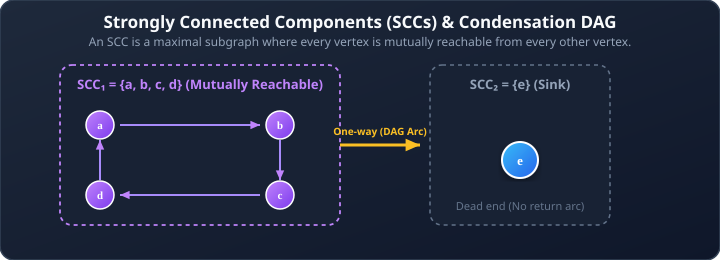

# 04. Connectivity, Paths, and Graph Components

**Course**: Discrete Mathematics  
**Textbook Reference**: Kenneth H. Rosen, *Discrete Mathematics and Its Applications*, Chapter 10, Section 10.4  
**Navigation**: [[03 - Planar Graphs and Graph Redrawing|← Prev: Planar Graphs]] | [[00 - Graph Theory & Trees Index|Master Index]] | [[05 - Euler and Hamiltonian Paths|Next: Euler & Hamiltonian Paths →]]

>[!abstract] Module Objectives
>- Master the formal definitions of **Walks, Paths, Cycles, and Circuits**.
>- Identify **Connected Components**, **Cut Vertices (Articulation Points)**, and **Cut Edges (Bridges)**.
>- Apply quantitative network reliability measures: **Vertex Connectivity ($\kappa$)** and **Edge Connectivity ($\lambda$)**.
>- Analyze directed graph reachability: **Strongly Connected** vs. **Weakly Connected** and **Strongly Connected Components (SCCs)**.
>- Use **Adjacency Matrix Powers ($\mathbf{A}^r$)** to count paths between vertices.

---

## 1. Paths, Circuits, and Connectedness

### 1.1 Formal Path Definitions

>[!note] Definition 1: Path, Circuit, and Simple Path
>Let $n$ be a nonnegative integer and $G$ an undirected graph.
>- **Path**: A sequence of edges $e_1, e_2, \dots, e_n$ of length $n$ such that $e_1 = \{x_0, x_1\}, e_2 = \{x_1, x_2\}, \dots, e_n = \{x_{n-1}, x_n\}$. It begins at initial vertex $x_0$ and ends at terminal vertex $x_n$.
>- **Circuit (Closed Path)**: A path that begins and ends at the same vertex ($x_0 = x_n$).
>- **Simple Path**: A path that contains **no repeated edges**.
>- **Simple Circuit (Cycle)**: A circuit that contains **no repeated edges** (and no repeated vertices except the starting/ending vertex).

### 1.2 Connectedness in Undirected Graphs

>[!note] Definition 2: Connected Graph & Connected Components
>- An undirected graph is **connected** if there is a path between every pair of distinct vertices in the graph. A graph that is not connected is called **disconnected**.
>- A **connected component** is a maximal connected subgraph of $G$. That is, it is a connected piece of $G$ that is not contained in any larger connected subgraph.

## 2. Network Reliability: Cut Vertices and Bridges

In real-world communication and electrical networks, certain nodes and connections represent **single points of failure**.

>[!note] Definition 3: Cut Vertex and Cut Edge
>- **Cut Vertex (Articulation Point)**: A vertex whose removal (along with all edges incident to it) produces a subgraph with **more connected components** than the original graph.
>- **Cut Edge (Bridge)**: An edge whose removal produces a graph with **more connected components** than the original graph.

>[!example] Example 1: The Two Computer Labs Network
>Consider two university computer labs connected together:
>- Lab A has 3 client computers ($A_1, A_2, A_3$) connected in a star topology to Server 1.
>- Lab B has 3 client computers ($B_1, B_2, B_3$) connected in a star topology to Server 2.
>- A single backbone cable connects Server 1 to Server 2.
>
>
> 
>
>
>**Analysis**:
>1. **Cut Vertices**:
>   - **Server 1**: If Server 1 fails, clients $A_1, A_2, A_3$ are stranded and Lab B loses communication with Lab A. (Server 1 is a cut vertex).
>   - **Server 2**: Symmetric reasoning; Server 2 is a cut vertex.
>   - **Clients $A_1, A_2, B_1\dots$**: Removing a client leaf does not disconnect the rest of the network; no client is a cut vertex.
>2. **Bridges**:
>   - The backbone link between Server 1 and Server 2 is a **bridge**.
>   - Every individual cable from a client to its server is also a **bridge** (removing it isolates that client).

## 3. Connectivity Measures ($\kappa$ and $\lambda$)

How resilient is a network to multiple simultaneous failures?

>[!note] Definition 4: Vertex and Edge Connectivity
>- **Vertex Connectivity ($\kappa(G)$)**: The minimum number of vertices that must be removed to disconnect $G$ or reduce it to a single vertex.
>  - A graph is **$k$-connected** if $\kappa(G) \ge k$.
>- **Edge Connectivity ($\lambda(G)$)**: The minimum number of edges that must be removed to disconnect $G$.
>- **Nonseparable Graph**: A connected graph with no cut vertices ($\kappa(G) \ge 2$).

>[!important] Theorem 1: The Fundamental Connectivity Inequality
>For any connected graph $G = (V, E)$:
>$$\kappa(G) \le \lambda(G) \le \min_{v \in V} \deg(v)$$
>
>In words: You can never need more vertex removals than edge removals, and you can never need more edge removals than the smallest vertex degree in the graph!

## 4. Connectivity in Directed Graphs

In directed graphs, connectivity is not symmetric because edges are one-way.

>[!note] Definition 5: Strongly vs. Weakly Connected
>- **Strongly Connected**: A directed graph is strongly connected if there is a directed path from $a$ to $b$ AND from $b$ to $a$ for **every** pair of vertices $a$ and $b$.
>- **Weakly Connected**: A directed graph is weakly connected if there is a path between every pair of vertices in the underlying undirected graph (ignoring edge arrows).
>- **Strongly Connected Component (SCC)**: A maximal strongly connected subgraph.

>[!example] Example 2: Decomposing into Strongly Connected Components
>Consider the digraph with vertices $\{a, b, c, d, e\}$ and directed edges:
>$$b \to c, \quad c \to d, \quad d \to b, \quad d \to e, \quad e \to a, \quad b \to a$$
>
>
> 
>
>
>**Decomposition**:
>1. Vertices $\{b, c, d\}$ form a continuous directed loop ($b \to c \to d \to b$). They can all reach one another $\implies \mathbf{\{b, c, d\}}$ is one SCC.
>2. Vertex $a$ has incoming edges from $b$ and $e$, but **no outgoing edges** at all. Once you enter $a$, you can never leave $\implies \mathbf{\{a\}}$ is a singleton SCC.
>3. Vertex $e$ can reach $a$, but cannot reach back into the $\{b, c, d\}$ loop $\implies \mathbf{\{e\}}$ is a singleton SCC.
>4. **Result**: The graph has **3 SCCs**: $\{b, c, d\}$, $\{a\}$, and $\{e\}$. It is **weakly connected**, but **not strongly connected**.
>
>**How to Make it Strongly Connected**:
>Reverse the two one-way escape edges: change $d \to e$ to $e \to d$, and $e \to a$ to $a \to e$.  
>Now we have a giant return cycle $a \to e \to d \to b \to a$, uniting all five vertices into **1 single SCC**!

## 5. Counting Paths via Powers of the Adjacency Matrix

A remarkable link between linear algebra and graph theory allows us to count paths of any length.

>[!important] Theorem 2: Path Counting Theorem
>Let $\mathbf{A}$ be the adjacency matrix of a simple graph $G$ (with ordered vertices $v_1, v_2, \dots, v_n$).  
>The number of distinct walks of length $r$ from $v_i$ to $v_j$ is equal to the entry in row $i$ and column $j$ of the matrix power $\mathbf{A}^r$:
>
>$$\text{Number of walks of length } r \text{ from } v_i \text{ to } v_j = (\mathbf{A}^r)_{ij}$$

>[!example] Example 3: Finding Paths of Length 2
>Consider the graph on vertices $\{a, b, c, d, e\}$ with adjacency matrix:
>
>$$\mathbf{A} = \begin{pmatrix}
>0 & 1 & 1 & 0 & 1 \\
>1 & 0 & 0 & 0 & 0 \\
>1 & 0 & 0 & 1 & 1 \\
>0 & 0 & 1 & 0 & 1 \\
>1 & 0 & 1 & 1 & 0
>\end{pmatrix}$$
>
>To find how many paths of length $2$ exist from vertex $a$ to vertex $d$, compute row $a$ of $\mathbf{A}$ dotted with column $d$ of $\mathbf{A}$:
>
>$$(\mathbf{A}^2)_{a,d} = \sum_{k=1}^{5} a_{a,k} \cdot a_{k,d}$$
>
>$$(\mathbf{A}^2)_{a,d} = (0)(0) + (1)(0) + (1)(1) + (0)(0) + (1)(1) = 0 + 0 + 1 + 0 + 1 = \mathbf{2}$$
>
>There are **exactly 2 walks of length 2** from $a$ to $d$:
>1. $a \to c \to d$
>2. $a \to e \to d$

---

## 6. Worked Problem Examples

### Problem 4.1: Checking Vertex Connectivity
**Problem**: What is the vertex connectivity $\kappa(C_n)$ and edge connectivity $\lambda(C_n)$ of a cycle graph $C_n$ ($n \ge 4$)?  
**Solution**:
1. Removing any single vertex leaves a simple path of length $n-1$, which remains connected. Removing two non-adjacent vertices disconnects the path into two pieces. Therefore:
   $$\kappa(C_n) = 2$$
2. Removing any single edge leaves a connected spanning path. Removing two edges disconnects the cycle. Therefore:
   $$\lambda(C_n) = 2$$
3. Notice that $\min \deg(v) = 2$, so:
   $$\kappa(C_n) = \lambda(C_n) = \min \deg(v) = 2$$
   The fundamental inequality holds with equality.

### Problem 4.2: Identifying Cut Vertices in a Tree
**Problem**: Let $T$ be a tree with at least 3 vertices. Which vertices of $T$ are cut vertices?  
**Solution**:
1. In any tree, there is a unique simple path between any two vertices.
2. If $v$ is a **leaf (pendant vertex)** of degree 1, removing $v$ does not disconnect any remaining vertices.
3. If $v$ is an **internal vertex** ($\deg(v) \ge 2$), there exist two neighbors $u$ and $w$ whose only path runs through $v$. Removing $v$ disconnects $u$ from $w$.
4. Therefore, **every internal vertex of a tree is a cut vertex**, and no leaf is a cut vertex.

---

## 6. Self-Check & Concept Verification

> [!question] Concept Check 1: Connectivity Inequality Bounds
> For any non-trivial connected graph $G$, what is the relationship between vertex connectivity $\kappa(G)$, edge connectivity $\lambda(G)$, and minimum vertex degree $\delta(G)$?
> - [ ] $\lambda(G) \le \kappa(G) \le \delta(G)$
> - [ ] $\kappa(G) \le \lambda(G) \le \delta(G)$
> - [ ] $\delta(G) \le \kappa(G) \le \lambda(G)$
> - [ ] $\kappa(G) = \lambda(G) = \delta(G)$ always
>
> > [!check]- Solution & Kenneth Rosen Explanation
> > Whitney's Inequality proves:
> > $$\kappa(G) \le \lambda(G) \le \delta(G)$$
> > It is never harder to disconnect a graph by removing edges than by removing vertices, and disconnecting a vertex of minimum degree requires at most $\delta(G)$ edge cuts.
> > **Correct Answer: $\kappa(G) \le \lambda(G) \le \delta(G)$**.

> [!question] Concept Check 2: Counting Walks of Length 3
> How can the number of distinct walks of length $k$ between vertices $v_i$ and $v_j$ in graph $G$ be determined algebraically?
> - [ ] Compute the determinant $\det(\mathbf{A})$
> - [ ] Calculate the entry $(\mathbf{A}^k)_{i,j}$ where $\mathbf{A}$ is the adjacency matrix of $G$
> - [ ] Sum the degrees $\deg(v_i) + \deg(v_j)$
> - [ ] Multiply the Laplacian matrix by $k$
>
> > [!check]- Solution & Kenneth Rosen Explanation
> > By Theorem 2, the $(i, j)$-entry of $\mathbf{A}^k$ counts the exact number of walks of length $k$ from vertex $i$ to vertex $j$.
> > **Correct Answer: Calculate the entry $(\mathbf{A}^k)_{i,j}$**.
