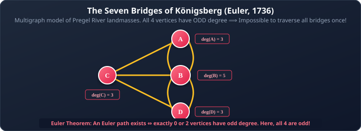
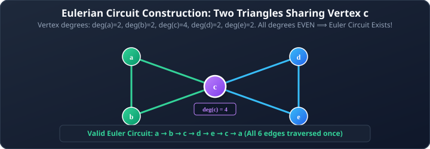
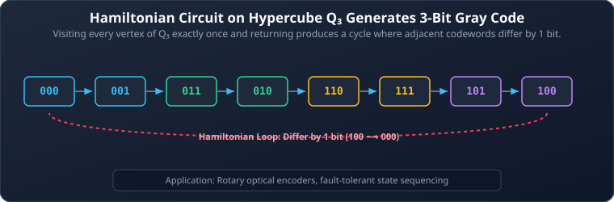

# 05. Euler and Hamiltonian Paths

**Course**: Discrete Mathematics  
**Textbook Reference**: Kenneth H. Rosen, *Discrete Mathematics and Its Applications*, Chapter 10, Section 10.5  
**Navigation**: [[04 - Connectivity, Paths, and Graph Components|← Prev: Connectivity & Paths]] | [[00 - Graph Theory & Trees Index|Master Index]] | [[06 - Shortest Paths and Directed Acyclic Graphs (DAGs)|Next: Shortest Paths & DAGs →]]

>[!abstract] Module Objectives
>- Understand the historical **Seven Bridges of Königsberg** problem.
>- State and apply the necessary and sufficient conditions for **Euler Paths and Euler Circuits**.
>- Trace **Fleury's Algorithm** to construct Euler circuits.
>- Contrast Euler circuits (visiting every **edge**) with Hamiltonian circuits (visiting every **vertex**).
>- Apply **Dirac's Theorem** and **Ore's Theorem** to establish the existence of Hamiltonian circuits.
>- Connect Hamiltonian paths in hypercubes to **Gray Codes** and the **Traveling Salesperson Problem (TSP)**.

---

## 1. Euler Paths and Circuits

The field of graph theory began in 1736 when Swiss mathematician Leonhard Euler solved the famous **Königsberg Bridge Problem**: Can a pedestrian cross all seven bridges over the Pregel River in Königsberg exactly once and return to the starting point?



Euler modeled the land masses as vertices and the bridges as edges. By analyzing the degrees of the vertices, he showed that such a journey was physically impossible!

### 1.1 Formal Definitions

>[!note] Definition 1: Euler Circuit and Euler Path
>Let $G$ be a connected multigraph.
>- An **Euler Circuit** in $G$ is a simple circuit containing **every edge** of $G$ exactly once.
>- An **Euler Path** in $G$ is a simple path containing **every edge** of $G$ exactly once (its starting and ending vertices may be distinct).

### 1.2 Euler's Theorems (Existence Criteria)

>[!important] Theorem 1: Euler Circuit Theorem
>A connected multigraph with at least two vertices has an **Euler Circuit** if and only if **every vertex has an EVEN degree**.

>[!important] Theorem 2: Euler Path Theorem
>A connected multigraph has an **Euler Path (that is not a circuit)** if and only if it has **EXACTLY TWO vertices of ODD degree**.
>
>Any such Euler path must begin at one of the odd-degree vertices and terminate at the other!

#### Why Königsberg Had No Euler Path or Circuit:
In the Königsberg multigraph:
- North Bank (A): $\deg(A) = 3$ (Odd)
- South Bank (D): $\deg(D) = 3$ (Odd)
- West Island (C): $\deg(C) = 3$ (Odd)
- Island (B): $\deg(B) = 5$ (Odd)

All **four** vertices have odd degrees. Since a graph can have at most two odd vertices to admit an Euler path, crossing each bridge exactly once is impossible!

### 1.3 Constructing an Euler Circuit: Fleury's Algorithm

Fleury's Algorithm provides a systematic method to trace out an Euler path or circuit:

```pascal
procedure Fleury(G: connected multigraph with valid degree conditions)
    if G has two odd-degree vertices then
        start := one of the odd vertices
    else
        start := any arbitrary vertex

    walk := [start]
    current := start

    while unused edges remain incident to current do
    begin
        pick an unused edge {current, v} such that {current, v} is NOT a bridge 
        of the remaining unused-edge subgraph (unless no other choice exists)

        traverse edge {current, v} and mark it used
        current := v
        append current to walk
    end
    return walk
```

>[!tip] The Golden Rule of Fleury's Algorithm
>**"Never cross a bridge unless there is no alternative!"**  
>Traversing a cut edge prematurely burns your only bridge back, leaving remaining edges stranded on the other side.



## 2. Hamiltonian Paths and Circuits

While Euler's problem focuses on traversing every **edge**, Sir William Rowan Hamilton formulated a problem focusing on visiting every **vertex**.

>[!note] Definition 2: Hamiltonian Circuit and Hamiltonian Path
>Let $G$ be a graph.
>- A **Hamiltonian Circuit** is a simple circuit in $G$ that passes through **every vertex** of $G$ exactly once (except for the initial vertex, which is also the terminal vertex).
>- A **Hamiltonian Path** is a simple path in $G$ that passes through **every vertex** of $G$ exactly once.

### 2.3 The Fundamental Computational Contrast

| Property | Euler Path / Circuit | Hamiltonian Path / Circuit |
| :--- | :--- | :--- |
| **Object Visited** | Visits every **EDGE** exactly once | Visits every **VERTEX** exactly once |
| **Characterization** | Simple necessary & sufficient degree condition ($\text{odd} = 0$ or $2$) | **No known simple characterization** |
| **Computational Complexity** | **Polynomial Time**: $O(|E|)$ (Very easy) | **NP-Complete**: Exponential in worst case |

## 3. Sufficient Conditions for Hamiltonian Circuits

Unlike Euler circuits, there is no simple "if and only if" condition for Hamiltonian circuits. However, mathematicians have developed powerful **sufficient conditions**: if the graph is sufficiently dense with edges, a Hamiltonian circuit is guaranteed.

### 3.1 Dirac's Theorem

>[!important] Theorem 3: Dirac's Theorem (1952)
>If $G$ is a simple graph with $n \ge 3$ vertices such that the degree of every vertex is at least $\frac{n}{2}$:
>$$\deg(v) \ge \frac{n}{2} \quad \text{for all } v \in V$$
>then $G$ contains a Hamiltonian circuit.

### 3.2 Ore's Theorem

Ore's theorem is a generalization that relaxes Dirac's condition to pairs of non-adjacent vertices.

>[!important] Theorem 4: Ore's Theorem (1960)
>If $G$ is a simple graph with $n \ge 3$ vertices such that for every pair of non-adjacent vertices $u$ and $v$:
>$$\deg(u) + \deg(v) \ge n$$
>then $G$ contains a Hamiltonian circuit.

>[!caution] Sufficient vs. Necessary
>Dirac's and Ore's theorems are **sufficient**, but **NOT necessary**!  
>For example, the cycle graph $C_6$ has $n = 6$ vertices, each of degree $2$. Here $\deg(v) = 2 < \frac{6}{2} = 3$, so it fails Dirac's and Ore's tests. Yet $C_6$ is obviously a Hamiltonian circuit!

## 4. Real-World Applications

### 4.1 Gray Codes and Hypercube Circuits
An **$n$-bit Gray Code** is an ordered sequence of all $2^n$ bit strings of length $n$ such that consecutive strings differ in **exactly one bit position**.
- By Definition, two vertices in the hypercube $Q_n$ are adjacent if and only if their bit strings differ in exactly one bit.
- Therefore, a **Hamiltonian circuit in the hypercube $Q_n$** is mathematically identical to an $n$-bit Gray code!



### 4.2 The Traveling Salesperson Problem (TSP)
Given a complete weighted graph of $n$ cities and the travel costs between them:
- **Goal**: Find a Hamiltonian circuit of **minimum total weight**.
- **Brute Force Cost**: $(n - 1)! / 2$ possible circuits. For $n = 30$, this is over $10^{30}$ calculations, making efficient approximation algorithms essential.

---

## 5. Worked Problem Examples

### Problem 5.1: Identifying Euler Circuits vs. Paths
**Problem**: Determine whether the graph $K_4$ has an Euler circuit, an Euler path, or neither.  
**Solution**:
1. In $K_4$, there are $n = 4$ vertices.
2. Every vertex in $K_4$ has degree $n - 1 = 3$.
3. All 4 vertices have **odd** degrees.
4. An Euler circuit requires 0 odd vertices; an Euler path requires exactly 2 odd vertices.
5. Since $K_4$ has 4 odd vertices, it has **neither an Euler circuit nor an Euler path**.

### Problem 5.2: Applying Dirac's Theorem
**Problem**: A simple graph has $7$ vertices. What is the minimum degree each vertex must have to guarantee a Hamiltonian circuit by Dirac's theorem?  
**Solution**:
1. By Dirac's theorem, we require:
   $$\deg(v) \ge \frac{n}{2} = \frac{7}{2} = 3.5$$
2. Since vertex degrees must be integers, each vertex must have:
   $$\deg(v) \ge \lceil 3.5 \rceil = 4$$

---

## 6. Self-Check & Concept Verification

> [!question] Concept Check 1: Euler Circuit vs. Path Degree Criteria
> A connected graph has exactly 2 vertices of odd degree and 8 vertices of even degree. Which of the following statements is TRUE?
> - [ ] The graph contains an Euler circuit.
> - [ ] The graph contains an Euler path but NOT an Euler circuit.
> - [ ] The graph contains neither an Euler path nor an Euler circuit.
> - [ ] The graph is guaranteed to have a Hamiltonian circuit.
>
> > [!check]- Solution & Kenneth Rosen Explanation
> > By Euler's Theorem:
> > - An Euler **circuit** exists $\iff$ all vertices have even degree.
> > - An Euler **path** (open trail) exists $\iff$ exactly 2 vertices have odd degree.
> > The path must begin at one odd-degree vertex and terminate at the other.
> > **Correct Answer: Contains an Euler path but NOT an Euler circuit**.

> [!question] Concept Check 2: Dirac's Theorem for Hamiltonian Circuits
> Dirac's Theorem guarantees that a simple graph with $n \ge 3$ vertices has a Hamiltonian circuit if:
> - [ ] $\deg(v) \ge \frac{n}{2}$ for every vertex $v$
> - [ ] $\deg(u) + \deg(v) \ge n$ for every pair of non-adjacent vertices
> - [ ] The graph has no cut vertices
> - [ ] The graph is bipartite
>
> > [!check]- Solution & Kenneth Rosen Explanation
> > Dirac's condition states $\deg(v) \ge n/2$ for all $v \in V$. (Ore's Theorem is the more general condition $\deg(u) + \deg(v) \ge n$ for non-adjacent pairs).
> > **Correct Answer: $\deg(v) \ge \frac{n}{2}$ for every vertex $v$**.
