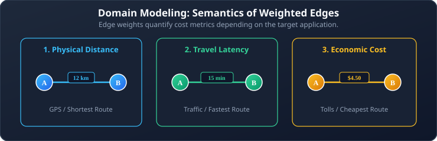
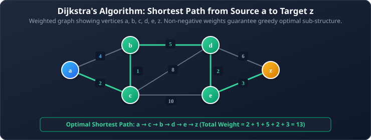
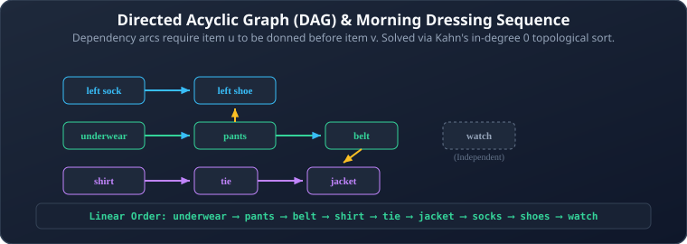

# 06. Shortest Paths and Directed Acyclic Graphs (DAGs)

**Course**: Discrete Mathematics  
**Textbook Reference**: Kenneth H. Rosen, *Discrete Mathematics and Its Applications*, Chapter 10, Section 10.6  
**Navigation**: [[05 - Euler and Hamiltonian Paths|← Prev: Euler & Hamiltonian Paths]] | [[00 - Graph Theory & Trees Index|Master Index]] | [[07 - Introduction to Trees and Tree Properties|Next: Trees & Properties →]]

>[!abstract] Module Objectives
>- Model optimization problems using **Weighted Graphs**.
>- Master **Dijkstra's Algorithm** for the Single-Source Shortest Path problem.
>- Understand the greedy invariant and why Dijkstra strictly requires **non-negative edge weights**.
>- Formulate **Directed Acyclic Graphs (DAGs)**.
>- Implement **Topological Sorting** using Kahn's in-degree reduction algorithm.

---

## 1. Weighted Graphs

In many real-world systems, edges are not merely present or absent; each edge carries a numerical value representing a cost, capacity, or physical quantity.



>[!note] Definition 1: Weighted Graph
>A **weighted graph** is a graph $G = (V, E)$ together with a weight function $w: E \to \mathbb{R}$ that assigns a real number $w(e)$ to each edge $e \in E$.
>
>The **length (weight)** of a path $P = e_1, e_2, \dots, e_k$ is the sum of the weights of its edges:
>$$w(P) = \sum_{i=1}^{k} w(e_i)$$

## 2. Dijkstra's Shortest Path Algorithm

Given a weighted graph with **non-negative weights**, Dijkstra's algorithm finds the shortest path from a specified start vertex $a$ to a destination vertex $z$ (or to all other vertices).

### 2.1 Formal Algorithm in Rosen Pseudocode

```pascal
procedure Dijkstra(G: weighted connected simple graph, with all weights positive)
    {G has vertices a = v0, v1, ..., vn = z and lengths w(vi, vj) 
     where w(vi, vj) = infinity if {vi, vj} is not an edge in G}

    for i := 1 to n do
        L(vi) := infinity
    L(a) := 0
    S := empty_set
    {Labels are initialized: L(a) = 0 and all other labels are infinity. S is empty}

    while z not in S do
    begin
        u := a vertex not in S with L(u) minimal
        S := S union {u}

        for all vertices v not in S do
            if L(u) + w(u, v) < L(v) then
                L(v) := L(u) + w(u, v)
        {Adds vertex u with minimal label to S and relaxes the labels of its neighbors}
    end
    return L(z) {L(z) is the length of a shortest path from a to z}
```

### 2.2 Why Does Dijkstra Always Pick the Minimum Label?

>[!important] The Greedy Invariant
>At each step, Dijkstra selects the vertex $u \notin S$ with the **smallest current label** $L(u)$ and adds it to the settled set $S$.
>
>Why is $L(u)$ guaranteed to be final?
>Because **all edge weights are non-negative** ($w \ge 0$). Any alternative path from $a$ to $u$ would have to leave the settled set $S$ through some other unsettled vertex $x$. But every unsettled vertex already has $L(x) \ge L(u)$ (otherwise $x$ would have been picked instead of $u$). Because future edges can only add positive cost, no path detouring through $x$ can ever beat $L(u)$!

>[!danger] Why Dijkstra Fails with Negative Weights
>If an edge could have a negative weight ($w < 0$), a detour through an unsettled vertex $x$ could traverse that negative edge later and end up with a smaller total distance, breaking the greedy assumption!

### 2.3 Complete Step-by-Step Trace of Dijkstra's Algorithm

**Problem**: Find the shortest path from vertex $a$ to vertex $z$ in the graph with vertices $\{a, b, c, d, e, z\}$ and edge weights:
- $\{a, c\} = 2, \quad \{a, b\} = 4, \quad \{b, c\} = 1$
- $\{b, d\} = 5, \quad \{c, e\} = 10, \quad \{c, d\} = 8$
- $\{d, e\} = 2, \quad \{d, z\} = 6, \quad \{e, z\} = 3$



#### Execution Trace Table:

| Step | Current Settled $u$ | $L(u)$ | Settled Set $S$ | $L(a)$ | $L(b)$ | $L(c)$ | $L(d)$ | $L(e)$ | $L(z)$ | Updated Distances |
| :---: | :---: | :---: | :---: | :---: | :---: | :---: | :---: | :---: | :---: | :--- |
| **0** | — | — | $\emptyset$ | **0** | $\infty$ | $\infty$ | $\infty$ | $\infty$ | $\infty$ | Initialization |
| **1** | **$a$** | 0 | $\{a\}$ | 0 | 4 | 2 | $\infty$ | $\infty$ | $\infty$ | $L(c)=\min(\infty, 0+2)=2$, $L(b)=\min(\infty, 0+4)=4$ |
| **2** | **$c$** | 2 | $\{a, c\}$ | 0 | **3** | 2 | 10 | 12 | $\infty$ | $L(b)=\min(4, 2+1)=\mathbf{3}$, $L(d)=2+8=10$, $L(e)=2+10=12$ |
| **3** | **$b$** | 3 | $\{a, c, b\}$ | 0 | 3 | 2 | **8** | 12 | $\infty$ | $L(d)=\min(10, 3+5)=\mathbf{8}$ |
| **4** | **$d$** | 8 | $\{a, c, b, d\}$ | 0 | 3 | 2 | 8 | **10** | 14 | $L(e)=\min(12, 8+2)=\mathbf{10}$, $L(z)=\min(\infty, 8+6)=14$ |
| **5** | **$e$** | 10 | $\{a, c, b, d, e\}$ | 0 | 3 | 2 | 8 | 10 | **13** | $L(z)=\min(14, 10+3)=\mathbf{13}$ |
| **6** | **$z$** | 13 | $\{a, c, b, d, e, z\}$| 0 | 3 | 2 | 8 | 10 | **13** | Destination $z$ settled! |

- **Shortest Path Length**: $L(z) = 13$
- **Reconstructed Shortest Path**: $a \to c \to b \to d \to e \to z$
  - Weights: $2 + 1 + 5 + 2 + 3 = 13$.

### 2.4 Time Complexity of Dijkstra's Algorithm
- **Using an Array**: At each of the $V$ steps, scanning to find the minimum label takes $O(V)$, leading to a total time of $\mathbf{O(V^2)}$. This is optimal for **dense graphs** ($E \approx V^2$).
- **Using a Min-Heap (Priority Queue)**: Extracting the minimum takes $O(\log V)$, and relaxing an edge takes $O(\log V)$, giving $\mathbf{O((V + E) \log V)}$. This is optimal for **sparse graphs** ($E \ll V^2$).

## 3. Directed Acyclic Graphs (DAGs) & Topological Sorting

### 3.1 What is a DAG?

>[!note] Definition 2: Directed Acyclic Graph (DAG)
>A **Directed Acyclic Graph (DAG)** is a directed graph that contains **no directed cycles**.

DAGs are the standard mathematical model for **dependency graphs**, prerequisites, compilation pipelines, and project task scheduling.

### 3.2 Topological Ordering

>[!note] Definition 3: Topological Sort
>A **topological sort** of a DAG $G = (V, E)$ is a linear ordering of its vertices $v_1, v_2, \dots, v_n$ such that for every directed edge $(u, v) \in E$, vertex $u$ comes **before** vertex $v$ in the ordering ($u < v$).

>[!important] Theorem 1: Existence of Topological Ordering
>A directed graph has a topological sort **if and only if it is a DAG** (contains no directed cycles).

### 3.3 Kahn's Algorithm (In-Degree Reduction)

The standard procedure to compute a topological sort uses vertex in-degrees:

```pascal
procedure TopologicalSort(G: directed acyclic graph)
    compute in-degree deg-(v) for all v in V
    Q := queue containing all vertices with deg-(v) = 0
    L := empty list

    while Q is not empty do
    begin
        u := dequeue(Q)
        append u to L

        for each outgoing edge (u, v) do
        begin
            deg-(v) := deg-(v) - 1
            if deg-(v) = 0 then
                enqueue(Q, v)
        end
    end

    if length(L) < |V| then
        error "Graph contains a cycle! No topological sort exists."
    return L
```

### 3.4 Worked Example: Getting Dressed in the Morning

Consider the dependencies involved in getting dressed before going to class:



#### Kahn's Algorithm Step-by-Step Trace:
1. **Initial in-degrees**:
   - $\deg^-(\text{left sock}) = 0$, $\deg^-(\text{pants}) = 0$, $\deg^-(\text{shirt}) = 0$, $\deg^-(\text{hat}) = 0$.
   - Enqueue all four in-degree 0 items: `Q = [left sock, pants, shirt, hat]`.
2. **Dequeue `left sock`**:
   - Output: `[left sock]`
   - Decrement in-degree of `left shoe` (now 0 $\implies$ enqueue `left shoe`).
3. **Dequeue `pants`**:
   - Output: `[left sock, pants]`
   - Decrement `right sock` (now 0 $\implies$ enqueue `right sock`).
   - Decrement `belt` (now 0 $\implies$ enqueue `belt`).
4. **Dequeue `shirt`**:
   - Output: `[left sock, pants, shirt]`
   - Decrement `jacket`.
5. **Dequeue `hat`**:
   - Output: `[left sock, pants, shirt, hat]` (no outgoing edges).
6. **Continue processing queue**:
   - Dequeue `right sock` $\implies$ decrements `right shoe`.
   - Dequeue `left shoe`.
   - Dequeue `right shoe`.
   - Dequeue `belt` $\implies$ `jacket` becomes 0 (enqueue `jacket`).
   - Dequeue `jacket` $\implies$ `scarf` becomes 0 (enqueue `scarf`).
   - Dequeue `scarf`.

**Final Valid Topological Order**:  
`left sock → pants → shirt → hat → right sock → left shoe → right shoe → belt → jacket → scarf`.  
Every single prerequisite is satisfied before the dependent item is worn!

---

## 6. Self-Check & Concept Verification

> [!question] Concept Check 1: Dijkstra's Non-Negative Weight Precondition
> Why does Dijkstra's algorithm fail to guarantee the shortest path when edges have negative weights?
> - [ ] The algorithm encounters an infinite recursion loop.
> - [ ] Once a vertex is finalized in set $S$, Dijkstra never revisits or decreases its distance estimate, which negative edges could invalidate.
> - [ ] It causes division by zero during relaxation.
> - [ ] The adjacency matrix becomes non-invertible.
>
> > [!check]- Solution & Kenneth Rosen Explanation
> > Dijkstra's greedy invariant relies on the property that paths only increase in cost as more edges are traversed. If negative edge weights exist, an already "finalized" vertex could have its true distance lowered by taking a longer detour through a negative edge. (Use the Bellman-Ford algorithm for negative weights).
> > **Correct Answer: Finalized vertices in set S are never reconsidered**.

> [!question] Concept Check 2: Topological Sorting Condition
> A directed graph $G$ admits a topological sorting if and only if:
> - [ ] $G$ is strongly connected.
> - [ ] $G$ is a Directed Acyclic Graph (DAG).
> - [ ] $G$ has an Euler circuit.
> - [ ] $G$ is a complete tournament.
>
> > [!check]- Solution & Kenneth Rosen Explanation
> > A directed cycle makes a topological ordering impossible because every vertex in the cycle would have to precede itself in the linear order.
> > **Correct Answer: G is a Directed Acyclic Graph (DAG)**.
