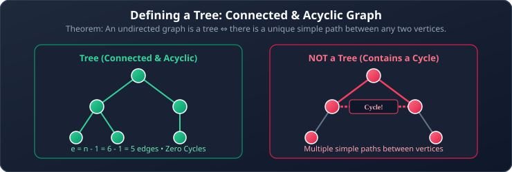
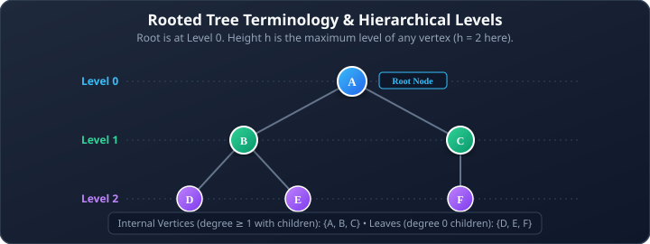
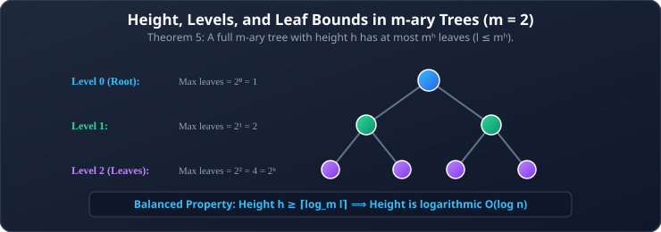
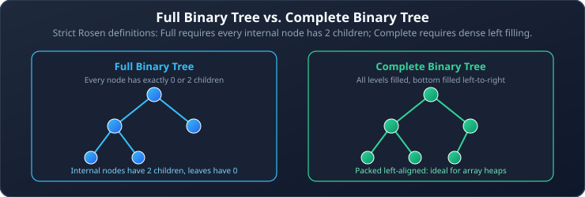
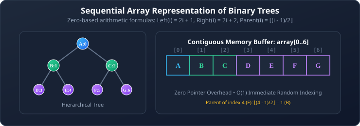
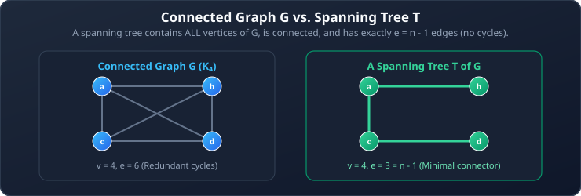

# 07. Introduction to Trees and Tree Properties

**Course**: Discrete Mathematics  
**Textbook Reference**: Kenneth H. Rosen, *Discrete Mathematics and Its Applications*, Chapter 11, Section 11.1  
**Navigation**: [[06 - Shortest Paths and Directed Acyclic Graphs (DAGs)|← Prev: Shortest Paths & DAGs]] | [[00 - Graph Theory & Trees Index|Master Index]] | [[08 - Graph Traversals: DFS and BFS|Next: Graph Traversals (DFS & BFS) →]]

>[!abstract] Module Objectives
>- Master the formal definition of **Trees** and the **5 Equivalent Characterizations**.
>- Understand **Rooted Trees** and their hierarchical vocabulary (parent, child, ancestor, descendant, leaf).
>- Derive mathematical relationships between vertices ($n$), internal vertices ($i$), leaves ($l$), and arity ($m$) in **$m$-ary Trees**.
>- Calculate tree **Height ($h$)** and apply the bound $l \le m^h$.
>- Contrast **Full** vs. **Complete** binary trees.
>- Implement tree data structures via **Sequential Array Storage** and **C Struct Pointers**.
>- Define **Spanning Trees**.

---

## 1. What is a Tree?

>[!note] Definition 1: Tree and Forest
>- A **tree** is a connected undirected graph that contains **no simple circuits** (an acyclic connected graph).
>- A **forest** is an undirected graph with no simple circuits. Each connected component of a forest is a tree.



### 1.1 The Five Equivalent Characterizations of a Tree

>[!important] Theorem 1: Equivalent Tree Characterizations
>Let $G = (V, E)$ be an undirected graph with $n = |V|$ vertices. The following five statements are **mathematically equivalent**:
>1. $G$ is a **tree** ($G$ is connected and has no simple circuits).
>2. $G$ has no simple circuits and has **$n - 1$ edges** ($e = n - 1$).
>3. $G$ is connected and has **$n - 1$ edges** ($e = n - 1$).
>4. There is a **unique simple path** between every pair of vertices in $G$.
>5. Adding any single new edge between non-adjacent vertices creates **exactly one simple circuit**.

>[!tip] Why $e = n - 1$ Always Holds
>Every tree with $n$ vertices has exactly $n - 1$ edges. If an $n$-vertex graph has fewer than $n-1$ edges, it must be disconnected; if it has more than $n-1$ edges, it must contain a cycle!

## 2. Rooted Trees and Hierarchy

In computer science, trees are almost always viewed hierarchically with a designated top node called the **root**.

>[!note] Definition 2: Rooted Tree
>A **rooted tree** is a tree in which one vertex has been designated as the **root** and every edge is directed away from the root.



### 2.1 Rooted Tree Vocabulary
For any vertex $v$ in a rooted tree:
- **Parent**: The unique vertex $u$ with a directed edge from $u$ to $v$. (The root has no parent).
- **Child**: Any vertex $w$ such that $v$ is the parent of $w$.
- **Siblings**: Vertices that share the exact same parent (e.g., $D$ and $E$).
- **Ancestors**: All vertices on the unique path from the root down to $v$, including the root.
- **Descendants**: All vertices that have $v$ as an ancestor.
- **Leaf (External Vertex)**: A vertex with **no children** ($\deg^+(v) = 0$).
- **Internal Vertex**: A vertex that has **at least one child**.
- **Subtree rooted at $v$**: The subgraph consisting of $v$, all its descendants, and all incident edges connecting them.

## 3. $m$-ary Trees

>[!note] Definition 3: $m$-ary Tree and Full $m$-ary Tree
>- An **$m$-ary tree** is a rooted tree where every internal vertex has **at most $m$ children**.
>- A **full $m$-ary tree** is a rooted tree where every internal vertex has **exactly $m$ children**.
>- An $m$-ary tree with $m = 2$ is called a **binary tree** (children are distinguished as the **left child** and **right child**).

### 3.1 Formulas for Full $m$-ary Trees

Let $T$ be a full $m$-ary tree with:
- $n$ = total number of vertices
- $i$ = number of internal vertices
- $l$ = number of leaves

>[!important] Theorem 2: Master Counting Relations for Full $m$-ary Trees
>1. **Total Vertices from Internal Vertices**:
>   Each of the $i$ internal vertices produces exactly $m$ children, plus the single root:
>   $$n = m \cdot i + 1$$
>2. **Partitioning Total Vertices**:
>   Every vertex is either an internal vertex or a leaf:
>   $$n = i + l$$
>3. **Leaves in Terms of Internal Vertices**:
>   $$l = (m - 1)i + 1$$
>4. **Internal Vertices in Terms of Leaves or Total Vertices**:
>   $$i = \frac{l - 1}{m - 1} = \frac{n - 1}{m}$$

## 4. Tree Height and Balanced Trees

- **Level of vertex $v$**: The length of the unique path from the root to $v$. The root is at level $0$.
- **Height ($h$)**: The maximum level of any vertex in the tree (the length of the longest path from the root to any leaf).



### 4.1 Leaf-Count Bounds and Height Limits

>[!important] Theorem 3: Leaf-Count Bound
>In an $m$-ary tree of height $h$, the number of leaves satisfies:
>$$l \le m^h$$

#### Taking Logarithms for Minimum Height:
$$\log_m(l) \le h \implies \mathbf{h \ge \lceil \log_m(l) \rceil}$$

>[!note] Definition 4: Balanced Tree
>A rooted $m$-ary tree of height $h$ is **balanced** if all its leaves are at levels $h$ or $h - 1$.
>
>Balanced trees achieve the minimum possible height $h = \lceil \log_m(n) \rceil$, ensuring $O(\log n)$ search and retrieval times in algorithms.

### 4.2 Full vs. Complete Binary Trees



- **Full Binary Tree**: Every internal vertex has **exactly two children**. No vertex has only one child.
- **Complete Binary Tree**: Every level, except possibly the last, is completely filled, and all vertices in the last level are positioned **as far left as possible**.

## 5. Computer Representations of Trees

### 5.1 Sequential Array Representation (For Complete Trees)
Complete binary trees can be stored in a contiguous array with **zero pointer overhead**:



For any node stored at array index $i$ (using 0-based indexing):
- **Left Child**: $\text{Index} = 2i + 1$
- **Right Child**: $\text{Index} = 2i + 2$
- **Parent**: $\text{Index} = \lfloor \frac{i - 1}{2} \rfloor$

### 5.2 Dynamic Pointer Representation in C (Linked Nodes)
For general and unbalanced binary trees, dynamic memory allocation with self-referential structures is standard:

```c
// C Struct Definition for a Binary Tree Node
struct TreeNode {
    int data;                   // Stored value
    struct TreeNode *left;      // Pointer to left child
    struct TreeNode *right;     // Pointer to right child
};
```

## 6. Spanning Trees

>[!note] Definition 5: Spanning Tree
>A **spanning tree** of an undirected graph $G$ is a subgraph of $G$ that is a **tree** and contains **every vertex** of $G$.

>[!important] Theorem 4: Spanning Tree Existence
>A simple graph $G$ has a spanning tree **if and only if $G$ is connected**.



---

## 7. Worked Problem Examples

### Problem 7.1: Calculating Leaves in a Chain of Stores
**Problem**: A full 3-ary tree has $100$ internal vertices. How many leaves does it have, and what is the total number of vertices?  
**Solution**:
1. Here $m = 3$ and $i = 100$.
2. Compute leaves using $l = (m - 1)i + 1$:
   $$l = (3 - 1)(100) + 1 = 2(100) + 1 = \mathbf{201 \text{ leaves}}$$
3. Compute total vertices:
   $$n = m \cdot i + 1 = 3(100) + 1 = \mathbf{301 \text{ vertices}}$$
   *(Check: $n = i + l = 100 + 201 = 301$.)*

### Problem 7.2: Finding Minimum Tree Height
**Problem**: A tournament bracket has $64$ contestants (leaves). What is the minimum height of a binary tournament tree ($m = 2$)?  
**Solution**:
1. By the height lower bound:
   $$h \ge \lceil \log_m(l) \rceil$$
2. Substitute $m = 2$ and $l = 64$:
   $$h \ge \lceil \log_2(64) \rceil = \lceil 6 \rceil = \mathbf{6}$$
3. A balanced binary tree of height $6$ can accommodate all $64$ contestants.

---

## 6. Self-Check & Concept Verification

> [!question] Concept Check 1: Leaves in a Full m-ary Tree
> A full 3-ary tree has 10 internal vertices. How many leaves does it have?
> - [ ] 20 leaves
> - [ ] 21 leaves
> - [ ] 30 leaves
> - [ ] 31 leaves
>
> > [!check]- Solution & Kenneth Rosen Explanation
> > For any full $m$-ary tree with $i$ internal vertices:
> > $$l = (m - 1)i + 1$$
> > Here $m = 3$ and $i = 10$:
> > $$l = (3 - 1)(10) + 1 = 2(10) + 1 = 21 \text{ leaves}$$
> > Total vertices: $n = mi + 1 = 3(10) + 1 = 31$, and $31 - 10 = 21$ leaves.
> > **Correct Answer: 21 leaves**.

> [!question] Concept Check 2: Array-Based Tree Indexing
> In a 0-based sequential array representation of a binary tree, where is the right child of the node stored at index 5?
> - [ ] Index 10
> - [ ] Index 11
> - [ ] Index 12
> - [ ] Index 13
>
> > [!check]- Solution & Kenneth Rosen Explanation
> > In 0-based indexing:
> > - $\text{Left}(i) = 2i + 1$
> > - $\text{Right}(i) = 2i + 2$
> > For $i = 5$: $\text{Right}(5) = 2(5) + 2 = 12$.
> > **Correct Answer: Index 12**.
