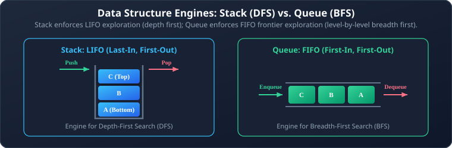
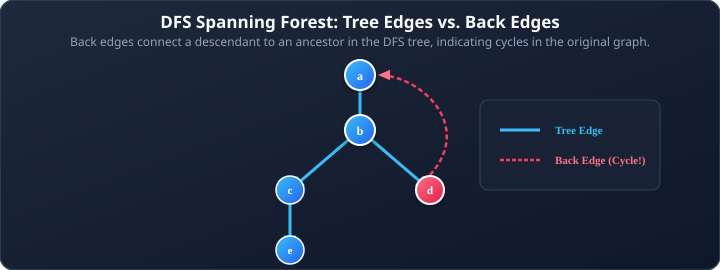
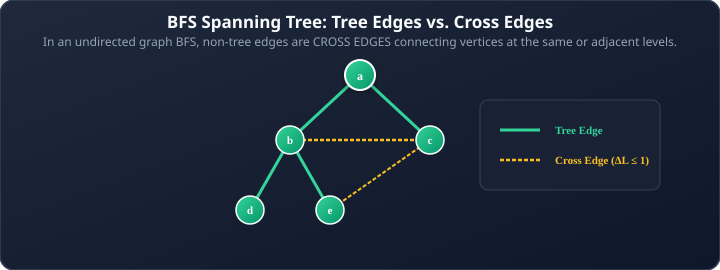

# 08. Graph Traversals: DFS and BFS

**Course**: Discrete Mathematics  
**Textbook Reference**: Kenneth H. Rosen, *Discrete Mathematics and Its Applications*, Chapter 11, Section 11.4  
**Navigation**: [[07 - Introduction to Trees and Tree Properties|← Prev: Trees & Properties]] | [[00 - Graph Theory & Trees Index|Master Index]] | [[09 - Minimum Spanning Trees (Prim's & Kruskal's)|Next: Minimum Spanning Trees →]]

>[!abstract] Module Objectives
>- Understand the auxiliary data structures: **Stacks (LIFO)** and **Queues (FIFO)**.
>- Master **Depth-First Search (DFS)** and identify **Tree Edges** vs. **Back Edges**.
>- Master **Breadth-First Search (BFS)** and identify **Tree Edges** vs. **Cross Edges**.
>- Use DFS for **Cycle Detection** and **Grid Maze Solving**.
>- Use BFS for **Unweighted Shortest Path** calculation.
>- Compare DFS and BFS across memory, tree topology, and algorithmic use-cases.

---

## 1. Linear Auxiliary Data Structures

Graph traversals visit all vertices systematically by keeping track of discovered vertices using linear memory buffers:



- **Stack**: Elements are added and removed from the same end (the **top**). Used for deep backtracking.
- **Queue**: Elements enter at the **rear** and exit from the **front**. Used for level-by-level exploration.

## 2. Depth-First Search (DFS)

Depth-First Search explores as deeply as possible along each branch before backtracking. It mimics exploring a maze by walking down a corridor until hitting a dead end, then backing up to the nearest junction.

### 2.1 Formal Algorithm in Rosen Pseudocode

```pascal
procedure DFS(G: connected graph with vertices v1, v2, ..., vn)
    T := tree consisting only of vertex v1
    mark v1 as visited
    DFS_Visit(v1)
    return T {T is a spanning tree of G}

procedure DFS_Visit(v: vertex of G)
    for each vertex w adjacent to v do
    begin
        if w is not visited then
        begin
            add vertex w and edge {v, w} to tree T
            mark w as visited
            DFS_Visit(w)
        end
    end
```

### 2.2 Edge Classification in Undirected DFS

When DFS traverses an undirected graph $G$, the edges of $G$ are partitioned into two distinct categories:



1. **Tree Edges**: Edges that are traversed by DFS to discover an unvisited vertex for the first time. These edges form the **DFS Spanning Tree**.
2. **Back Edges**: Non-tree edges that connect a vertex to an **ancestor** in the DFS tree that has already been visited.

>[!important] The Undirected DFS Structural Theorem
>In an undirected graph, **every non-tree edge discovered by DFS is a BACK EDGE**!  
>Undirected DFS never produces cross edges between separate parallel branches.

### 2.3 Applications of DFS

1. **Spanning Tree Construction**: DFS visits every vertex in a connected graph, building a tree with $n-1$ tree edges.
2. **Cycle Detection**: An undirected graph contains a cycle **if and only if DFS encounters at least one back edge**!
3. **Maze / Grid Puzzle Solving**: By modeling valid floor tiles as vertices and accessible paths as edges, DFS finds a path from start to finish by backtracking out of dead ends.

## 3. Breadth-First Search (BFS)

Breadth-First Search explores the graph in concentric ripples: it visits the starting vertex, then **all** neighbors of the start vertex (Level 1), then all unvisited neighbors of those vertices (Level 2), and so on.

### 3.1 Formal Algorithm in Rosen Pseudocode

```pascal
procedure BFS(G: connected graph with vertices v1, v2, ..., vn)
    T := tree consisting only of vertex v1
    L := empty list
    mark v1 as visited
    Q := queue containing only v1

    while Q is not empty do
    begin
        remove front vertex v from Q
        for each vertex w adjacent to v do
        begin
            if w is not visited then
            begin
                add vertex w and edge {v, w} to tree T
                mark w as visited
                enqueue(Q, w)
            end
        end
    end
    return T {T is a BFS spanning tree of G}
```

### 3.2 Edge Classification in BFS

In a BFS tree, vertices are grouped strictly by their **level** (distance from root):



- **Tree Edges**: Edges used to discover new vertices. Every tree edge connects a vertex at Level $k$ to a child at Level $k + 1$.
- **Cross Edges**: Non-tree edges. In an undirected graph, a cross edge connects two vertices at the **same level** or at **adjacent levels** ($|L(u) - L(v)| \le 1$). There are **no back edges** skipping multiple levels in BFS!

### 3.3 Applications of BFS

1. **Shortest Path in Unweighted Graphs**: Because BFS explores level by level, the path found from the root to any vertex $v$ in the BFS tree contains the **minimum possible number of edges**.
2. **Bipartite Graph Testing**: Color the root Red (Level 0), all Level 1 vertices Blue, all Level 2 vertices Red, and so on. If any cross edge connects two vertices on the **same level**, they share a color $\implies$ an odd cycle exists $\implies$ the graph is not bipartite!

## 4. Comprehensive Comparison: DFS vs. BFS

| Feature | Depth-First Search (DFS) | Breadth-First Search (BFS) |
| :--- | :--- | :--- |
| **Data Structure** | **Stack** (LIFO) or Recursion | **Queue** (FIFO) |
| **Exploration Strategy** | Go deep down a branch until blocked, then backtrack | Explore all immediate neighbors level by level |
| **Tree Topology** | **Tall and narrow** (Long paths) | **Short and bushy** (Broad spread) |
| **Non-Tree Edges** | **Back Edges** (connect to ancestors) | **Cross Edges** (connect to same or adjacent levels) |
| **Time Complexity** | $\Theta(|V| + |E|)$ | $\Theta(|V| + |E|)$ |
| **Primary Superpower** | Cycle detection, Topological sort, Maze solving | **Unweighted Shortest Path**, Minimum-height tree |

---

## 5. Worked Problem Examples

### Problem 8.1: Tracing DFS vs. BFS on a Cycle
**Problem**: Consider the cycle graph $C_4$ on vertices $\{1, 2, 3, 4\}$ with edges $\{1, 2\}, \{2, 3\}, \{3, 4\}, \{4, 1\}$. Trace the spanning trees produced by DFS and BFS starting from vertex $1$.  
**Solution**:
1. **DFS from vertex 1**:
   - Start at $1$. Visit neighbor $2$ (Tree edge $\{1, 2\}$).
   - From $2$, visit neighbor $3$ (Tree edge $\{2, 3\}$).
   - From $3$, visit neighbor $4$ (Tree edge $\{3, 4\}$).
   - From $4$, neighbor $1$ is already visited (Back edge $\{4, 1\}$).
   - **DFS Spanning Tree**: A simple path of length 3 ($1 - 2 - 3 - 4$). Height $= 3$.
2. **BFS from vertex 1**:
   - Start at $1$ (Level 0).
   - Enqueue neighbors $2$ and $4$ (Level 1, Tree edges $\{1, 2\}$ and $\{1, 4\}$).
   - Dequeue $2$: visits neighbor $3$ (Level 2, Tree edge $\{2, 3\}$).
   - Dequeue $4$: neighbor $3$ is already visited (Cross edge $\{4, 3\}$).
   - **BFS Spanning Tree**: A tree with root $1$, children $2$ and $4$, and grandchild $3$. Height $= 2$.

---

## 6. Self-Check & Concept Verification

> [!question] Concept Check 1: DFS Cycle Detection Edge Type
> When running Depth-First Search on an undirected connected graph, the presence of which edge type immediately indicates that the graph contains a cycle?
> - [ ] Tree edge
> - [ ] Back edge
> - [ ] Forward edge
> - [ ] Cross edge
>
> > [!check]- Solution & Kenneth Rosen Explanation
> > A **back edge** connects a current vertex to one of its ancestors in the DFS spanning tree (an already visited vertex that is not its direct parent). Following tree edges from ancestor to descendant and then the back edge closes a simple cycle.
> > **Correct Answer: Back edge**.

> [!question] Concept Check 2: BFS Shortest Path Property
> Why does Breadth-First Search guarantee the shortest path between two vertices in an unweighted graph?
> - [ ] BFS sorts edges by weight before processing.
> - [ ] Vertices are discovered in non-decreasing order of their hop distance from the start node (Level 0, then Level 1, then Level 2, ...).
> - [ ] BFS maintains a priority queue of path products.
> - [ ] BFS explores deeper paths first.
>
> > [!check]- Solution & Kenneth Rosen Explanation
> > Because BFS explores the frontier using a FIFO queue, all vertices at distance $k$ hops are processed and dequeued before any vertex at distance $k+1$ is examined.
> > **Correct Answer: Vertices are discovered in non-decreasing hop distance order**.
