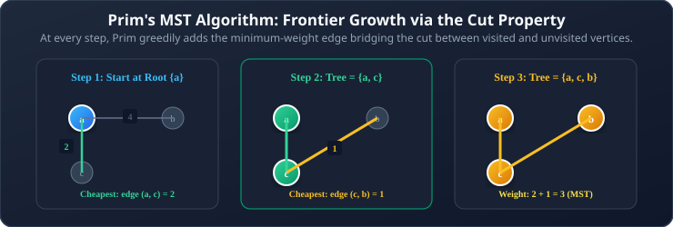
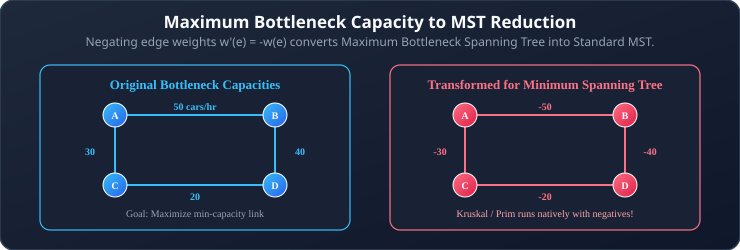

# 09. Minimum Spanning Trees (Prim's & Kruskal's)

**Course**: Discrete Mathematics  
**Textbook Reference**: Kenneth H. Rosen, *Discrete Mathematics and Its Applications*, Chapter 11, Section 11.5  
**Navigation**: [[08 - Graph Traversals: DFS and BFS|← Prev: Graph Traversals (DFS & BFS)]] | [[00 - Graph Theory & Trees Index|Master Index]] | [[10 - Tree Applications: Backtracking, BSTs, and Expression Trees|Next: Tree Applications →]]

>[!abstract] Module Objectives
>- Define the **Minimum Spanning Tree (MST)** problem.
>- Master **Prim's Algorithm** (growing a single tree outward).
>- Master **Kruskal's Algorithm** (merging a forest of components).
>- Understand why MST algorithms succeed on **negative edge weights** while Dijkstra fails.
>- Apply MSTs to **Maximum Bottleneck Capacity** problems.
>- Compare **Prim's vs. Dijkstra** and **Prim's vs. Kruskal's** across algorithmic structure and time complexity.

---

## 1. The Minimum Spanning Tree (MST) Problem

When designing infrastructure—such as laying fiber-optic cables between cities or connecting electrical power grids—every connection costs money. We need a network that connects every vertex while minimizing the total cost.

>[!note] Definition 1: Minimum Spanning Tree (MST)
>Let $G = (V, E)$ be a connected, weighted, undirected graph. A **Minimum Spanning Tree (MST)** of $G$ is a spanning tree $T$ whose total edge weight is as small as possible:
>
>$$w(T) = \sum_{e \in T} w(e) \quad \text{is minimized}$$

- **Edge Count**: An MST on $n$ vertices always contains **exactly $n - 1$ edges**.
- **Uniqueness**: If all edge weights in $G$ are distinct, the MST is **strictly unique**. If some edges have identical weights, multiple distinct MSTs with the same minimum total weight may exist.

## 2. Prim's Algorithm

Prim's algorithm operates by growing a **single tree** from an arbitrary starting vertex, adding one cheapest connecting edge at a time until all vertices are included.

### 2.1 Formal Algorithm in Rosen Pseudocode

```pascal
procedure Prim(G: connected weighted undirected graph with n vertices)
    T := a minimum-weight edge
    for i := 1 to n - 2 do
    begin
        e := an edge of minimum weight incident to a vertex in T and not in T
             such that T union {e} produces no simple circuit
        T := T union {e}
    end
    return T {T is a minimum spanning tree of G}
```

### 2.2 Prim's Step-by-Step Execution
1. Select an arbitrary starting vertex $s$ and add it to the tree $T$.
2. Examine all edges that connect a vertex **inside** $T$ to a vertex **outside** $T$ (the frontier cut).
3. Pick the edge with the **minimum weight** across this frontier and add it (along with the newly reached vertex) to $T$.
4. Repeat until all $n$ vertices are inside $T$ (exactly $n - 1$ edges added).



## 3. Kruskal's Algorithm

While Prim's grows one single tree from a fixed starting vertex, Kruskal's takes a global edge-centric approach: it starts with a **forest of $n$ disconnected vertices** and gradually merges them into a single tree.

### 3.1 Formal Algorithm in Rosen Pseudocode

```pascal
procedure Kruskal(G: connected weighted undirected graph with n vertices)
    T := empty graph with all n vertices of G and no edges
    sort all edges in non-decreasing order of weight: e1, e2, ..., em

    for i := 1 to m do
    begin
        if adding ei to T does not create a simple circuit then
            T := T union {ei}

        if T contains n - 1 edges then
            break
    end
    return T {T is a minimum spanning tree of G}
```

### 3.2 Crucial Insight: Why "Already in the Tree" Isn't Enough for Kruskal's

In Prim's algorithm, there is only one growing tree, so checking whether a candidate vertex is "already in the tree" is sufficient to prevent cycles.

>[!important] Kruskal's Forest Property
>Kruskal's tree is not grown from one starting point—it is a **forest of separate fragments** that gradually merge.  
>Suppose edges $\{a, b\}$ and $\{c, d\}$ are already in the forest (two separate components). If we consider edge $\{b, c\}$:
>- Both $b$ and $c$ are already in the forest!
>- But adding $\{b, c\}$ **does not form a cycle**—it safely merges the $\{a, b\}$ tree with the $\{c, d\}$ tree into a single 4-vertex component!
>- An edge creates a cycle **only if both endpoints already belong to the SAME connected component**. (This is efficiently managed using the **Disjoint-Set / Union-Find** data structure).

## 4. Why MST Algorithms Handle Negative Weights (Dijkstra vs. Prim)

A common student misconception is assuming that negative edge weights break Prim's and Kruskal's just like they break Dijkstra's algorithm.

>[!important] Negative Weights are Safe for MST!
>- **Dijkstra fails** on negative weights because its labels **accumulate path distances** ($L(u) + w(u, v)$). A negative edge can retroactively make an already-settled vertex cheaper.
>- **Prim's and Kruskal's succeed** on negative weights because their greedy decision depends **only on the weight of the individual edge itself** ($w(e)$). Adding a negative constant to edge weights shifts total tree weight by a fixed constant ($(n-1) \times C$), leaving the relative ordering of spanning trees completely invariant!

## 5. Real-World Modeling: Maximum Capacity Spanning Trees

**Problem**: A transportation department wants to find a spanning tree of roads that maximizes the minimum bottle-neck vehicle capacity.



>[!tip] The Negation Trick
>Any algorithm that finds a minimum spanning tree can find a **maximum spanning tree** by:
>1. Sorting edges in **descending order** (largest capacity first).
>2. Or equivalently: **negating all edge weights** ($w' = -w$) and running standard Kruskal's!

## 6. Comprehensive Comparison

### 6.1 Prim's vs. Dijkstra: Same Skeleton, Different Update Rule

Both algorithms maintain a settled set $S$ and update neighbor labels greedily:

| Algorithm | Quantity Tracked for Vertex $v$ | Greedy Update Rule | Optimization Goal |
| :--- | :--- | :--- | :--- |
| **Dijkstra** | Total distance from source $a$ to $v$ | $L(v) := \min(L(v), \mathbf{L(u) + w(u, v)})$ | Path from single source |
| **Prim's** | Cheapest link connecting $v$ to the tree | $\text{key}(v) := \min(\text{key}(v), \mathbf{w(u, v)})$ | Total tree weight |

### 6.2 Prim's vs. Kruskal's: When to Pick Which

| Criteria | Prim's Algorithm | Kruskal's Algorithm |
| :--- | :--- | :--- |
| **Approach** | Grows a single tree outward from one vertex | Merges a forest of components globally |
| **Data Structure** | Min-Heap / Priority Queue | Edge Sorting + Disjoint Set (Union-Find) |
| **Time Complexity** | $O(|V|^2)$ (Array) or $O(|E| \log |V|)$ (Heap) | $O(|E| \log |E|) = O(|E| \log |V|)$ |
| **Best Suited For** | **Dense Graphs** ($|E| \approx |V|^2$) | **Sparse Graphs** ($|E| \ll |V|^2$) |

---

## 7. Worked Problem Examples

### Problem 9.1: Running Kruskal's Algorithm
**Problem**: Find the MST for a graph with vertices $\{a, b, c, d\}$ and edges:
$\{a, b\} = 1, \quad \{c, d\} = 2, \quad \{b, c\} = 3, \quad \{a, c\} = 4, \quad \{b, d\} = 5$.  
**Solution**:
1. **Sort all edges by weight**:
   1. $\{a, b\} = 1$
   2. $\{c, d\} = 2$
   3. $\{b, c\} = 3$
   4. $\{a, c\} = 4$
   5. $\{b, d\} = 5$
2. **Step-by-step edge selection**:
   - Edge $\{a, b\}$ (wt 1): Endpoints in different components. **Accept** $\{a, b\}$. Edges $= 1$.
   - Edge $\{c, d\}$ (wt 2): Endpoints in different components. **Accept** $\{c, d\}$. Edges $= 2$.
   - Edge $\{b, c\}$ (wt 3): Connects component $\{a, b\}$ with $\{c, d\}$. No cycle formed. **Accept** $\{b, c\}$. Edges $= 3$.
3. We have accepted $n - 1 = 4 - 1 = 3$ edges. The algorithm terminates!
4. **MST Total Weight**:
   $$w(T) = 1 + 2 + 3 = \mathbf{6}$$

---

## 6. Self-Check & Concept Verification

> [!question] Concept Check 1: Negative Edges in MST Algorithms
> Can Prim's and Kruskal's algorithms correctly find the Minimum Spanning Tree if the graph contains negative edge weights?
> - [ ] No, both fail just like Dijkstra's algorithm.
> - [ ] Only Kruskal works; Prim fails on negatives.
> - [ ] Yes, both algorithms work correctly with negative weights.
> - [ ] Only Prim works; Kruskal fails on negatives.
>
> > [!check]- Solution & Kenneth Rosen Explanation
> > The Cut Property and Cycle Property depend only on the relative order of edge weights, NOT on weights being non-negative. Adding a constant $C$ to all edge weights preserves the exact same MST structure. Therefore, both Prim and Kruskal find the correct MST even with negative weights.
> > **Correct Answer: Yes, both algorithms work correctly with negative weights**.

> [!question] Concept Check 2: Dense Graph Algorithm Selection
> For a very dense graph with $V = 1000$ vertices and nearly all possible edges ($E \approx 500,000$), which algorithm implementation is asymptotically faster?
> - [ ] Kruskal's algorithm using edge sorting ($O(E \log E)$)
> - [ ] Prim's algorithm using an adjacency matrix ($O(V^2)$)
> - [ ] Fleury's algorithm ($O(E^2)$)
> - [ ] Kahn's topological sort
>
> > [!check]- Solution & Kenneth Rosen Explanation
> > In dense graphs where $E \approx V^2$:
> > - Prim with adjacency matrix takes $O(V^2) \approx 10^6$ operations.
> > - Kruskal takes $O(E \log E) \approx 500,000 \times \log_2(500,000) \approx 500,000 \times 19 \approx 9.5 \times 10^6$ operations.
> > Prim's algorithm with an adjacency matrix is significantly faster on dense graphs.
> > **Correct Answer: Prim's algorithm using an adjacency matrix ($O(V^2)$)**.
