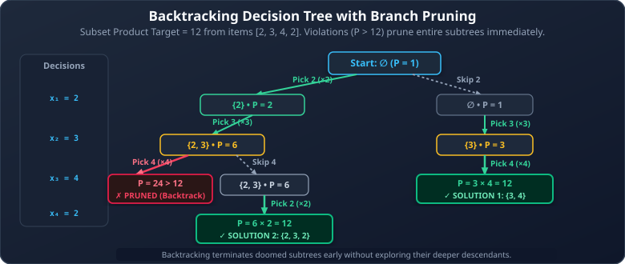
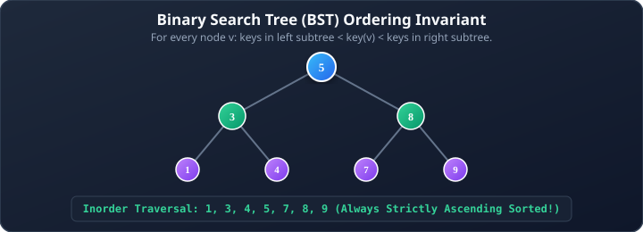
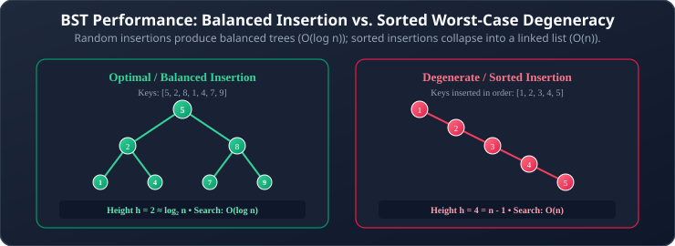
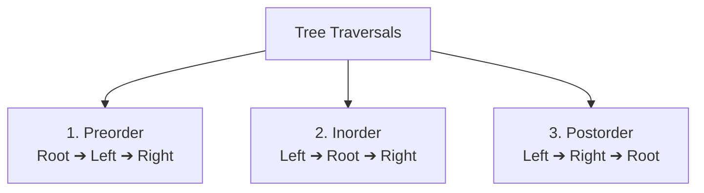
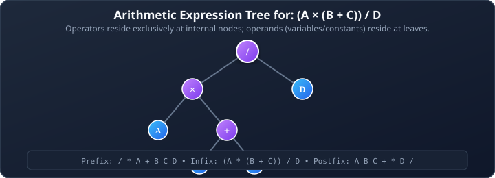

# 10. Tree Applications: Backtracking, BSTs, and Expression Trees

**Course**: Discrete Mathematics  
**Textbook Reference**: Kenneth H. Rosen, *Discrete Mathematics and Its Applications*, Chapter 11, Sections 11.2 & 11.3  
**Navigation**: [[09 - Minimum Spanning Trees (Prim's & Kruskal's)|← Prev: Minimum Spanning Trees]] | [[00 - Graph Theory & Trees Index|Master Index]]

>[!abstract] Module Objectives
>- Master **Backtracking** as Depth-First Search over a state-space decision tree with **pruning**.
>- Define and construct **Binary Search Trees (BST)**.
>- Understand how insertion order affects tree height, contrasting balanced trees ($O(\log n)$) with degenerate linked-list trees ($O(n)$).
>- Master the three classical tree traversals: **Preorder**, **Inorder**, and **Postorder**.
>- Model algebraic calculations with **Expression Trees** and convert among **Infix**, **Prefix (Polish)**, and **Postfix (Reverse Polish)** notations.

---

## 1. Backtracking (DFS Over a Decision Tree)

Many combinatorial problems require finding a combination of elements that satisfies specific constraints. **Backtracking** systematically explores the space of partial solutions by performing a Depth-First Search over a **decision tree**.



>[!important] The Power of Pruning
>The fundamental efficiency of backtracking comes from **pruning**: as soon as a partial solution violates a constraint (e.g., the product exceeds 12, or a dead end is reached), the algorithm **abandons that entire subtree immediately** and backtracks to try the next alternative.

>[!example] Example 1: Product Subset Puzzle
>Given the list of numbers $[2, 3, 4, 2]$, find all subsets whose product equals $12$:
>- Branch 1: Include 2, include 3, include 2 $\implies 2 \times 3 \times 2 = \mathbf{12}$ (**Solution 1: $\{2, 3, 2\}$**).
>- Branch 2: Exclude 2, include 3, include 4 $\implies 3 \times 4 = \mathbf{12}$ (**Solution 2: $\{3, 4\}$**).
>- Subtree Pruning: Any branch that includes both 3 and 4 immediately hits $3 \times 4 = 12$; trying to include the second 2 yields $24 > 12$, which is pruned without exploring further.

## 2. Binary Search Trees (BST)

A **Binary Search Tree (BST)** is an ordered binary tree optimized for rapid searching, insertion, and retrieval.

>[!note] Definition 1: Binary Search Tree (BST)
>A **Binary Search Tree** is a binary tree in which each vertex $v$ stores a key value such that:
>1. Every key in the **left subtree** of $v$ is strictly less than the key at $v$:
>   $$\text{key}(u) < \text{key}(v) \quad \text{for all } u \in \text{LeftSubtree}(v)$$
>2. Every key in the **right subtree** of $v$ is strictly greater than the key at $v$:
>   $$\text{key}(w) > \text{key}(v) \quad \text{for all } w \in \text{RightSubtree}(v)$$



### 2.1 The BST Insertion Algorithm

```pascal
procedure BST_Insert(root: pointer to TreeNode, key: integer)
    if root is null then
        return new TreeNode(key)

    if key < root.data then
        root.left := BST_Insert(root.left, key)
    else if key > root.data then
        root.right := BST_Insert(root.right, key)

    return root
```

### 2.2 Why Insertion Order Matters: Balanced vs. Degenerate Trees

The efficiency of a BST depends entirely on its **height ($h$)**. The height, in turn, is determined by the order in which keys are inserted:



>[!warning] The Sorted Array Trap
>If you insert a pre-sorted list into a naive BST, every new element is placed in the right child of the previous one. The tree degenerates into a **linear linked list** with height $n - 1$, destroying search efficiency ($O(n)$ instead of $O(\log n)$)!

>[!tip] Preview: Self-Balancing Trees
>To prevent degeneration, advanced data structures rebalance themselves automatically via rotations during insertions and deletions:
>- **AVL Trees**: Strictly balanced; height difference between child subtrees is at most 1.
>- **Red-Black Trees**: Looser balance; faster insertions/deletions (used in C++ `std::map` and Java `TreeMap`).
>- **B-Trees / B+ Trees**: Multi-way shallow trees used as the indexing backbone of database storage and file systems.

## 3. Tree Traversals

A **tree traversal** is an algorithm that visits every vertex in a tree exactly once. The three classical depth-first traversals are classified by when the **root** is processed relative to its children:



### 3.1 Preorder Traversal (Root $\to$ Left $\to$ Right)

```pascal
procedure Preorder(root: pointer to TreeNode)
    if root is not null then
    begin
        print(root.data)         {Process root first}
        Preorder(root.left)      {Traverse left subtree}
        Preorder(root.right)     {Traverse right subtree}
    end
```
- **Primary Use**: **Cloning / Copying a tree** (a parent node must be created before its children can be attached), or generating **Prefix notation**.

### 3.2 Inorder Traversal (Left $\to$ Root $\to$ Right)

```pascal
procedure Inorder(root: pointer to TreeNode)
    if root is not null then
    begin
        Inorder(root.left)       {Traverse left subtree}
        print(root.data)         {Process root}
        Inorder(root.right)      {Traverse right subtree}
    end
```

>[!important] The Sacred Inorder BST Theorem
>Performing an **Inorder Traversal on any Binary Search Tree** outputs the keys in **STRICTLY INCREASING SORTED ORDER**!
>
>For the tree above: `Inorder` outputs `1, 2, 3, 4, 5, 7, 8, 9`.

### 3.3 Postorder Traversal (Left $\to$ Right $\to$ Root)

```pascal
procedure Postorder(root: pointer to TreeNode)
    if root is not null then
    begin
        Postorder(root.left)     {Traverse left subtree}
        Postorder(root.right)    {Traverse right subtree}
        print(root.data)         {Process root last}
    end
```
- **Primary Use**: **Deleting / Freeing a tree from memory** (both child subtrees must be deallocated before freeing the parent), or generating **Postfix notation**.

## 4. Expression Trees & Mathematical Notations

An **Expression Tree** represents an algebraic equation:
- **Internal Vertices**: Operators ($+, -, \times, \div$)
- **Leaves**: Operands (variables or constants: $A, B, C, D$)



### 4.1 Converting Between Expression Notations

The three standard mathematical notations correspond directly to our three tree traversals:

| Notation | Traversal Used | Expression for Example Tree | Description |
| :--- | :---: | :--- | :--- |
| **Infix** | **Inorder** | $(A \times (B + C)) \div D$ | Standard algebraic notation; requires parentheses to specify operator precedence. |
| **Prefix (Polish)** | **Preorder** | $/ \times A + B C D$ | Operator precedes its operands; **zero parentheses required**. |
| **Postfix (Reverse Polish)** | **Postorder** | $A B C + \times D /$ | Operands precede their operator; **zero parentheses required**, evaluated via an operand stack! |

### 4.2 Stack-Based Evaluation of Postfix Expressions
Compilers and calculators evaluate Postfix (Reverse Polish) expressions using a single stack:
1. Scan the expression from **left to right**.
2. If an **operand** is read $\implies$ **Push** it onto the stack.
3. If an **operator** is read $\implies$ **Pop** the top two operands, apply the operator, and **Push** the result back.
4. When finished, the final answer is the sole value remaining on the stack.

---

## 5. Worked Problem Examples

### Problem 10.1: Traversals of an Expression Tree
**Problem**: Consider the expression $(3 + 5) \times (8 - 2)$. Construct the expression tree and determine its prefix and postfix forms.  
**Solution**:
1. **Tree Construction**:
   - Root is $\times$.
   - Left subtree is $(3 + 5)$ with root $+$, children $3$ and $5$.
   - Right subtree is $(8 - 2)$ with root $-$, children $8$ and $2$.
2. **Prefix Notation (Preorder: Root $\to$ Left $\to$ Right)**:
   $$\times + 3 \enspace 5 - 8 \enspace 2$$
3. **Postfix Notation (Postorder: Left $\to$ Right $\to$ Root)**:
   $$3 \enspace 5 + 8 \enspace 2 - \times$$

### Problem 10.2: Tracing Postfix Evaluation
**Problem**: Evaluate the postfix expression $3 \enspace 5 + 8 \enspace 2 - \times$ using a stack.  
**Solution**:
- Read `3` $\implies$ Stack: `[3]`
- Read `5` $\implies$ Stack: `[3, 5]`
- Read `+` $\implies$ Pop 5, Pop 3 $\implies 3 + 5 = 8 \implies$ Stack: `[8]`
- Read `8` $\implies$ Stack: `[8, 8]`
- Read `2` $\implies$ Stack: `[8, 8, 2]`
- Read `-` $\implies$ Pop 2, Pop 8 $\implies 8 - 2 = 6 \implies$ Stack: `[8, 6]`
- Read `*` $\implies$ Pop 6, Pop 8 $\implies 8 \times 6 = 48 \implies$ Stack: `[48]`
- **Final Result**: $\mathbf{48}$.

---

## 6. Self-Check & Concept Verification

> [!question] Concept Check 1: BST Inorder Traversal Property
> What property is always guaranteed when performing an inorder traversal (Left, Root, Right) on a valid Binary Search Tree?
> - [ ] The keys are visited in strictly descending order.
> - [ ] The keys are visited in strictly ascending (sorted) order.
> - [ ] The root of the tree is visited first.
> - [ ] All leaves are visited before any internal nodes.
>
> > [!check]- Solution & Kenneth Rosen Explanation
> > By the BST ordering invariant, every key in the left subtree is $< \text{Root}$, and every key in the right subtree is $> \text{Root}$. Traversing $\text{Left} \to \text{Root} \to \text{Right}$ recursively yields the elements in strictly non-decreasing sorted order.
> > **Correct Answer: The keys are visited in strictly ascending (sorted) order**.

> [!question] Concept Check 2: Expression Tree Notations
> In an expression tree, which tree traversal corresponds directly to Reverse Polish Notation (Postfix)?
> - [ ] Preorder traversal
> - [ ] Inorder traversal
> - [ ] Postorder traversal
> - [ ] Breadth-first traversal
>
> > [!check]- Solution & Kenneth Rosen Explanation
> > Postorder traversal visits $\text{Left} \to \text{Right} \to \text{Root}$. This visits the operands first, followed by their operator, which is the exact definition of Postfix / Reverse Polish Notation.
> > **Correct Answer: Postorder traversal**.
