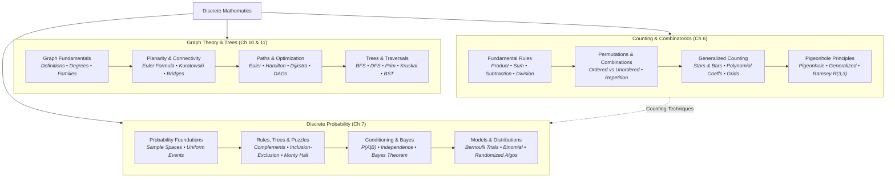

# Discrete Mathematics

> [!abstract] Course Knowledge Base & Learning Hub
> **Course**: Discrete Mathematics  
> **Textbook Reference**: Kenneth H. Rosen, *Discrete Mathematics and Its Applications* (8th Edition)  
> **Scope**: Complete lecture and textbook notes covering Graph Theory, Trees, Combinatorial Counting, and Discrete Probability.  
> **Features**: Rigorous definitions, step-by-step algorithms, 48 custom vector diagrams, worked examples, formula sheets, and practice problems.

---

## 🏛️ Knowledge Base Pillars

The course is organized into three major core modules:

> [!summary] 🌐 [[Graph/00 - Graph Theory & Trees Index|Graph Theory & Trees]]
> **Chapters 10 & 11** — Foundations of topological structures, networks, connectivity, traversals, and trees.
> - Handshaking theorem, graph families ($K_n, C_n, W_n, Q_n$), bipartite graphs & matchings.
> - Planar graph embeddings, Euler's formula, and Kuratowski's theorem.
> - Connectivity, cut vertices, bridges, Eulerian/Hamiltonian paths, and Dijkstra's algorithm.
> - Tree characterizations, BFS/DFS traversals, Prim & Kruskal MST, and Expression/Search trees.
> 
> 👉 **[[Graph/00 - Graph Theory & Trees Index|Open Graph Theory & Trees Notes →]]**

> [!tip] 🔢 [[Counting/00 Counting|Counting & Combinatorics]]
> **Chapter 6** — Systematic enumeration, decision modeling, and combinatorial guarantees.
> - Fundamental rules: Product, Sum, Subtraction (PIE for 2 & 3 sets), and Division rules.
> - Permutations & Combinations (with/without repetition, circular & unoriented arrangements).
> - Generalized counting: Stars and bars, multinomial coefficients, and lattice grid walks.
> - Pigeonhole Principle: Basic, generalized, geometry, pair-sum guarantees, and Ramsey $R(3,3)=6$.
> 
> 👉 **[[Counting/00 Counting|Open Counting Notes →]]**

> [!note] 🎲 [[Probability/00 Probability|Discrete Probability]]
> **Chapter 7** — Sample spaces, conditioning, stochastic models, and randomized algorithms.
> - Finite probability foundations, uniform spaces, events, and complementary counting.
> - Conditional probability, multiplication rule, independence, and Monty Hall / Fair Split puzzles.
> - Bernoulli trials, Binomial distribution $b(k;n,p)$, and independence tests.
> - Bayes' Theorem, diagnostic 2×2 confusion matrices, base-rate fallacy, and Naive Bayes classification.
> - Non-uniform probability distributions, the probabilistic method, and Monte Carlo min-cut.
> 
> 👉 **[[Probability/00 Probability|Open Probability Notes →]]**

---

## 🗺️ Master Curriculum Roadmap

---

## 📚 Fast Reference & Decision Sheets

Quick-access summary cards and decision sheets for problem-solving:

| Sheet | Module | Focus Areas |
| :--- | :---: | :--- |
| **[[Counting/05 Counting Formula and Decision Sheet\|Counting Decision Sheet]]** | Counting | Compass flowchart, formula lookup (combinations, permutations, stars & bars), problem identifier |
| **[[Counting/06 Counting Mixed Practice\|Counting Mixed Practice]]** | Counting | Unlabeled multi-concept challenge problems with complete worked solutions |
| **[[Probability/07 Probability Formula and Decision Sheet\|Probability Decision Sheet]]** | Probability | Axioms, conditional formulas, tree decision models, Bayes confusion matrices |
| **[[Probability/08 Probability Mixed Practice\|Probability Mixed Practice]]** | Probability | Scenario classification, trick detection, and comprehensive problem sets |
| **[[Graph/00 - Graph Theory & Trees Index\|Graph Theory Index]]** | Graph | Module directory, 40 SVG diagrams, algorithm pseudocode, and self-check quizzes |
